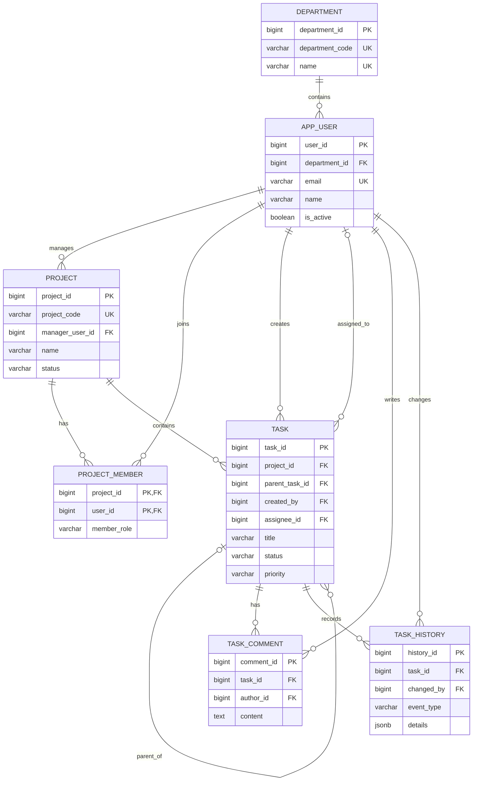

# 업무 관리 시스템 요구사항과 데이터 모델

이 문서는 교재 전체에서 사용하는 업무 관리 시스템의 기준 모델을 정의한다. 6장에서 개념 모델을 설명하고, 7장에서 데이터 타입을 검토한 뒤, 8장에서 실제 PostgreSQL 테이블과 제약조건으로 구현한다.

## 1. 시스템 목적

조직의 부서와 사용자를 관리하고, 여러 사용자가 프로젝트에 참여하여 업무를 등록·배정·처리하며, 댓글과 변경 이력을 남기는 소규모 업무 관리 시스템을 만든다.

## 2. 핵심 요구사항

1. 부서는 부서 코드와 이름으로 식별하며 여러 사용자를 포함할 수 있다.
2. 사용자는 정확히 한 부서에 소속되고, 이름·이메일·활성 상태를 가진다.
3. 프로젝트는 프로젝트 코드, 이름, 상태, 기간과 한 명의 관리자를 가진다.
4. 사용자는 여러 프로젝트에 참여할 수 있고 프로젝트에도 여러 사용자가 참여할 수 있다.
5. 프로젝트 참여자는 `manager`, `member`, `viewer` 중 하나의 참여 역할을 가진다.
6. 업무는 한 프로젝트에 속하며 작성자는 필수, 담당자와 상위 업무는 선택이다.
7. 업무는 제목, 설명, 상태, 우선순위, 시작일, 마감일과 생성·수정 시각을 가진다.
8. 업무 상태는 `todo`, `in_progress`, `blocked`, `done`, `cancelled`를 사용한다.
9. 업무 우선순위는 `low`, `medium`, `high`, `urgent`를 사용한다.
10. 사용자는 업무에 여러 댓글을 남길 수 있다.
11. 업무의 주요 변경은 변경자, 변경 시각, 이벤트 종류와 상세 내용으로 기록한다.
12. 예제 시각은 `Asia/Seoul`을 기준으로 설명하고 실제 저장 시각에는 시간대 정보를 보존한다.

## 3. 명명 규칙

- 테이블 이름은 영문 소문자 단수형 `snake_case`를 사용한다.
- 기본 키는 `<table_name>_id`, 외래 키는 참조 대상에 맞는 `*_id`를 사용한다.
- 날짜만 저장하는 열은 `*_date`, 시각을 저장하는 열은 `*_at`로 끝낸다.
- 논리값은 `is_*`로 시작한다.
- 업무 시스템의 사용자 테이블은 PostgreSQL 예약어 및 역할과 혼동하지 않도록 `app_user`로 정한다.
- 상태 코드와 역할 코드는 영문 소문자로 저장하고 화면에서 한국어로 번역한다.

## 4. 엔터티와 식별자

| 테이블 | 의미 | 대리 키 | 자연 키·후보 키 |
|---|---|---|---|
| `department` | 조직 부서 | `department_id` | `department_code`, `name` |
| `app_user` | 업무 시스템 사용자 | `user_id` | `email` |
| `project` | 프로젝트 | `project_id` | `project_code` |
| `project_member` | 프로젝트 참여 관계 | 없음 | (`project_id`, `user_id`) 복합 키 |
| `task` | 프로젝트 업무 | `task_id` | 없음 |
| `task_comment` | 업무 댓글 | `comment_id` | 없음 |
| `task_history` | 업무 변경 이력 | `history_id` | 없음 |

업무 제목과 사용자 이름은 중복될 수 있으므로 키로 사용하지 않는다. 이메일과 코드는 업무상 바뀔 가능성이 있지만 중복 방지를 위한 후보 키로 유지하고, 관계에는 변경에 안정적인 숫자 대리 키를 사용한다.

## 5. 열 설계 초안

PostgreSQL 데이터 타입과 제약조건은 7~8장에서 확정했다. 실제 구현의 단일 기준은 `examples/08_create_schema.sql`이며, 이 절은 설계 의도를 빠르게 확인하기 위한 요약이다.

### `department`

| 열 | 필수 | 설명 |
|---|---|---|
| `department_id` | 예 | 숫자 대리 키 |
| `department_code` | 예 | 중복되지 않는 부서 코드 |
| `name` | 예 | 중복되지 않는 부서 이름 |
| `created_at` | 예 | 생성 시각 |

### `app_user`

| 열 | 필수 | 설명 |
|---|---|---|
| `user_id` | 예 | 숫자 대리 키 |
| `department_id` | 예 | 소속 부서 외래 키 |
| `name` | 예 | 표시 이름, 중복 허용 |
| `email` | 예 | 중복되지 않는 이메일 |
| `is_active` | 예 | 사용 가능 여부 |
| `created_at` | 예 | 생성 시각 |
| `deactivated_at` | 아니요 | 비활성화 시각 |

### `project`

| 열 | 필수 | 설명 |
|---|---|---|
| `project_id` | 예 | 숫자 대리 키 |
| `project_code` | 예 | 중복되지 않는 프로젝트 코드 |
| `name` | 예 | 프로젝트 이름 |
| `description` | 아니요 | 상세 설명 |
| `manager_user_id` | 예 | 프로젝트 관리자 외래 키 |
| `status` | 예 | `planned`, `active`, `on_hold`, `completed`, `cancelled` |
| `start_date` | 예 | 시작일 |
| `end_date` | 아니요 | 종료 예정일 또는 실제 종료일 |
| `created_at` | 예 | 생성 시각 |
| `updated_at` | 예 | 마지막 수정 시각 |

### `project_member`

| 열 | 필수 | 설명 |
|---|---|---|
| `project_id` | 예 | 프로젝트 외래 키, 복합 기본 키 구성 |
| `user_id` | 예 | 사용자 외래 키, 복합 기본 키 구성 |
| `member_role` | 예 | `manager`, `member`, `viewer` |
| `joined_at` | 예 | 참여 시각 |

`project.manager_user_id`의 사용자는 해당 프로젝트의 `project_member`에도 있어야 한다. 이 교차 테이블 규칙은 단순 외래 키 하나만으로 표현하기 어려우므로 초기 구현에서는 설정 SQL과 애플리케이션이 지키고, 후속 장에서 제약 강화 방법을 검토한다.

### `task`

| 열 | 필수 | 설명 |
|---|---|---|
| `task_id` | 예 | 숫자 대리 키 |
| `project_id` | 예 | 소속 프로젝트 외래 키 |
| `parent_task_id` | 아니요 | 상위 업무를 가리키는 자기 참조 외래 키 |
| `created_by` | 예 | 작성자 사용자 외래 키 |
| `assignee_id` | 아니요 | 담당자 사용자 외래 키 |
| `title` | 예 | 업무 제목 |
| `description` | 아니요 | 상세 설명 |
| `status` | 예 | 업무 상태 코드 |
| `priority` | 예 | 우선순위 코드 |
| `start_date` | 아니요 | 시작일 |
| `due_date` | 아니요 | 마감일 |
| `created_at` | 예 | 생성 시각 |
| `updated_at` | 예 | 마지막 수정 시각 |
| `completed_at` | 아니요 | 완료 시각 |

### `task_comment`

| 열 | 필수 | 설명 |
|---|---|---|
| `comment_id` | 예 | 숫자 대리 키 |
| `task_id` | 예 | 대상 업무 외래 키 |
| `author_id` | 예 | 작성자 사용자 외래 키 |
| `content` | 예 | 댓글 내용 |
| `created_at` | 예 | 작성 시각 |
| `updated_at` | 아니요 | 수정 시각 |

### `task_history`

| 열 | 필수 | 설명 |
|---|---|---|
| `history_id` | 예 | 숫자 대리 키 |
| `task_id` | 예 | 대상 업무 외래 키 |
| `changed_by` | 예 | 변경자 사용자 외래 키 |
| `event_type` | 예 | 생성, 상태 변경, 담당자 변경 등의 코드 |
| `details` | 예 | 변경 세부 정보를 담는 JSONB 후보 열 |
| `changed_at` | 예 | 변경 시각 |

## 6. 관계와 카디널리티

| 부모 | 자식·연결 | 관계 | 선택성 |
|---|---|---|---|
| `department` | `app_user` | 1:N | 사용자는 부서 필수 |
| `app_user` | `project` | 1:N | 프로젝트 관리자 필수 |
| `project` | `app_user` | M:N (`project_member`) | 프로젝트에 여러 참여자 가능 |
| `project` | `task` | 1:N | 업무는 프로젝트 필수 |
| `task` | `task` | 1:N 자기 참조 | 상위 업무는 선택 |
| `app_user` | `task.created_by` | 1:N | 작성자 필수 |
| `app_user` | `task.assignee_id` | 1:N | 담당자 선택 |
| `task` | `task_comment` | 1:N | 댓글은 업무 필수 |
| `app_user` | `task_comment` | 1:N | 댓글 작성자 필수 |
| `task` | `task_history` | 1:N | 이력은 업무 필수 |
| `app_user` | `task_history` | 1:N | 변경자 필수 |

## 7. 삭제 원칙

- 부서, 사용자와 프로젝트는 참조가 있으면 물리 삭제보다 비활성화 또는 상태 변경을 우선한다.
- 프로젝트를 삭제할 때 업무까지 자동 삭제하는 규칙은 기본값으로 두지 않는다.
- 업무를 삭제하는 기능은 초기 요구사항에서 제외하고 상태를 `cancelled`로 바꾼다.
- 댓글과 변경 이력은 감사 가능성을 위해 업무와 함께 임의 삭제하지 않는다.
- 실제 외래 키의 `ON DELETE` 정책은 8장에서 이 원칙을 SQL로 옮기며 다시 검토한다.

## 8. ERD

## 9. 후속 구현 순서

1. 7장: 각 열의 PostgreSQL 데이터 타입과 시간대 정책을 검토한다.
2. 8장: 테이블, 기본 키, 외래 키, `UNIQUE`, `CHECK`와 기본값을 구현한다.
3. 9장: 고정 샘플 데이터를 입력하고 안전한 CRUD를 연습한다.
4. 17장: 조회 패턴에 맞는 인덱스를 추가한다.
5. 20장: 업무 변경 이력을 트리거로 기록한다.
6. 21장: `task_history.details`의 JSONB 구조와 인덱스를 다룬다.
7. 22장: `task_admin`과 `task_app`의 객체 권한을 최소 권한으로 세분화한다.
