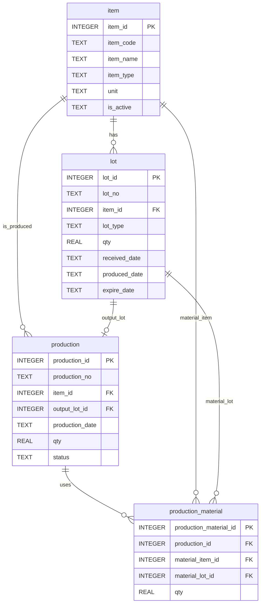

# Chapter 1. Mini MES 교재 개요

## 1. 학습 목표

이 장을 마치면 다음을 설명할 수 있다.

- MES가 제조 현장에서 어떤 역할을 하는지 말할 수 있다.
- 라면공장 생산 흐름을 데이터 관점으로 바라볼 수 있다.
- 이 교재에서 사용하는 4개 테이블의 역할을 구분할 수 있다.
- SQL을 왜 MES 학습에 함께 사용해야 하는지 이해할 수 있다.

이 장은 SQL 문법을 깊게 다루기보다, 앞으로 조회할 데이터가 어떤 현장 상황에서 만들어지는지 먼저 잡아 주는 장이다.

## 2. 현장 상황

라면공장에서는 하루에도 여러 종류의 라면을 생산한다. 오전에는 `봉지라면 매운맛`을 만들고, 오후에는 `봉지라면 순한맛`을 만들 수 있다. 생산을 하려면 면 블록, 스프, 포장재 같은 원재료가 필요하다.

현장 작업자, 품질 담당자, 생산 관리자는 자주 다음 질문을 받는다.

| 질문 | 필요한 데이터 |
| --- | --- |
| 오늘 어떤 제품을 얼마나 생산했는가? | 생산 실적 |
| 생산에 사용한 원재료는 무엇인가? | 원재료 투입 이력 |
| 특정 완제품 LOT는 언제 만들어졌는가? | 생산 LOT와 생산일자 |
| 문제가 생긴 원재료 LOT를 사용한 완제품은 무엇인가? | 원재료 LOT와 완제품 LOT의 연결 |
| 현재 창고에 남아 있는 재고는 어느 정도인가? | LOT별 수량 |

이 질문들은 말로만 관리하기 어렵다. 작업 일지, 창고 기록, 품질 기록이 따로 있으면 필요한 정보를 찾는 데 시간이 오래 걸린다. Mini MES는 이런 제조 데이터를 테이블에 저장하고 SQL로 조회할 수 있게 만드는 학습용 시스템이다.

## 3. 핵심 개념

### MES

MES는 Manufacturing Execution System의 약자다. 한국어로는 제조 실행 시스템이라고 부른다. 생산 계획을 실제 현장에서 실행하면서, 생산 실적과 자재 사용 이력, LOT 정보를 기록하는 시스템이다.

ERP가 회사 전체의 자원과 계획을 넓게 관리한다면, MES는 공장 안에서 실제로 어떤 일이 일어났는지를 더 자세히 기록한다.

| 구분 | 주 관심사 | 예시 질문 |
| --- | --- | --- |
| ERP | 계획, 구매, 회계, 영업 | 다음 달에 원재료를 얼마나 구매해야 하는가? |
| MES | 생산 실행, 실적, LOT 추적 | 오늘 생산한 라면에 어떤 스프 LOT가 들어갔는가? |

### 품목

품목은 공장에서 관리하는 물건의 기준정보다. 이 교재에서는 제품과 원재료를 모두 `item` 테이블에 저장한다.

| 품목 예 | 구분 | 설명 |
| --- | --- | --- |
| 봉지라면 매운맛 | 제품 | 생산 결과로 만들어지는 완제품 |
| 봉지라면 순한맛 | 제품 | 생산 결과로 만들어지는 완제품 |
| 면 블록 | 원재료 | 제품 생산에 투입되는 재료 |
| 매운맛 스프 | 원재료 | 제품 생산에 투입되는 재료 |
| 봉지 포장재 | 원재료 | 제품 포장에 사용하는 재료 |

### LOT

LOT는 같은 조건에서 입고되었거나 생산된 묶음이다. 같은 매운맛 스프라도 입고일과 공급 배치가 다르면 다른 LOT로 관리할 수 있다.

LOT를 관리하면 단순히 총수량만 보는 것이 아니라, 물건의 출처와 사용 흐름을 추적할 수 있다.

### 생산 실적

생산 실적은 특정 날짜에 어떤 제품을 얼마나 만들었는지에 대한 기록이다. 이 교재에서는 `production` 테이블이 이 역할을 한다.

### 투입 자재

투입 자재는 생산할 때 실제로 사용한 원재료 기록이다. 같은 제품을 만들더라도 어떤 원재료 LOT를 사용했는지는 생산 시점마다 달라질 수 있다. 이 교재에서는 `production_material` 테이블이 이 역할을 한다.

## 4. 모델링 설명

이 교재의 데이터 모델은 4개 테이블만 사용한다.

| 테이블 | 역할 | 주요 질문 |
| --- | --- | --- |
| `item` | 제품과 원재료 기준정보 | 이 코드는 어떤 품목인가? |
| `lot` | 입고 또는 생산으로 생긴 LOT | 이 LOT는 어떤 품목이고 얼마나 남아 있는가? |
| `production` | 완제품 생산 실적 | 언제 어떤 제품을 얼마나 생산했는가? |
| `production_material` | 생산에 투입된 원재료 LOT | 이 생산에 어떤 원재료 LOT가 들어갔는가? |

4개 테이블의 기본 관계는 다음과 같다.



외래키는 한 테이블의 값이 다른 테이블의 기준값을 참조한다는 뜻이다. 예를 들어 `lot.item_id`는 `item.item_id`를 참조한다. 그래서 LOT를 조회할 때 그 LOT가 어떤 품목인지 연결해서 알 수 있다.

이 관계를 현장 문장으로 바꾸면 다음과 같다.

- 하나의 품목은 여러 LOT를 가질 수 있다.
- 하나의 생산 실적은 하나의 완제품 LOT를 만든다.
- 하나의 생산 실적은 여러 원재료 LOT를 사용할 수 있다.
- 원재료 LOT는 여러 생산 실적에 나누어 사용될 수 있다.

## 5. SQL 예제

아래 SQL은 샘플 데이터가 입력된 SQLite 데이터베이스에서 실행할 수 있다.

### 5.1 품목 전체 조회

```sql
SELECT
    item_id,
    item_code,
    item_name,
    item_type,
    unit,
    is_active
FROM item
ORDER BY item_id;
```

이 SQL은 `item` 테이블에 등록된 제품과 원재료를 모두 보여 준다.

### 5.2 제품만 조회

```sql
SELECT
    item_code,
    item_name,
    unit
FROM item
WHERE item_type = 'PRODUCT'
ORDER BY item_code;
```

`WHERE item_type = 'PRODUCT'` 조건을 사용하면 완제품만 볼 수 있다.

### 5.3 원재료만 조회

```sql
SELECT
    item_code,
    item_name,
    unit
FROM item
WHERE item_type = 'MATERIAL'
ORDER BY item_code;
```

`item` 테이블 하나에서 제품과 원재료를 함께 관리하되, `item_type`으로 구분한다.

### 5.4 생산 실적 기본 조회

```sql
SELECT
    production_no,
    production_date,
    item_id,
    qty,
    status
FROM production
ORDER BY production_date;
```

아직 `JOIN`을 배우기 전에는 `item_id`처럼 숫자 ID가 보인다. 뒤 장에서는 이 ID를 `item` 테이블과 연결해서 `봉지라면 매운맛` 같은 품목명으로 조회한다.

## 6. 데이터 해석

샘플 데이터에는 제품 2개와 원재료 4개가 들어 있다.

| 구분 | 품목 |
| --- | --- |
| 제품 | 봉지라면 매운맛, 봉지라면 순한맛 |
| 원재료 | 면 블록, 매운맛 스프, 순한맛 스프, 봉지 포장재 |

생산 실적은 3건이다.

| 생산일자 | 생산번호 | 의미 |
| --- | --- | --- |
| 2026-07-10 | PRD-20260710-001 | 봉지라면 매운맛을 생산한 기록 |
| 2026-07-11 | PRD-20260711-001 | 봉지라면 순한맛을 생산한 기록 |
| 2026-07-12 | PRD-20260712-001 | 봉지라면 매운맛을 다시 생산한 기록 |

이 데이터에서 중요한 점은 제품명만 저장한 것이 아니라는 점이다. 생산 실적, 생산 LOT, 투입 원재료 LOT가 분리되어 있다. 이렇게 나누어야 나중에 다음 질문에 답할 수 있다.

- 같은 제품을 여러 번 생산했을 때 각 생산을 구분할 수 있는가?
- 특정 생산 실적의 완제품 LOT를 찾을 수 있는가?
- 특정 생산 실적에 들어간 원재료 LOT를 찾을 수 있는가?

## 7. 잘못된 설계 사례

### 7.1 제품과 원재료를 다른 기준으로 관리하는 경우

초급 설계에서 제품 목록과 원재료 목록을 서로 다른 기준으로 관리하려는 경우가 있다. 이 방식은 처음에는 쉬워 보이지만, 생산 실적과 LOT를 연결할 때 기준이 나뉘어 복잡해진다.

| 잘못된 방향 | 문제점 | 이 교재의 기준 |
| --- | --- | --- |
| 제품 기준정보와 원재료 기준정보를 따로 관리 | 생산품과 투입품을 같은 방식으로 조회하기 어렵다 | 모두 `item`에 저장하고 `item_type`으로 구분 |
| 생산 실적에 품목명을 직접 입력 | 이름 오타가 생기면 같은 품목도 다르게 보인다 | `production.item_id`로 `item` 참조 |
| LOT에 품목명을 직접 입력 | 품목명이 바뀌면 LOT 데이터도 수정해야 한다 | `lot.item_id`로 `item` 참조 |

### 7.2 수량 컬럼명을 섞어 쓰는 경우

어떤 테이블은 `qty`, 어떤 테이블은 다른 이름을 쓰면 SQL을 작성할 때 매번 컬럼명을 확인해야 한다. 이 교재에서는 수량 컬럼명을 항상 `qty`로 고정한다.

| 테이블 | 수량 컬럼 |
| --- | --- |
| `lot` | `qty` |
| `production` | `qty` |
| `production_material` | `qty` |

### 7.3 생산 기록에 원재료 목록을 문장으로 적는 경우

생산 기록의 메모 칸에 `면 블록, 매운맛 스프, 봉지 포장재 사용`처럼 적으면 사람이 읽기는 쉽다. 하지만 데이터베이스가 특정 원재료 LOT를 찾아내기는 어렵다. Mini MES에서는 원재료 투입 이력을 `production_material`에 한 줄씩 저장한다.

## 8. 실습

### 실습 1. 전체 품목 조회하기

```sql
SELECT
    item_id,
    item_code,
    item_name,
    item_type,
    unit,
    is_active
FROM item
ORDER BY item_id;
```

확인할 내용:

- 제품은 몇 개인가?
- 원재료는 몇 개인가?
- 모든 품목의 단위는 무엇인가?

### 실습 2. 생산 완료 실적 조회하기

```sql
SELECT
    production_no,
    production_date,
    item_id,
    qty
FROM production
WHERE status = 'COMPLETED'
ORDER BY production_date;
```

확인할 내용:

- 완료된 생산 실적은 몇 건인가?
- 가장 먼저 생산된 날짜는 언제인가?
- 생산 수량이 가장 큰 행은 어느 것인가?

### 실습 3. LOT 유형 구분하기

```sql
SELECT
    lot_no,
    item_id,
    lot_type,
    qty,
    received_date,
    produced_date
FROM lot
ORDER BY lot_id;
```

확인할 내용:

- `lot_type`이 `RECEIPT`인 행은 무엇을 뜻하는가?
- `lot_type`이 `PRODUCTION`인 행은 무엇을 뜻하는가?
- 입고 LOT에는 어떤 날짜 컬럼이 채워져 있는가?

## 9. 확인 문제

1. MES는 제조 현장에서 어떤 데이터를 기록하는 시스템인가?
2. 이 교재에서 사용하는 4개 테이블 이름을 모두 쓰시오.
3. 제품과 원재료를 구분하기 위해 `item` 테이블에서 사용하는 컬럼은 무엇인가?
4. 수량 컬럼명을 `qty`로 통일하면 어떤 장점이 있는가?
5. `production_material` 테이블이 필요한 이유를 한 문장으로 설명하시오.

## 10. 핵심 정리

- MES는 공장에서 실제로 일어난 생산과 자재 사용 이력을 기록한다.
- 이 교재는 `item`, `lot`, `production`, `production_material` 4개 테이블만 사용한다.
- 제품과 원재료는 모두 `item`에 저장하고, `item_type`으로 구분한다.
- LOT는 물건의 출처와 생산 묶음을 추적하기 위한 단위다.
- SQL은 MES 데이터를 조회하고 해석하기 위한 기본 도구다.
