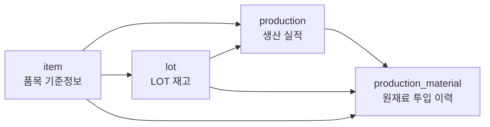
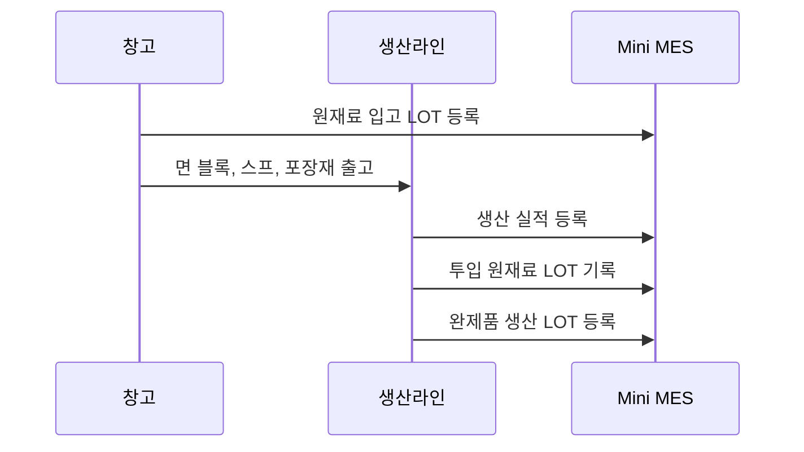

# Chapter 2. LOT가 필요한 이유

## 1. 학습 목표

이 장을 마치면 다음을 설명할 수 있다.

- LOT가 단순 재고 수량과 어떻게 다른지 설명할 수 있다.
- 라면공장에서 LOT를 사용하는 이유를 현장 사례로 이해할 수 있다.
- `lot` 테이블이 `item`, `production`, `production_material`과 어떻게 연결되는지 설명할 수 있다.
- SQL로 LOT 재고와 LOT 유형을 조회할 수 있다.
- 원재료 LOT와 완제품 LOT를 구분해서 해석할 수 있다.

LOT는 MES에서 매우 중요한 개념이다. 초급자는 처음에 LOT를 단순한 번호로 생각하기 쉽지만, 실제 제조 현장에서는 품질 문제, 재고 관리, 리콜 범위 판단에 직접 연결된다.

## 2. 현장 상황

라면공장에 같은 `매운맛 스프`가 두 번 입고되었다고 가정하자.

| 입고일 | 원재료 | 입고 수량 | 비고 |
| --- | --- | ---: | --- |
| 2026-07-01 | 매운맛 스프 | 8,000 EA | 정상 입고 |
| 2026-07-08 | 매운맛 스프 | 7,000 EA | 다른 공급 배치 |

두 입고는 같은 품목이지만 같은 물건 묶음은 아니다. 공급 시점, 제조 조건, 검사 결과, 유통기한이 다를 수 있다. 만약 2026-07-08에 입고된 스프에서 품질 문제가 발견되면, 2026-07-01에 입고된 스프까지 모두 문제로 볼 필요는 없다.

이때 필요한 구분 단위가 LOT다. LOT를 사용하면 같은 품목이라도 언제 들어왔고, 어느 생산에 사용되었고, 어떤 완제품으로 이어졌는지 추적할 수 있다.

라면공장 현장에서 LOT가 필요한 대표 상황은 다음과 같다.

| 상황 | LOT가 없을 때 | LOT가 있을 때 |
| --- | --- | --- |
| 원재료 품질 문제 | 어떤 제품에 들어갔는지 찾기 어렵다 | 해당 원재료 LOT가 투입된 생산만 찾는다 |
| 유통기한 관리 | 전체 재고 수량만 보인다 | 유통기한이 빠른 LOT부터 출고할 수 있다 |
| 생산 이력 확인 | 제품명과 날짜만 보고 추측한다 | 완제품 LOT로 생산 실적을 찾는다 |
| 리콜 범위 판단 | 같은 제품 전체를 회수할 수 있다 | 영향받은 완제품 LOT만 좁힐 수 있다 |

## 3. 핵심 개념

### LOT

LOT는 같은 조건에서 만들어졌거나 입고된 물건의 묶음이다. 이 교재에서는 두 종류의 LOT를 사용한다.

| LOT 유형 | `lot_type` 값 | 의미 | 예시 |
| --- | --- | --- | --- |
| 입고 LOT | `RECEIPT` | 외부에서 들어온 원재료 묶음 | 면 블록 입고 LOT |
| 생산 LOT | `PRODUCTION` | 생산으로 만들어진 완제품 묶음 | 봉지라면 매운맛 생산 LOT |

입고 LOT는 원재료 입고에서 생긴다. 생산 LOT는 생산 실적의 결과로 생긴다.

### LOT 번호

LOT 번호는 현장에서 LOT를 식별하기 위해 붙이는 고유 번호다. 샘플 데이터의 LOT 번호는 다음처럼 읽을 수 있다.

| LOT 번호 | 해석 |
| --- | --- |
| `RM-NOODLE-20260701-001` | 2026-07-01에 입고된 면 블록 LOT |
| `RM-SOUP-HOT-20260701-001` | 2026-07-01에 입고된 매운맛 스프 LOT |
| `FG-RAMEN-HOT-20260710-001` | 2026-07-10에 생산된 매운맛 라면 LOT |

실제 회사마다 LOT 번호 규칙은 다르다. 중요한 것은 LOT 번호가 사람이 읽을 수 있는 식별자이고, 데이터베이스에서는 `lot_id`가 내부 연결용 식별자라는 점이다.

### 재고 수량과 LOT 수량

품목별 총재고만 보면 `매운맛 스프가 8,000 EA 있다`처럼 보인다. 하지만 LOT 기준으로 보면 어느 입고 묶음에 얼마가 남아 있는지까지 볼 수 있다.

| 관점 | 질문 | 필요한 데이터 |
| --- | --- | --- |
| 품목 재고 | 매운맛 스프가 총 몇 개 있는가? | 품목별 `qty` 합계 |
| LOT 재고 | 특정 매운맛 스프 LOT가 몇 개 남았는가? | LOT별 `qty` |
| 추적성 | 이 LOT가 어느 생산에 들어갔는가? | `production_material` 연결 |

## 4. 모델링 설명

`lot` 테이블은 LOT의 기준 위치다. LOT 자체의 번호, 품목, 유형, 수량, 날짜를 저장한다.

| 컬럼 | 의미 | 예시 |
| --- | --- | --- |
| `lot_id` | LOT 내부 식별자 | `1` |
| `lot_no` | 현장에서 사용하는 LOT 번호 | `RM-NOODLE-20260701-001` |
| `item_id` | 어떤 품목의 LOT인지 연결 | `3` |
| `lot_type` | 입고 LOT인지 생산 LOT인지 구분 | `RECEIPT` |
| `qty` | 현재 LOT 수량 | `10000` |
| `received_date` | 입고일 | `2026-07-01` |
| `produced_date` | 생산일 | `2026-07-10` |
| `expire_date` | 유통기한 또는 사용기한 | `2026-10-01` |

LOT 관련 관계는 다음과 같다.



이 그림은 세 가지 연결을 보여 준다.

- `lot.item_id`는 LOT가 어떤 품목인지 알려 준다.
- `production.output_lot_id`는 생산 실적이 만든 완제품 LOT를 알려 준다.
- `production_material.material_lot_id`는 생산에 사용한 원재료 LOT를 알려 준다.

생산 흐름을 LOT 관점으로 보면 다음과 같다.



이 흐름에서 중요한 점은 완제품만 기록하지 않는다는 것이다. 어떤 원재료 LOT가 들어갔는지 함께 기록해야 나중에 추적할 수 있다.

## 5. SQL 예제

아래 SQL은 샘플 데이터가 입력된 SQLite 데이터베이스에서 실행할 수 있다.

### 5.1 LOT 전체 조회

```sql
SELECT
    lot_id,
    lot_no,
    item_id,
    lot_type,
    qty,
    received_date,
    produced_date,
    expire_date
FROM lot
ORDER BY lot_id;
```

이 SQL은 입고 LOT와 생산 LOT를 모두 보여 준다.

### 5.2 입고 LOT만 조회

```sql
SELECT
    lot_no,
    item_id,
    qty,
    received_date,
    expire_date
FROM lot
WHERE lot_type = 'RECEIPT'
ORDER BY received_date, lot_no;
```

입고 LOT는 원재료가 창고에 들어올 때 생긴 LOT다. 샘플 데이터에서는 면 블록, 스프, 포장재 입고 LOT가 조회된다.

### 5.3 생산 LOT만 조회

```sql
SELECT
    lot_no,
    item_id,
    qty,
    produced_date,
    expire_date
FROM lot
WHERE lot_type = 'PRODUCTION'
ORDER BY produced_date, lot_no;
```

생산 LOT는 생산 실적의 결과로 만들어진 완제품 LOT다.

### 5.4 품목별 LOT 수량 합계

```sql
SELECT
    item_id,
    SUM(qty) AS total_qty
FROM lot
GROUP BY item_id
ORDER BY item_id;
```

이 SQL은 품목별로 LOT 수량을 합산한다. 아직 품목명은 보이지 않지만, `item_id`별 재고 규모를 볼 수 있다.

### 5.5 유통기한이 있는 LOT 조회

```sql
SELECT
    lot_no,
    item_id,
    qty,
    expire_date
FROM lot
WHERE expire_date IS NOT NULL
ORDER BY expire_date, lot_no;
```

유통기한이 빠른 LOT를 먼저 확인할 때 사용할 수 있다. 포장재처럼 유통기한을 관리하지 않는 품목은 `expire_date`가 `NULL`일 수 있다.

### 5.6 특정 원재료 LOT가 사용된 생산 찾기

```sql
SELECT
    production_id,
    material_item_id,
    material_lot_id,
    qty
FROM production_material
WHERE material_lot_id = 2
ORDER BY production_id;
```

이 SQL은 `material_lot_id = 2`인 원재료 LOT가 어느 생산 실적에 사용되었는지 보여 준다. 뒤 장에서 `JOIN`을 배우면 LOT 번호와 품목명까지 함께 표시할 수 있다.

## 6. 데이터 해석

샘플 데이터에서 `lot_type = 'RECEIPT'`인 LOT는 원재료 입고 LOT다.

| `lot_id` | LOT 번호 | 의미 |
| ---: | --- | --- |
| 1 | `RM-NOODLE-20260701-001` | 면 블록 입고 LOT |
| 2 | `RM-SOUP-HOT-20260701-001` | 매운맛 스프 입고 LOT |
| 3 | `RM-SOUP-MILD-20260701-001` | 순한맛 스프 입고 LOT |
| 4 | `RM-PACK-20260701-001` | 봉지 포장재 입고 LOT |

`lot_type = 'PRODUCTION'`인 LOT는 완제품 생산 LOT다.

| `lot_id` | LOT 번호 | 의미 |
| ---: | --- | --- |
| 5 | `FG-RAMEN-HOT-20260710-001` | 매운맛 라면 생산 LOT |
| 6 | `FG-RAMEN-MILD-20260711-001` | 순한맛 라면 생산 LOT |
| 7 | `FG-RAMEN-HOT-20260712-001` | 매운맛 라면 생산 LOT |

LOT 번호만 봐도 어느 정도 정보를 읽을 수 있지만, 데이터베이스에서는 반드시 관계를 따라가야 한다. LOT 번호 문자열을 잘라서 의미를 해석하는 방식은 위험하다. 정확한 품목은 `item_id`로 `item` 테이블과 연결해서 확인해야 한다.

`production_material`에는 원재료 LOT 사용 이력이 저장된다. 예를 들어 `material_lot_id = 2`는 매운맛 스프 입고 LOT를 뜻한다. 이 LOT는 매운맛 라면 생산에 사용된다. 이런 구조가 있어야 품질 문제가 발생했을 때 영향받은 생산을 찾을 수 있다.

## 7. 잘못된 설계 사례

### 7.1 품목별 총수량만 저장하는 경우

품목별 총수량만 저장하면 `면 블록이 총 몇 개 있는가?`에는 답할 수 있다. 하지만 LOT 추적에는 부족하다.

| 저장한 정보 | 답할 수 있는 질문 | 답하기 어려운 질문 |
| --- | --- | --- |
| 품목별 총수량 | 이 품목이 총 몇 개 있는가? | 어느 날짜에 입고된 LOT인가? |
| 품목별 총수량 | 생산 가능한 수량이 충분한가? | 유통기한이 가장 빠른 LOT는 무엇인가? |
| 품목별 총수량 | 창고 전체 수량은 얼마인가? | 특정 원재료 LOT가 어느 생산에 사용되었는가? |

MES에서는 총수량도 중요하지만, LOT별 수량과 이력이 더 중요할 때가 많다.

### 7.2 생산 실적에 원재료 LOT 목록을 한 칸에 적는 경우

생산 실적 메모에 `RM-NOODLE-20260701-001, RM-SOUP-HOT-20260701-001`처럼 여러 LOT 번호를 한 칸에 적으면 사람이 읽을 수는 있다. 하지만 특정 원재료 LOT를 검색하거나 사용 수량을 합산하기 어렵다.

이 교재에서는 원재료 투입을 `production_material`에 한 줄씩 저장한다. 한 생산 실적에 원재료가 3종류 들어가면 `production_material`에도 3행이 생긴다.

### 7.3 입고 LOT와 생산 LOT를 구분하지 않는 경우

LOT 번호만 있고 `lot_type`이 없으면 그 LOT가 외부에서 입고된 원재료인지, 생산으로 만들어진 완제품인지 바로 알기 어렵다.

이 교재에서는 `lot_type`을 사용해 `RECEIPT`와 `PRODUCTION`을 구분한다. 초급 단계에서는 이 구분만으로도 생산 흐름을 이해하는 데 충분하다.

## 8. 실습

### 실습 1. 입고 LOT와 생산 LOT 개수 세기

LOT 유형별 행 개수를 조회해 보자.

```sql
SELECT
    lot_type,
    COUNT(*) AS lot_count
FROM lot
GROUP BY lot_type
ORDER BY lot_type;
```

확인할 내용:

- 입고 LOT는 몇 개인가?
- 생산 LOT는 몇 개인가?
- 왜 원재료 LOT가 완제품 LOT보다 많을 수 있는가?

### 실습 2. 유통기한 순서로 LOT 조회하기

유통기한이 있는 LOT를 빠른 순서로 조회해 보자.

```sql
SELECT
    lot_no,
    item_id,
    qty,
    expire_date
FROM lot
WHERE expire_date IS NOT NULL
ORDER BY expire_date;
```

확인할 내용:

- 가장 먼저 유통기한이 도래하는 LOT는 무엇인가?
- `expire_date`가 `NULL`인 LOT는 왜 결과에서 제외되는가?

### 실습 3. 매운맛 스프 LOT 사용 이력 찾기

샘플 데이터에서 `material_lot_id = 2`는 매운맛 스프 입고 LOT다. 이 LOT가 사용된 생산 이력을 조회해 보자.

```sql
SELECT
    production_id,
    material_item_id,
    material_lot_id,
    qty
FROM production_material
WHERE material_lot_id = 2
ORDER BY production_id;
```

확인할 내용:

- 몇 개 생산 실적에서 사용되었는가?
- 각 생산 실적에 투입된 수량은 얼마인가?
- 같은 원재료 LOT가 여러 생산에 나누어 사용될 수 있는가?

### 실습 4. LOT별 수량이 3,000 이상인 행 찾기

```sql
SELECT
    lot_no,
    lot_type,
    qty
FROM lot
WHERE qty >= 3000
ORDER BY qty DESC, lot_no;
```

확인할 내용:

- 큰 수량의 LOT는 주로 입고 LOT인가, 생산 LOT인가?
- 생산 LOT 중 수량이 3,000 이상인 행은 무엇인가?

## 9. 확인 문제

1. LOT를 사용하는 가장 큰 이유를 제조 현장 관점에서 설명하시오.
2. `lot_type`의 값 `RECEIPT`와 `PRODUCTION`은 각각 무엇을 뜻하는가?
3. `lot.item_id`가 `item.item_id`를 참조하는 이유는 무엇인가?
4. 완제품 LOT에서 생산 실적을 찾으려면 어떤 테이블의 어떤 컬럼을 확인해야 하는가?
5. 원재료 LOT가 어느 생산에 사용되었는지 찾으려면 어떤 테이블을 조회해야 하는가?
6. 품목별 총수량만 저장하는 설계가 LOT 추적에 부족한 이유를 쓰시오.

## 10. 핵심 정리

- LOT는 같은 조건에서 입고되었거나 생산된 물건의 묶음이다.
- `lot` 테이블은 입고 LOT와 생산 LOT를 모두 저장한다.
- `lot_type`은 LOT가 원재료 입고에서 생겼는지, 완제품 생산에서 생겼는지 구분한다.
- `production.output_lot_id`는 생산 실적이 만든 완제품 LOT를 가리킨다.
- `production_material.material_lot_id`는 생산에 사용한 원재료 LOT를 가리킨다.
- LOT를 관리해야 품질 문제, 유통기한, 리콜 범위를 데이터로 추적할 수 있다.
