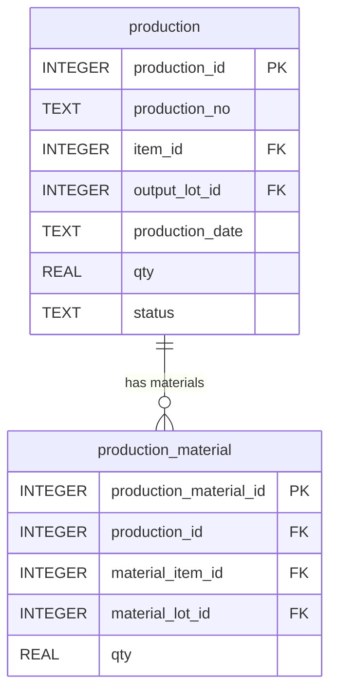
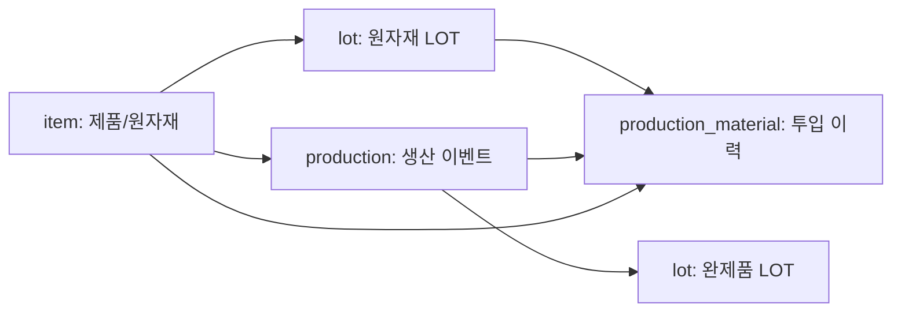

# Chapter 3. Mini MES 데이터 모델 이해

## 1. 학습 목표

이 장을 마치면 다음을 설명할 수 있다.

- 품목과 LOT의 차이를 구분할 수 있다.
- 원자재 LOT와 완제품 LOT가 각각 어디에서 생기는지 설명할 수 있다.
- 생산 이벤트와 생산 결과물을 구분할 수 있다.
- `production`과 `production_material`을 분리하는 이유를 이해할 수 있다.
- 하나의 생산이 여러 원자재를 사용하는 1:N 관계를 데이터 모델로 표현할 수 있다.

이 장은 Mini MES의 핵심 데이터 모델을 다룬다. SQL 문법보다 먼저, 어떤 현실을 어떤 테이블에 나누어 담는지 이해하는 것이 중요하다.

## 2. 현장 상황

라면공장에서 `봉지라면 매운맛` 3,000개를 생산한다고 생각해 보자. 현장에서는 단순히 완제품 3,000개가 생기는 것이 아니다. 실제로는 다음 일이 함께 일어난다.

| 순서 | 현장 활동 | 데이터로 남겨야 할 것 |
| ---: | --- | --- |
| 1 | 생산할 제품을 확인한다 | 생산 대상 품목 |
| 2 | 면 블록, 매운맛 스프, 포장재를 준비한다 | 투입 원자재 LOT |
| 3 | 생산라인에서 라면을 만든다 | 생산 이벤트 |
| 4 | 완제품이 포장되어 나온다 | 완제품 LOT |
| 5 | 원자재 재고가 줄고 완제품 재고가 늘어난다 | LOT별 `qty` 변화 |

이 흐름을 하나의 긴 문장으로만 기록하면 나중에 분석하기 어렵다. 예를 들어 `2026-07-10에 매운맛 라면 3,000개 생산, 면과 스프와 포장재 사용`이라고 적으면 사람이 읽기에는 충분해 보인다. 하지만 데이터베이스는 다음 질문에 정확히 답하기 어렵다.

- 사용한 매운맛 스프는 어느 LOT인가?
- 같은 생산에 원자재가 몇 종류 들어갔는가?
- 생산 결과로 만들어진 완제품 LOT는 무엇인가?
- 특정 원자재 LOT가 여러 생산에 나누어 사용되었는가?

Mini MES 데이터 모델은 이 질문에 답하기 위해 현실을 4개 테이블로 나누어 저장한다.

## 3. 핵심 개념

### 품목과 LOT의 차이

품목은 물건의 종류다. LOT는 그 물건의 특정 묶음이다.

| 구분 | 의미 | 예시 |
| --- | --- | --- |
| 품목 | 무엇인가 | 매운맛 스프 |
| LOT | 어느 묶음인가 | 2026-07-01에 입고된 매운맛 스프 LOT |

품목은 기준정보에 가깝다. 한 번 등록하면 자주 바뀌지 않는다. LOT는 현장 활동에서 계속 생긴다. 원자재가 입고되면 원자재 LOT가 생기고, 제품을 생산하면 완제품 LOT가 생긴다.

같은 품목도 LOT가 여러 개일 수 있다.

| 품목 | LOT 번호 | 의미 |
| --- | --- | --- |
| 매운맛 스프 | `RM-SOUP-HOT-20260701-001` | 2026-07-01 입고분 |
| 매운맛 스프 | `RM-SOUP-HOT-20260708-001` | 2026-07-08 입고분 |

품목만 저장하면 `매운맛 스프`라는 종류만 알 수 있다. LOT까지 저장해야 어느 날짜에 들어온 스프인지, 어떤 생산에 사용되었는지 알 수 있다.

### 원자재 LOT와 완제품 LOT

이 교재에서 `lot` 테이블은 원자재 LOT와 완제품 LOT를 함께 저장한다. 둘 다 LOT이기 때문이다. 다만 생기는 이유가 다르다.

| 구분 | `lot_type` | 생기는 시점 | 예시 |
| --- | --- | --- | --- |
| 원자재 LOT | `RECEIPT` | 원자재 입고 시점 | 면 블록 입고 LOT |
| 완제품 LOT | `PRODUCTION` | 생산 완료 시점 | 봉지라면 매운맛 생산 LOT |

원자재 LOT는 생산에 투입된다. 완제품 LOT는 생산 결과물이다. 같은 `lot` 테이블에 있지만 역할이 다르므로 `lot_type`으로 구분한다.

### 생산 이벤트와 생산 결과물

생산 이벤트는 `만드는 행위`다. 생산 결과물은 그 행위로 만들어진 `완제품 LOT`다.

| 개념 | 테이블 | 예시 |
| --- | --- | --- |
| 생산 이벤트 | `production` | 2026-07-10에 매운맛 라면 3,000개 생산 |
| 생산 결과물 | `lot` | `FG-RAMEN-HOT-20260710-001` |

이 둘을 구분해야 한다. 생산 이벤트에는 생산번호, 생산일자, 생산 상태가 있다. 완제품 LOT에는 LOT 번호, 현재 수량, 유통기한이 있다. 생산 이벤트와 결과물은 연결되어 있지만 같은 개념은 아니다.

### 생산과 원자재의 1:N 관계

라면 한 종류를 만들 때 원자재는 보통 여러 개가 들어간다. 매운맛 라면을 만들려면 면 블록, 매운맛 스프, 포장재가 필요하다.

| 생산 | 투입 원자재 |
| --- | --- |
| 매운맛 라면 생산 1건 | 면 블록 LOT |
| 매운맛 라면 생산 1건 | 매운맛 스프 LOT |
| 매운맛 라면 생산 1건 | 봉지 포장재 LOT |

하나의 생산 이벤트가 여러 원자재 투입 행을 가진다. 그래서 `production`과 `production_material`은 1:N 관계가 된다.

## 4. 모델링 설명

4개 테이블의 역할을 다시 정리하면 다음과 같다.

| 테이블 | 저장하는 것 | 바뀌는 빈도 |
| --- | --- | --- |
| `item` | 품목 기준정보 | 낮음 |
| `lot` | 원자재 LOT와 완제품 LOT | 입고와 생산 때마다 증가 |
| `production` | 생산 이벤트 | 생산 때마다 증가 |
| `production_material` | 생산별 원자재 투입 이력 | 생산 때마다 여러 행 증가 |

### 왜 `production`과 `production_material`을 분리하는가

`production`에는 생산 이벤트의 공통 정보가 들어간다.

| 컬럼 | 의미 |
| --- | --- |
| `production_no` | 생산번호 |
| `item_id` | 생산한 제품 품목 |
| `output_lot_id` | 생산 결과 완제품 LOT |
| `production_date` | 생산일자 |
| `qty` | 생산 수량 |
| `status` | 생산 상태 |

`production_material`에는 원자재 투입 한 줄이 들어간다.

| 컬럼 | 의미 |
| --- | --- |
| `production_id` | 어느 생산에 들어갔는가 |
| `material_item_id` | 어떤 원자재 품목인가 |
| `material_lot_id` | 어느 원자재 LOT인가 |
| `qty` | 얼마나 투입했는가 |

이렇게 나누면 하나의 생산에 원자재가 3개 들어가도 `production`은 1행만 저장하고, `production_material`은 3행을 저장하면 된다.



이 구조는 원자재 종류가 늘어나도 흔들리지 않는다. 새 원자재가 추가되면 `production_material` 행이 하나 더 늘어날 뿐이다.

### 생산 흐름 전체 관계



이 그림에서 `lot`은 두 위치에 등장한다. 하나는 생산 전에 존재하는 원자재 LOT이고, 다른 하나는 생산 후에 생기는 완제품 LOT다. 실제 테이블은 하나지만 역할을 이해하기 위해 그림에서는 나누어 표현했다.

## 5. SQL 예제

### 5.1 품목과 LOT 함께 보기

```sql
SELECT
    l.lot_no,
    i.item_code,
    i.item_name,
    i.item_type,
    l.lot_type,
    l.qty
FROM lot AS l
JOIN item AS i ON l.item_id = i.item_id
ORDER BY l.lot_id;
```

이 SQL은 LOT가 어떤 품목에 속하는지 보여 준다. 품목과 LOT의 차이를 이해할 때 가장 먼저 실행해 볼 만한 조회다.

### 5.2 원자재 LOT만 보기

```sql
SELECT
    l.lot_no,
    i.item_name,
    l.qty,
    l.received_date,
    l.expire_date
FROM lot AS l
JOIN item AS i ON l.item_id = i.item_id
WHERE l.lot_type = 'RECEIPT'
ORDER BY l.received_date, l.lot_no;
```

`lot_type = 'RECEIPT'`인 LOT는 입고로 생긴 원자재 LOT다.

### 5.3 완제품 LOT만 보기

```sql
SELECT
    l.lot_no,
    i.item_name,
    l.qty,
    l.produced_date,
    l.expire_date
FROM lot AS l
JOIN item AS i ON l.item_id = i.item_id
WHERE l.lot_type = 'PRODUCTION'
ORDER BY l.produced_date, l.lot_no;
```

`lot_type = 'PRODUCTION'`인 LOT는 생산 결과로 생긴 완제품 LOT다.

### 5.4 생산 이벤트와 결과 LOT 연결하기

```sql
SELECT
    p.production_no,
    p.production_date,
    i.item_name AS product_name,
    p.qty AS production_qty,
    l.lot_no AS output_lot_no
FROM production AS p
JOIN item AS i ON p.item_id = i.item_id
JOIN lot AS l ON p.output_lot_id = l.lot_id
ORDER BY p.production_date;
```

이 SQL은 생산 이벤트와 생산 결과물인 완제품 LOT를 함께 보여 준다.

### 5.5 생산별 원자재 투입 이력 보기

```sql
SELECT
    p.production_no,
    i.item_name AS material_name,
    l.lot_no AS material_lot_no,
    pm.qty AS used_qty
FROM production_material AS pm
JOIN production AS p ON pm.production_id = p.production_id
JOIN item AS i ON pm.material_item_id = i.item_id
JOIN lot AS l ON pm.material_lot_id = l.lot_id
ORDER BY p.production_no, i.item_name;
```

이 SQL은 하나의 생산번호 아래에 여러 원자재 투입 행이 나오는 것을 보여 준다. 이것이 생산과 원자재 투입의 1:N 관계다.

## 6. 데이터 해석

샘플 데이터에서 `PRD-20260710-001` 생산은 매운맛 라면 3,000개를 만든 생산 이벤트다. 이 이벤트의 결과물은 `FG-RAMEN-HOT-20260710-001` 완제품 LOT다.

같은 생산에 투입된 원자재는 3개다.

| 생산번호 | 원자재 | 투입 LOT | 투입 수량 |
| --- | --- | --- | ---: |
| `PRD-20260710-001` | 면 블록 | `RM-NOODLE-20260701-001` | 3,000 |
| `PRD-20260710-001` | 매운맛 스프 | `RM-SOUP-HOT-20260701-001` | 3,000 |
| `PRD-20260710-001` | 봉지 포장재 | `RM-PACK-20260701-001` | 3,000 |

여기서 중요한 해석은 다음과 같다.

- `production` 1행은 생산 이벤트 1건이다.
- `production_material` 3행은 그 생산에 사용한 원자재 3종류다.
- 생산 수량 `p.qty`와 원자재 투입 수량 `pm.qty`는 의미가 다르다.
- 완제품 LOT는 `production.output_lot_id`로 찾는다.
- 원자재 LOT는 `production_material.material_lot_id`로 찾는다.

## 7. 잘못된 설계 사례

### 7.1 생산 테이블에 원자재 컬럼을 여러 개 만드는 경우

초급자는 다음과 같은 방향을 떠올릴 수 있다.

| 생산번호 | 제품 | 원자재1 | 원자재2 | 원자재3 |
| --- | --- | --- | --- | --- |
| PRD-20260710-001 | 매운맛 라면 | 면 블록 | 매운맛 스프 | 포장재 |

이 구조는 원자재가 항상 3개일 때만 편해 보인다. 하지만 어떤 제품은 원자재가 2개일 수 있고, 어떤 제품은 5개일 수 있다. 원자재 수가 달라질 때마다 컬럼 구조를 바꿔야 한다.

`production_material`을 별도 테이블로 두면 원자재 수가 달라져도 행만 추가하면 된다.

### 7.2 완제품 LOT와 생산 이벤트를 같은 것으로 보는 경우

생산 이벤트와 완제품 LOT를 같은 개념으로 보면 다음 정보가 섞인다.

| 생산 이벤트 정보 | 완제품 LOT 정보 |
| --- | --- |
| 생산번호 | LOT 번호 |
| 생산일자 | 현재 LOT 수량 |
| 생산 상태 | 유통기한 |

생산이 취소되거나 계획 상태일 수 있다는 점도 중요하다. 생산 이벤트는 상태를 가진 업무 기록이고, 완제품 LOT는 생산 결과로 생기는 재고 묶음이다.

### 7.3 품목명만 기록하고 LOT를 기록하지 않는 경우

`매운맛 스프 사용`이라고만 기록하면 어느 스프 LOT를 사용했는지 알 수 없다. 품질 문제가 생기면 영향 범위를 좁힐 수 없다. 따라서 원자재 투입에는 품목뿐 아니라 `material_lot_id`가 반드시 필요하다.

## 8. 실습

### 실습 1. 품목과 LOT의 차이 확인하기

```sql
SELECT
    i.item_name,
    l.lot_no,
    l.lot_type,
    l.qty
FROM item AS i
JOIN lot AS l ON i.item_id = l.item_id
ORDER BY i.item_name, l.lot_no;
```

확인할 내용:

- 같은 품목이 여러 LOT를 가질 수 있는가?
- 원자재 LOT와 완제품 LOT는 어떻게 구분되는가?

### 실습 2. 생산 이벤트와 완제품 LOT 연결하기

```sql
SELECT
    p.production_no,
    p.production_date,
    p.qty,
    l.lot_no,
    l.lot_type
FROM production AS p
JOIN lot AS l ON p.output_lot_id = l.lot_id
ORDER BY p.production_no;
```

확인할 내용:

- 생산 이벤트 1건은 몇 개의 완제품 LOT와 연결되는가?
- 결과 LOT의 `lot_type`은 무엇인가?

### 실습 3. 생산별 원자재 투입 행 수 세기

```sql
SELECT
    p.production_no,
    COUNT(*) AS material_row_count
FROM production AS p
JOIN production_material AS pm ON p.production_id = pm.production_id
GROUP BY p.production_no
ORDER BY p.production_no;
```

확인할 내용:

- 각 생산에는 원자재 투입 행이 몇 개씩 있는가?
- 이 결과가 생산과 원자재의 1:N 관계를 어떻게 보여 주는가?

## 9. 확인 문제

1. 품목과 LOT의 차이를 한 문장으로 설명하시오.
2. 원자재 LOT와 완제품 LOT는 각각 언제 생기는가?
3. 생산 이벤트와 생산 결과물을 구분해야 하는 이유는 무엇인가?
4. `production`과 `production_material`을 분리하면 어떤 장점이 있는가?
5. 하나의 생산이 여러 원자재와 1:N 관계가 되는 이유를 라면공장 예시로 설명하시오.

## 10. 핵심 정리

- 품목은 물건의 종류이고, LOT는 그 물건의 특정 묶음이다.
- 원자재 LOT는 입고 시점에 생기고, 완제품 LOT는 생산 완료 시점에 생긴다.
- `production`은 생산 이벤트를 저장하고, `lot`은 생산 결과물인 완제품 LOT를 저장한다.
- `production_material`은 생산 이벤트에 투입된 원자재 LOT를 여러 행으로 저장한다.
- 생산 1건에 원자재 여러 종류가 들어가기 때문에 `production`과 `production_material`은 1:N 관계가 된다.
