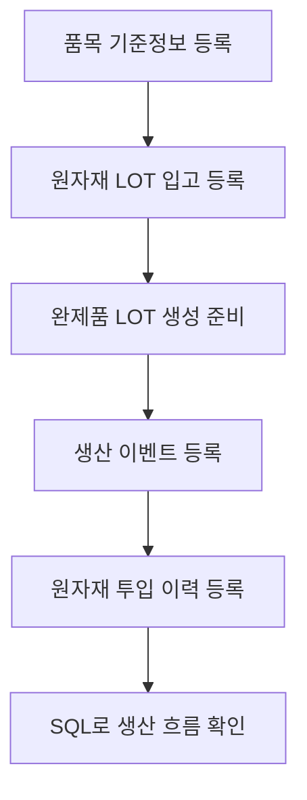
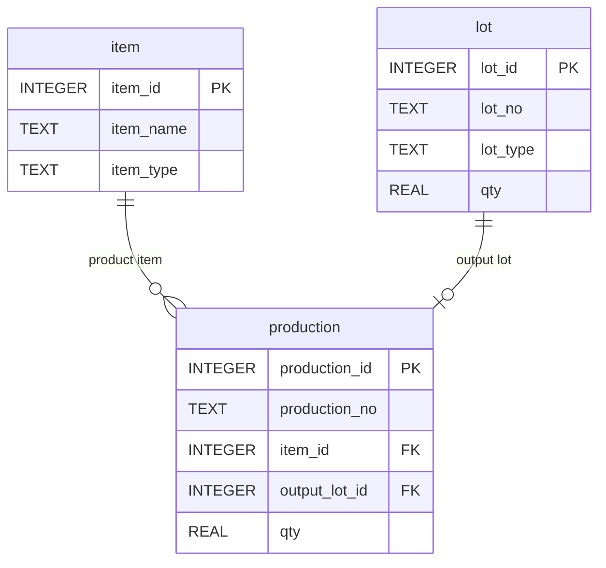
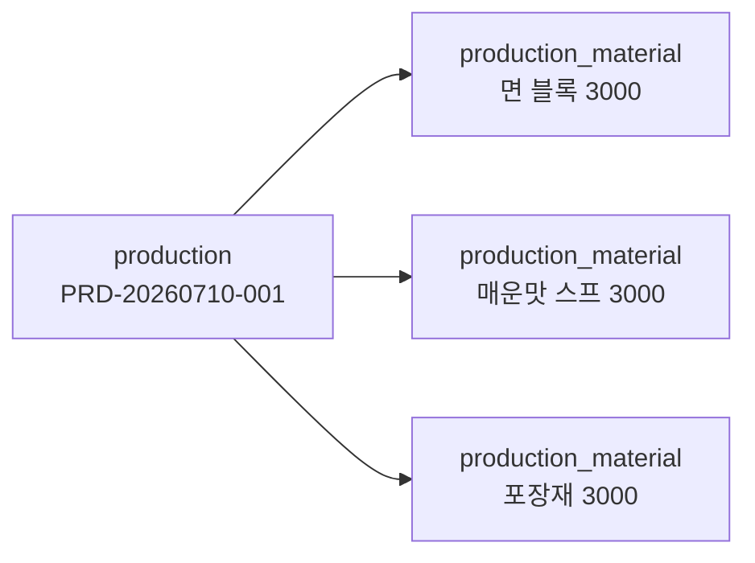

# Chapter 4. 실습 환경 준비와 생산 흐름 데이터 적재

## 1. 학습 목표

이 장을 마치면 다음을 할 수 있다.

- SQLite 기준으로 Mini MES 실습 환경을 준비할 수 있다.
- `sql/schema.sql`과 `sql/sample_data.sql`의 역할을 설명할 수 있다.
- 라면공장 생산 흐름이 어떤 순서로 데이터에 반영되는지 이해할 수 있다.
- 외래키 관계가 데이터 입력 순서에 영향을 주는 이유를 설명할 수 있다.
- 생산 이벤트, 완제품 LOT, 원자재 투입 이력을 SQL로 확인할 수 있다.

Chapter 3이 데이터 모델의 생각 과정을 다루었다면, 이 장은 그 모델을 실제 SQLite 데이터베이스에 올리고 조회하는 준비 단계다.

## 2. 현장 상황

교육장에서 Mini MES 실습을 시작한다고 생각해 보자. 강사는 교육생에게 두 개의 SQL 파일을 제공한다.

| 파일 | 역할 |
| --- | --- |
| `sql/schema.sql` | 테이블 구조를 만든다 |
| `sql/sample_data.sql` | 라면공장 예제 데이터를 입력한다 |

현장에서는 생산이 먼저 일어나는 것처럼 느껴질 수 있다. 하지만 데이터베이스에 입력할 때는 기준정보와 LOT 관계를 먼저 준비해야 한다.

라면공장의 예제 흐름은 다음과 같다.



이 순서는 외래키 때문이다. 예를 들어 `lot.item_id`는 `item.item_id`를 참조한다. 따라서 LOT를 입력하려면 먼저 품목이 있어야 한다. `production_material.production_id`는 `production.production_id`를 참조하므로, 원자재 투입 이력을 입력하려면 먼저 생산 이벤트가 있어야 한다.

## 3. 핵심 개념

### 스키마

스키마는 테이블의 구조다. 어떤 테이블이 있고, 각 테이블에 어떤 컬럼이 있으며, 어떤 테이블과 연결되는지를 정의한다.

이 교재의 스키마는 다음 네 테이블로 고정된다.

| 테이블 | 스키마에서 정하는 내용 |
| --- | --- |
| `item` | 품목 코드, 품목명, 품목 유형 |
| `lot` | LOT 번호, 품목, LOT 유형, 수량, 날짜 |
| `production` | 생산번호, 생산 품목, 결과 LOT, 생산일자, 생산 수량 |
| `production_material` | 생산별 원자재 품목, 원자재 LOT, 투입 수량 |

### 샘플 데이터

샘플 데이터는 실습을 위해 미리 넣어 둔 예제 행이다. 실제 회사 데이터가 아니라 학습용 데이터다. 하지만 구조는 실제 MES의 기본 사고와 비슷하게 만들어져 있다.

샘플 데이터의 역할은 다음과 같다.

| 데이터 | 학습 목적 |
| --- | --- |
| 제품과 원자재 품목 | `item` 기준정보 이해 |
| 원자재 입고 LOT | `RECEIPT` LOT 이해 |
| 완제품 생산 LOT | `PRODUCTION` LOT 이해 |
| 생산 이벤트 | 생산 실적 조회 이해 |
| 원자재 투입 이력 | 생산과 원자재의 1:N 관계 이해 |

### 외래키와 입력 순서

외래키는 데이터가 서로 맞물리도록 지키는 규칙이다. 예를 들어 존재하지 않는 품목으로 LOT를 만들면 안 된다. 존재하지 않는 생산 이벤트에 원자재 투입 이력을 붙여도 안 된다.

그래서 샘플 데이터는 다음 순서로 입력된다.

| 입력 순서 | 테이블 | 이유 |
| ---: | --- | --- |
| 1 | `item` | 다른 테이블이 품목을 참조한다 |
| 2 | `lot` | 생산 결과 LOT와 원자재 LOT가 필요하다 |
| 3 | `production` | 생산 이벤트가 결과 LOT를 참조한다 |
| 4 | `production_material` | 생산 이벤트와 원자재 LOT를 참조한다 |

## 4. 모델링 설명

### 라면 생산 흐름을 데이터로 나누는 사고

라면 생산을 데이터로 만들 때 가장 먼저 해야 할 일은 `무엇을 기준정보로 볼 것인가`, `무엇을 이벤트로 볼 것인가`, `무엇을 결과물로 볼 것인가`를 나누는 것이다.

| 현실의 말 | 데이터 모델 관점 | 테이블 |
| --- | --- | --- |
| 매운맛 라면이라는 제품이 있다 | 품목 기준정보 | `item` |
| 면 블록이 입고되었다 | 원자재 LOT | `lot` |
| 매운맛 라면을 생산했다 | 생산 이벤트 | `production` |
| 생산된 매운맛 라면 묶음이 생겼다 | 완제품 LOT | `lot` |
| 면 블록과 스프를 사용했다 | 원자재 투입 이력 | `production_material` |

이 구분이 명확해야 SQL도 명확해진다. 생산 이벤트와 생산 결과물, 투입 원자재를 한 테이블에 모두 넣으면 처음에는 단순해 보이지만, 조회와 추적에서 문제가 생긴다.

### 생산 이벤트와 생산 결과물의 연결

`production`에는 `output_lot_id`가 있다. 이 컬럼은 생산 결과로 만들어진 완제품 LOT를 가리킨다.



여기서 `production.item_id`는 어떤 제품을 생산했는지를 나타낸다. `production.output_lot_id`는 그 생산으로 만들어진 완제품 LOT를 나타낸다. 두 컬럼은 모두 필요하다. 제품 품목과 생산 결과 LOT는 서로 다른 개념이기 때문이다.

### 생산과 원자재 투입의 연결

`production_material`은 생산 이벤트와 원자재 LOT 사이를 연결한다. 이 테이블이 없으면 생산 1건에 원자재 여러 개를 자연스럽게 저장하기 어렵다.



이 모델에서는 원자재가 3개면 `production_material` 3행, 원자재가 5개면 5행이 된다. 테이블 구조는 바뀌지 않는다. 이것이 1:N 관계를 별도 테이블로 표현하는 이유다.

## 5. SQL 예제

### 5.1 SQLite에서 테이블 목록 확인하기

스키마와 샘플 데이터를 로드한 뒤 다음 SQL을 실행한다.

```sql
SELECT
    name
FROM sqlite_master
WHERE type = 'table'
ORDER BY name;
```

결과에는 `item`, `lot`, `production`, `production_material`이 포함되어야 한다.

### 5.2 각 테이블의 행 수 확인하기

```sql
SELECT 'item' AS table_name, COUNT(*) AS row_count FROM item
UNION ALL
SELECT 'lot' AS table_name, COUNT(*) AS row_count FROM lot
UNION ALL
SELECT 'production' AS table_name, COUNT(*) AS row_count FROM production
UNION ALL
SELECT 'production_material' AS table_name, COUNT(*) AS row_count FROM production_material;
```

이 SQL은 실습 데이터가 정상적으로 들어갔는지 빠르게 확인할 때 유용하다.

### 5.3 생산 흐름 한 번에 보기

```sql
SELECT
    p.production_no,
    p.production_date,
    product.item_name AS product_name,
    output_lot.lot_no AS output_lot_no,
    p.qty AS production_qty,
    p.status
FROM production AS p
JOIN item AS product ON p.item_id = product.item_id
JOIN lot AS output_lot ON p.output_lot_id = output_lot.lot_id
ORDER BY p.production_date;
```

이 SQL은 생산 이벤트와 완제품 LOT를 연결해서 보여 준다.

### 5.4 생산별 투입 원자재 보기

```sql
SELECT
    p.production_no,
    material.item_name AS material_name,
    material_lot.lot_no AS material_lot_no,
    pm.qty AS used_qty
FROM production AS p
JOIN production_material AS pm ON p.production_id = pm.production_id
JOIN item AS material ON pm.material_item_id = material.item_id
JOIN lot AS material_lot ON pm.material_lot_id = material_lot.lot_id
ORDER BY p.production_no, material.item_name;
```

이 SQL은 한 생산 이벤트에 여러 원자재 투입 행이 연결되는 모습을 보여 준다.

### 5.5 생산별 투입 원자재 수량 합계 보기

```sql
SELECT
    p.production_no,
    COUNT(*) AS material_count,
    SUM(pm.qty) AS total_material_qty
FROM production AS p
JOIN production_material AS pm ON p.production_id = pm.production_id
GROUP BY p.production_no
ORDER BY p.production_no;
```

이 결과에서 `material_count`는 한 생산에 투입된 원자재 행 수다. 매운맛 라면 생산 1건에 면 블록, 스프, 포장재가 들어가므로 3행이 된다.

## 6. 데이터 해석

실습 데이터가 정상적으로 들어갔다면 테이블별 행 수는 다음 의미를 가진다.

| 테이블 | 행 수의 의미 |
| --- | --- |
| `item` | 제품과 원자재 기준정보 개수 |
| `lot` | 원자재 입고 LOT와 완제품 생산 LOT 개수 |
| `production` | 생산 이벤트 개수 |
| `production_material` | 모든 생산의 원자재 투입 행 개수 |

`production`이 3행이고 `production_material`이 9행이라면, 생산 1건마다 평균 3개의 원자재 투입 행이 있다는 뜻이다. 이 데이터에서는 라면 1종을 만들 때 면 블록, 스프, 포장재 3종이 들어가는 예제로 구성되어 있다.

생산 수량과 원자재 투입 수량도 구분해야 한다.

| 컬럼 | 의미 |
| --- | --- |
| `production.qty` | 완제품을 몇 개 생산했는가 |
| `production_material.qty` | 특정 원자재 LOT를 몇 개 투입했는가 |
| `lot.qty` | 해당 LOT의 현재 수량 또는 예제상 보유 수량 |

같은 이름 `qty`를 사용하지만 테이블에 따라 의미가 다르다. 그래서 SQL을 볼 때는 반드시 어떤 테이블의 `qty`인지 함께 확인해야 한다. 예제 SQL에서 `p.qty AS production_qty`, `pm.qty AS used_qty`처럼 별칭을 붙이는 이유도 이 때문이다.

## 7. 잘못된 설계 사례

### 7.1 데이터 입력 순서를 무시하는 경우

외래키가 있는 모델에서는 아무 테이블이나 먼저 입력할 수 없다. 예를 들어 품목이 없는 상태에서 LOT를 입력하면 `lot.item_id`가 참조할 대상이 없다.

| 잘못된 순서 | 문제 |
| --- | --- |
| `lot`을 먼저 입력 | 참조할 `item`이 없을 수 있다 |
| `production_material`을 먼저 입력 | 참조할 `production`이 없을 수 있다 |
| 완제품 LOT 없이 `production` 입력 | `output_lot_id`가 가리킬 LOT가 없다 |

학습용 데이터에서는 `item`, `lot`, `production`, `production_material` 순서로 입력한다.

### 7.2 생산 수량과 원자재 수량을 같은 의미로 해석하는 경우

`production.qty = 3000`은 완제품 3,000개를 생산했다는 뜻이다. `production_material.qty = 3000`은 특정 원자재 3,000개를 투입했다는 뜻이다. 둘 다 `qty`지만 같은 업무 의미는 아니다.

| 예 | 의미 |
| --- | --- |
| `production.qty` | 생산 결과 수량 |
| `production_material.qty` | 투입 원자재 수량 |
| `lot.qty` | LOT 기준 수량 |

초급자는 같은 컬럼명만 보고 같은 의미라고 생각하기 쉽다. 실제로는 테이블의 역할과 함께 해석해야 한다.

### 7.3 원자재 투입 이력을 생략하는 경우

생산 실적과 완제품 LOT만 저장하면 `무엇을 만들었는가`는 알 수 있다. 하지만 `무엇으로 만들었는가`는 알 수 없다. 품질 문제나 원자재 사용량 분석을 하려면 `production_material`이 필요하다.

## 8. 실습

### 실습 1. 실습 데이터 로드 확인하기

```sql
SELECT 'item' AS table_name, COUNT(*) AS row_count FROM item
UNION ALL
SELECT 'lot' AS table_name, COUNT(*) AS row_count FROM lot
UNION ALL
SELECT 'production' AS table_name, COUNT(*) AS row_count FROM production
UNION ALL
SELECT 'production_material' AS table_name, COUNT(*) AS row_count FROM production_material;
```

확인할 내용:

- 네 테이블이 모두 조회되는가?
- `production_material` 행 수가 `production` 행 수보다 많은 이유는 무엇인가?

### 실습 2. 생산 이벤트와 완제품 LOT 조회하기

```sql
SELECT
    p.production_no,
    product.item_name AS product_name,
    output_lot.lot_no AS output_lot_no,
    p.qty AS production_qty
FROM production AS p
JOIN item AS product ON p.item_id = product.item_id
JOIN lot AS output_lot ON p.output_lot_id = output_lot.lot_id
ORDER BY p.production_no;
```

확인할 내용:

- 각 생산 이벤트는 어떤 완제품 LOT를 만들었는가?
- 생산 품목명과 LOT 번호는 같은 의미인가?

### 실습 3. 하나의 생산번호에 연결된 원자재 확인하기

```sql
SELECT
    p.production_no,
    material.item_name AS material_name,
    material_lot.lot_no AS material_lot_no,
    pm.qty AS used_qty
FROM production AS p
JOIN production_material AS pm ON p.production_id = pm.production_id
JOIN item AS material ON pm.material_item_id = material.item_id
JOIN lot AS material_lot ON pm.material_lot_id = material_lot.lot_id
WHERE p.production_no = 'PRD-20260710-001'
ORDER BY material.item_name;
```

확인할 내용:

- 이 생산에는 원자재가 몇 종류 들어갔는가?
- 각 원자재의 LOT 번호는 무엇인가?
- 같은 생산번호가 여러 행으로 나오는 이유는 무엇인가?

## 9. 확인 문제

1. `sql/schema.sql`과 `sql/sample_data.sql`의 역할을 각각 설명하시오.
2. 샘플 데이터를 `item`, `lot`, `production`, `production_material` 순서로 입력하는 이유는 무엇인가?
3. `production.output_lot_id`는 무엇을 가리키는가?
4. `production_material.material_lot_id`는 무엇을 가리키는가?
5. `production.qty`와 `production_material.qty`의 의미 차이를 설명하시오.
6. 생산 1건에 원자재 투입 행이 여러 개 생기는 이유를 설명하시오.

## 10. 핵심 정리

- SQLite 실습은 스키마 생성 후 샘플 데이터 입력 순서로 진행한다.
- 외래키 관계 때문에 기준정보와 참조 대상 데이터를 먼저 준비해야 한다.
- 생산 이벤트는 `production`, 생산 결과 완제품 LOT는 `lot`에 저장된다.
- 원자재 투입 이력은 `production_material`에 여러 행으로 저장된다.
- `qty`는 공통 수량 컬럼명이지만, 테이블에 따라 생산 수량, 투입 수량, LOT 수량으로 해석해야 한다.
