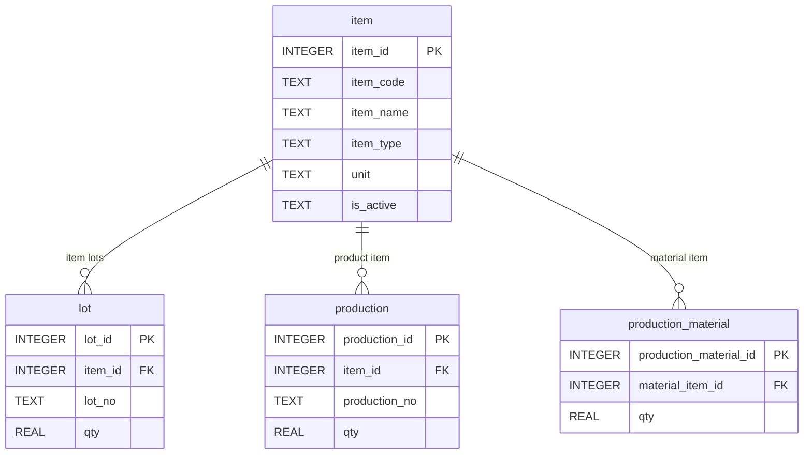

# Chapter 6. 품목 기준정보 조회

## 1. 학습 목표

이 장을 마치면 다음을 할 수 있다.

- `item` 테이블이 Mini MES에서 어떤 기준정보 역할을 하는지 설명할 수 있다.
- 제품과 원자재를 `item_type`으로 구분할 수 있다.
- `is_active`를 사용해 사용 중인 품목만 조회할 수 있다.
- 품목 코드와 품목명으로 필요한 품목을 검색할 수 있다.
- 품목 기준정보에서 발생할 수 있는 오류를 SQL로 점검할 수 있다.

품목 기준정보는 MES 데이터의 출발점이다. 생산, LOT, 원자재 투입 이력은 모두 품목을 참조한다. 품목 기준정보가 흔들리면 뒤의 데이터도 함께 흔들린다.

## 2. 현장 상황

라면공장에는 완제품과 원자재가 함께 존재한다. 생산팀은 `봉지라면 매운맛`을 제품으로 보고, 창고팀은 `면 블록`, `스프`, `포장재`를 원자재로 본다. 하지만 데이터베이스에서는 이들을 모두 품목으로 관리한다.

| 현장 표현 | 데이터 모델 표현 | 저장 위치 |
| --- | --- | --- |
| 매운맛 라면 제품 | 제품 품목 | `item` |
| 순한맛 라면 제품 | 제품 품목 | `item` |
| 면 블록 | 원자재 품목 | `item` |
| 매운맛 스프 | 원자재 품목 | `item` |
| 포장재 | 원자재 품목 | `item` |

만약 제품과 원자재를 제각각 다른 이름과 규칙으로 관리하면 생산 실적과 LOT를 연결하기 어려워진다. 그래서 이 교재에서는 제품과 원자재를 모두 `item`에 저장하고, `item_type`으로 구분한다.

품목 기준정보가 필요한 대표 업무는 다음과 같다.

| 업무 | 필요한 품목 정보 |
| --- | --- |
| 생산 실적 등록 | 생산할 제품 품목 |
| 원자재 입고 등록 | 입고된 원자재 품목 |
| LOT 조회 | LOT가 어떤 품목인지 확인 |
| 원자재 투입 이력 조회 | 투입된 원자재 품목 확인 |

## 3. 핵심 개념

### 기준정보

기준정보는 여러 업무에서 공통으로 참조하는 기본 데이터다. 품목 기준정보는 제품과 원자재의 이름, 코드, 유형, 단위를 담는다.

| 컬럼 | 의미 | 예시 |
| --- | --- | --- |
| `item_id` | 내부 식별자 | `1` |
| `item_code` | 품목 코드 | `FG-RAMEN-001` |
| `item_name` | 품목명 | `봉지라면 매운맛` |
| `item_type` | 품목 유형 | `PRODUCT` |
| `unit` | 단위 | `EA` |
| `is_active` | 사용 여부 | `Y` |

`item_id`는 테이블 사이를 연결할 때 사용한다. 현장 사용자는 보통 `item_code`나 `item_name`을 더 자주 본다.

### 제품과 원자재

`item_type`은 품목이 제품인지 원자재인지 구분한다.

| `item_type` | 의미 | 예시 |
| --- | --- | --- |
| `PRODUCT` | 생산 결과로 만들어지는 완제품 | 봉지라면 매운맛 |
| `MATERIAL` | 생산에 투입되는 원자재 | 면 블록, 스프, 포장재 |

하나의 `item` 테이블에 함께 저장하면 `lot`, `production`, `production_material`이 모두 같은 품목 기준을 참조할 수 있다.

### 사용 여부

`is_active`는 현재 사용하는 품목인지 나타낸다.

| 값 | 의미 |
| --- | --- |
| `Y` | 사용 중 |
| `N` | 사용하지 않음 |

실제 공장에서는 단종 제품이나 더 이상 사용하지 않는 원자재가 생길 수 있다. 이때 데이터를 삭제하기보다 사용 여부를 바꾸는 방식이 흔하다. 과거 생산 이력과 LOT가 그 품목을 참조할 수 있기 때문이다.

## 4. 모델링 설명

`item`은 다른 테이블의 출발점이다. `lot`, `production`, `production_material`은 모두 품목을 참조한다.



관계를 문장으로 바꾸면 다음과 같다.

- `lot.item_id`는 LOT가 어떤 품목인지 알려 준다.
- `production.item_id`는 어떤 제품을 생산했는지 알려 준다.
- `production_material.material_item_id`는 어떤 원자재를 투입했는지 알려 준다.

같은 `item`을 참조하지만 의미는 테이블마다 다르다. `production.item_id`는 제품이어야 하고, `production_material.material_item_id`는 원자재여야 한다. 이 교재의 스키마는 초급 학습을 위해 이 업무 규칙을 복잡한 제약으로 강제하지 않는다. 대신 SQL 조회로 데이터가 올바른지 확인하는 연습을 한다.

## 5. SQL 예제

### 5.1 품목 전체 조회

```sql
SELECT
    item_id,
    item_code,
    item_name,
    item_type,
    unit,
    is_active
FROM item
ORDER BY item_id;
```

품목 기준정보의 전체 모습을 확인한다.

### 5.2 제품 품목만 조회

```sql
SELECT
    item_code,
    item_name,
    unit
FROM item
WHERE item_type = 'PRODUCT'
ORDER BY item_code;
```

생산 결과로 만들어지는 완제품만 조회한다.

### 5.3 원자재 품목만 조회

```sql
SELECT
    item_code,
    item_name,
    unit
FROM item
WHERE item_type = 'MATERIAL'
ORDER BY item_code;
```

생산에 투입되는 원자재만 조회한다.

### 5.4 사용 중인 품목 조회

```sql
SELECT
    item_code,
    item_name,
    item_type
FROM item
WHERE is_active = 'Y'
ORDER BY item_type, item_code;
```

현재 사용 중인 품목만 조회한다. 샘플 데이터는 모든 품목이 사용 중이다.

### 5.5 품목명으로 검색

```sql
SELECT
    item_code,
    item_name,
    item_type
FROM item
WHERE item_name LIKE '%스프%'
ORDER BY item_code;
```

`LIKE`는 문자열 검색에 사용한다. 이 SQL은 품목명에 `스프`가 들어간 품목을 찾는다.

### 5.6 품목 유형별 개수 세기

```sql
SELECT
    item_type,
    COUNT(*) AS item_count
FROM item
GROUP BY item_type
ORDER BY item_type;
```

제품과 원자재가 각각 몇 개인지 확인한다.

### 5.7 LOT에서 사용 중인 품목 확인

```sql
SELECT
    i.item_code,
    i.item_name,
    COUNT(l.lot_id) AS lot_count
FROM item AS i
LEFT JOIN lot AS l ON i.item_id = l.item_id
GROUP BY i.item_id, i.item_code, i.item_name
ORDER BY i.item_code;
```

이 SQL은 품목별 LOT 개수를 보여 준다. `LEFT JOIN`은 뒤 장에서 더 자세히 다루지만, 여기서는 품목 기준정보가 LOT와 연결된다는 점을 확인하는 용도로 사용한다.

### 5.8 생산 실적에 사용된 제품 품목 확인

```sql
SELECT
    i.item_code,
    i.item_name,
    COUNT(p.production_id) AS production_count
FROM item AS i
JOIN production AS p ON i.item_id = p.item_id
GROUP BY i.item_id, i.item_code, i.item_name
ORDER BY i.item_code;
```

이 SQL은 생산 실적에 등장한 제품 품목을 보여 준다.

## 6. 데이터 해석

샘플 데이터의 `item` 테이블에는 6개 품목이 있다.

| 유형 | 품목 수 | 예시 |
| --- | ---: | --- |
| `PRODUCT` | 2 | 봉지라면 매운맛, 봉지라면 순한맛 |
| `MATERIAL` | 4 | 면 블록, 스프, 포장재 |

품목 조회에서 중요한 점은 품목 자체가 재고 수량을 뜻하지 않는다는 것이다. `item`은 물건의 종류를 정의한다. 실제 재고 묶음과 수량은 `lot`에 있다.

| 질문 | 확인할 테이블 |
| --- | --- |
| 매운맛 스프라는 품목이 등록되어 있는가? | `item` |
| 매운맛 스프 LOT가 몇 개 남아 있는가? | `lot` |
| 매운맛 스프가 어느 생산에 투입되었는가? | `production_material` |

품목 기준정보를 잘 관리하면 생산, LOT, 투입 이력을 안정적으로 연결할 수 있다.

## 7. 잘못된 설계 사례

### 7.1 품목명을 생산 실적에 직접 입력하는 경우

생산 실적에 `봉지라면 매운맛`이라는 문자열을 직접 입력하면 오타와 표기 차이가 생길 수 있다.

| 입력값 | 문제 |
| --- | --- |
| 봉지라면 매운맛 | 정상 |
| 봉지 라면 매운맛 | 공백 차이 |
| 매운맛 봉지라면 | 표현 순서 차이 |

이런 값은 사람이 보면 비슷하지만 데이터베이스는 다른 문자열로 본다. 그래서 `production.item_id`로 `item`을 참조해야 한다.

### 7.2 제품과 원자재를 테이블 이름으로 나누는 경우

제품과 원자재를 처음부터 서로 다른 기준정보로 나누면, LOT나 생산 이력에서 품목을 공통으로 참조하기 어려워진다. 이 교재는 `item` 하나로 제품과 원자재를 모두 관리하고 `item_type`으로 구분한다.

### 7.3 사용하지 않는 품목을 삭제하는 경우

과거 생산 이력이나 LOT가 어떤 품목을 참조하고 있는데 그 품목을 삭제하면 이력이 깨진다. 실제 운영에서는 삭제보다 `is_active = 'N'`처럼 사용 여부를 바꾸는 방식을 고려한다.

## 8. 실습

### 실습 1. 제품과 원자재 목록 나누어 보기

```sql
SELECT
    item_type,
    item_code,
    item_name
FROM item
ORDER BY item_type, item_code;
```

확인할 내용:

- 제품은 몇 개인가?
- 원자재는 몇 개인가?
- `ORDER BY item_type, item_code`는 어떤 순서로 정렬하는가?

### 실습 2. 스프 품목 검색하기

```sql
SELECT
    item_code,
    item_name,
    item_type
FROM item
WHERE item_name LIKE '%스프%'
ORDER BY item_code;
```

확인할 내용:

- 검색 결과는 몇 개인가?
- 검색된 품목은 제품인가, 원자재인가?

### 실습 3. 품목 유형별 개수 확인하기

```sql
SELECT
    item_type,
    COUNT(*) AS item_count
FROM item
GROUP BY item_type
ORDER BY item_type;
```

확인할 내용:

- `PRODUCT`는 몇 개인가?
- `MATERIAL`은 몇 개인가?

### 실습 4. 생산에 사용된 제품 품목 확인하기

```sql
SELECT
    i.item_code,
    i.item_name,
    COUNT(p.production_id) AS production_count
FROM item AS i
JOIN production AS p ON i.item_id = p.item_id
GROUP BY i.item_id, i.item_code, i.item_name
ORDER BY production_count DESC, i.item_code;
```

확인할 내용:

- 생산 실적에 등장한 제품은 무엇인가?
- 생산 횟수가 가장 많은 제품은 무엇인가?

### 실습 5. 원자재 투입 이력에 등장한 품목 확인하기

```sql
SELECT
    i.item_code,
    i.item_name,
    COUNT(pm.production_material_id) AS use_count
FROM item AS i
JOIN production_material AS pm ON i.item_id = pm.material_item_id
GROUP BY i.item_id, i.item_code, i.item_name
ORDER BY use_count DESC, i.item_code;
```

확인할 내용:

- 원자재 투입 이력에 등장한 품목은 무엇인가?
- 가장 자주 등장한 원자재는 무엇인가?

## 9. 확인 문제

1. `item` 테이블이 기준정보인 이유를 설명하시오.
2. 제품과 원자재를 구분하는 컬럼은 무엇인가?
3. `item_id`와 `item_code`의 차이를 설명하시오.
4. 품목 기준정보에서 `is_active`가 필요한 이유는 무엇인가?
5. 품목명을 생산 실적에 직접 입력하면 어떤 문제가 생길 수 있는가?
6. 품목과 LOT의 차이를 `item`과 `lot` 테이블 관점에서 설명하시오.

## 10. 핵심 정리

- `item`은 제품과 원자재의 기준정보를 저장한다.
- 제품과 원자재는 `item_type`으로 구분한다.
- `item_id`는 다른 테이블과 연결하기 위한 내부 식별자다.
- 품목 기준정보는 `lot`, `production`, `production_material`에서 참조된다.
- 품목은 물건의 종류이고, LOT는 그 물건의 실제 묶음이다.
- 품목 기준정보가 정확해야 생산, 재고, 투입 이력 조회도 정확해진다.
