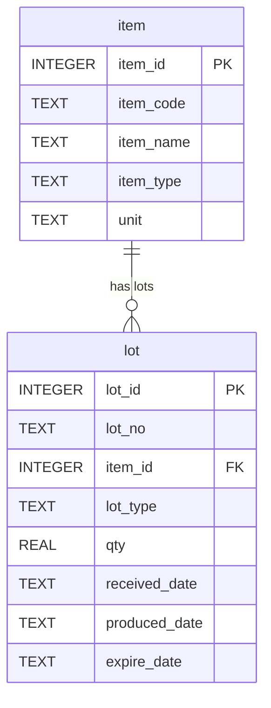
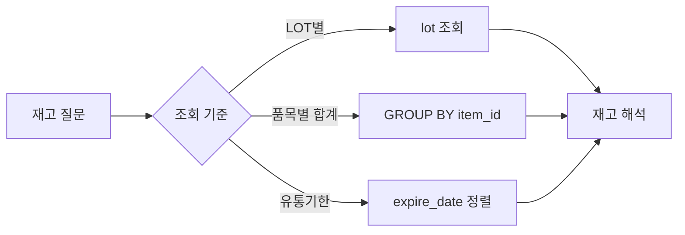

# Chapter 7. LOT 재고 조회

## 1. 학습 목표

이 장을 마치면 다음을 할 수 있다.

- LOT 재고가 품목 재고와 어떻게 다른지 설명할 수 있다.
- `lot` 테이블에서 원자재 LOT와 완제품 LOT를 구분해 조회할 수 있다.
- 품목별 LOT 수량 합계를 계산할 수 있다.
- 유통기한이 임박한 LOT를 SQL로 찾을 수 있다.
- LOT 재고 조회 결과를 생산과 품질 관점에서 해석할 수 있다.

LOT 재고 조회는 MES에서 가장 자주 사용하는 조회 중 하나다. 재고가 있는지 없는지만 보는 것이 아니라, 어떤 LOT가 얼마나 있고 언제까지 사용할 수 있는지를 함께 확인해야 한다.

## 2. 현장 상황

라면공장 창고 담당자가 오늘 사용할 원자재를 확인한다고 생각해 보자. 단순히 `면 블록이 10,000개 있다`는 정보만으로는 부족할 수 있다. 어느 LOT인지, 유통기한은 언제인지, 생산에 사용할 수 있는 상태인지 확인해야 한다.

생산 담당자는 완제품 재고도 확인해야 한다. 같은 매운맛 라면이라도 2026-07-10에 생산된 LOT와 2026-07-12에 생산된 LOT는 서로 다른 재고 묶음이다.

| 현장 질문 | 필요한 조회 |
| --- | --- |
| 현재 LOT별 수량은 얼마인가? | `lot` 전체 조회 |
| 원자재 LOT만 보고 싶은가? | `lot_type = 'RECEIPT'` 조건 |
| 완제품 LOT만 보고 싶은가? | `lot_type = 'PRODUCTION'` 조건 |
| 품목별 총 재고는 얼마인가? | `GROUP BY item_id` |
| 유통기한이 빠른 LOT는 무엇인가? | `expire_date` 정렬 |

LOT 재고를 관리하면 선입선출, 품질 추적, 유통기한 관리가 가능해진다. 특히 식품 공장에서는 유통기한이 중요한 관리 기준이다.

## 3. 핵심 개념

### LOT 재고

LOT 재고는 LOT 단위로 관리하는 수량이다. `lot.qty`는 해당 LOT의 수량을 뜻한다.

| LOT 번호 | 품목 | LOT 유형 | 수량 |
| --- | --- | --- | ---: |
| `RM-NOODLE-20260701-001` | 면 블록 | 원자재 LOT | 10,000 |
| `FG-RAMEN-HOT-20260710-001` | 봉지라면 매운맛 | 완제품 LOT | 3,000 |

품목 기준으로 보면 같은 품목의 LOT가 여러 개 있을 수 있다. LOT 기준으로 보면 각 묶음의 수량과 날짜를 따로 관리할 수 있다.

### 현재 재고 수량

이 교재의 샘플 데이터에서 `lot.qty`는 현재 LOT 수량으로 사용한다. 실제 시스템에서는 입고, 생산, 출고, 폐기, 조정 같은 이벤트로 LOT 수량이 계속 바뀔 수 있다. 하지만 이 교재는 입문용이므로 `lot` 테이블의 `qty`를 조회하여 현재 수량을 확인한다.

### 유통기한

`expire_date`는 유통기한 또는 사용기한을 저장한다. 날짜는 `YYYY-MM-DD` 형식의 `TEXT`로 저장한다.

SQLite에서는 이 형식의 날짜 문자열을 정렬하면 날짜 순서대로 정렬된다.

| 날짜 문자열 | 정렬 의미 |
| --- | --- |
| `2026-10-01` | 2026년 10월 1일 |
| `2026-12-31` | 2026년 12월 31일 |
| `2027-01-10` | 2027년 1월 10일 |

### 원자재 LOT와 완제품 LOT의 재고 관점

원자재 LOT는 생산에 투입될 수 있는 재고다. 완제품 LOT는 고객에게 출고될 수 있는 재고다.

| LOT 유형 | 재고 관점 | 예시 업무 |
| --- | --- | --- |
| `RECEIPT` | 생산에 사용할 원자재 재고 | 생산 전 자재 확인 |
| `PRODUCTION` | 출고 가능한 완제품 재고 | 완제품 출하 준비 |

## 4. 모델링 설명

LOT 재고 조회의 중심 테이블은 `lot`이다. 하지만 실제 보고서에서는 품목 코드와 품목명이 필요하므로 `item`과 함께 조회하는 경우가 많다.



`lot.item_id`는 `item.item_id`를 참조한다. 따라서 LOT 재고 조회에서 다음을 연결할 수 있다.

- LOT 번호는 `lot.lot_no`에서 확인한다.
- LOT 수량은 `lot.qty`에서 확인한다.
- 품목명은 `item.item_name`에서 확인한다.
- 원자재인지 완제품인지는 `item.item_type`과 `lot.lot_type`을 함께 보면 더 명확하다.

LOT 재고 조회 흐름은 다음과 같다.



## 5. SQL 예제

### 5.1 LOT 전체 재고 조회

```sql
SELECT
    lot_id,
    lot_no,
    item_id,
    lot_type,
    qty,
    received_date,
    produced_date,
    expire_date
FROM lot
ORDER BY lot_id;
```

이 SQL은 LOT 재고의 기본 형태를 보여 준다.

### 5.2 품목명과 함께 LOT 재고 조회

```sql
SELECT
    l.lot_no,
    i.item_code,
    i.item_name,
    l.lot_type,
    l.qty,
    l.expire_date
FROM lot AS l
JOIN item AS i ON l.item_id = i.item_id
ORDER BY i.item_code, l.lot_no;
```

실제 업무에서는 `item_id`만 보는 것보다 품목 코드와 품목명을 함께 보는 것이 이해하기 쉽다.

### 5.3 원자재 LOT 재고 조회

```sql
SELECT
    l.lot_no,
    i.item_name,
    l.qty,
    l.received_date,
    l.expire_date
FROM lot AS l
JOIN item AS i ON l.item_id = i.item_id
WHERE l.lot_type = 'RECEIPT'
ORDER BY l.received_date, l.lot_no;
```

입고로 생긴 원자재 LOT만 조회한다.

### 5.4 완제품 LOT 재고 조회

```sql
SELECT
    l.lot_no,
    i.item_name,
    l.qty,
    l.produced_date,
    l.expire_date
FROM lot AS l
JOIN item AS i ON l.item_id = i.item_id
WHERE l.lot_type = 'PRODUCTION'
ORDER BY l.produced_date, l.lot_no;
```

생산으로 생긴 완제품 LOT만 조회한다.

### 5.5 품목별 LOT 수량 합계

```sql
SELECT
    i.item_code,
    i.item_name,
    i.item_type,
    SUM(l.qty) AS total_qty
FROM item AS i
JOIN lot AS l ON i.item_id = l.item_id
GROUP BY i.item_id, i.item_code, i.item_name, i.item_type
ORDER BY i.item_code;
```

품목별 총 LOT 수량을 계산한다. 같은 품목에 여러 LOT가 있으면 합산된다.

### 5.6 LOT 유형별 수량 합계

```sql
SELECT
    lot_type,
    COUNT(*) AS lot_count,
    SUM(qty) AS total_qty
FROM lot
GROUP BY lot_type
ORDER BY lot_type;
```

원자재 LOT와 완제품 LOT의 개수와 수량 합계를 비교할 수 있다.

### 5.7 유통기한이 있는 LOT 조회

```sql
SELECT
    l.lot_no,
    i.item_name,
    l.lot_type,
    l.qty,
    l.expire_date
FROM lot AS l
JOIN item AS i ON l.item_id = i.item_id
WHERE l.expire_date IS NOT NULL
ORDER BY l.expire_date, l.lot_no;
```

유통기한이 빠른 LOT부터 정렬한다.

### 5.8 유통기한이 2026년 안에 끝나는 LOT 조회

```sql
SELECT
    l.lot_no,
    i.item_name,
    l.qty,
    l.expire_date
FROM lot AS l
JOIN item AS i ON l.item_id = i.item_id
WHERE l.expire_date BETWEEN '2026-01-01' AND '2026-12-31'
ORDER BY l.expire_date;
```

날짜가 `YYYY-MM-DD` 형식의 `TEXT`이므로 범위 조건을 사용할 수 있다.

### 5.9 수량이 3,000 이상인 LOT 조회

```sql
SELECT
    lot_no,
    lot_type,
    qty
FROM lot
WHERE qty >= 3000
ORDER BY qty DESC, lot_no;
```

큰 수량의 LOT를 먼저 확인할 때 사용한다.

## 6. 데이터 해석

LOT 재고 조회 결과를 해석할 때는 다음 세 가지를 함께 봐야 한다.

| 항목 | 확인 이유 |
| --- | --- |
| `lot_type` | 원자재 LOT인지 완제품 LOT인지 구분 |
| `qty` | 해당 LOT에 남아 있는 수량 확인 |
| `expire_date` | 먼저 사용하거나 출고해야 할 LOT 확인 |

예를 들어 `RM-NOODLE-20260701-001`은 면 블록 원자재 LOT다. `qty`가 10,000이면 현재 예제 데이터 기준으로 면 블록 LOT 수량이 10,000개 있다는 뜻이다.

`FG-RAMEN-HOT-20260710-001`은 완제품 생산 LOT다. 이것은 원자재가 아니라 생산 결과물이다. 같은 `lot` 테이블에 있지만 `lot_type`이 다르므로 업무 의미가 다르다.

품목별 합계 조회는 전체 재고 규모를 볼 때 유용하다. 하지만 품목별 합계만 보면 유통기한이나 LOT 번호가 사라진다.

| 조회 방식 | 장점 | 놓치는 정보 |
| --- | --- | --- |
| LOT별 조회 | LOT 번호와 유통기한을 볼 수 있다 | 품목 전체 합계는 직접 계산해야 한다 |
| 품목별 합계 | 전체 재고 규모를 빠르게 볼 수 있다 | LOT별 유통기한과 출처가 보이지 않는다 |

따라서 현장에서는 두 조회를 목적에 따라 함께 사용한다.

## 7. 잘못된 설계 사례

### 7.1 품목별 총재고만 저장하는 경우

품목별 총재고만 저장하면 `매운맛 스프가 총 몇 개 있다`는 질문에는 답할 수 있다. 하지만 어느 LOT가 남아 있는지 알 수 없다.

| 필요한 질문 | 품목별 총재고만 있을 때 |
| --- | --- |
| 유통기한이 가장 빠른 LOT는 무엇인가? | 답하기 어렵다 |
| 특정 LOT가 어느 생산에 사용되었는가? | 답하기 어렵다 |
| 문제가 있는 LOT만 격리할 수 있는가? | 답하기 어렵다 |

LOT 재고를 관리해야 품질과 추적성 업무가 가능하다.

### 7.2 유통기한을 자유로운 문장으로 저장하는 경우

유통기한을 `2026년 10월`, `10/01/2026`, `올해 말`처럼 제각각 저장하면 정렬과 범위 검색이 어렵다. 이 교재에서는 날짜를 `YYYY-MM-DD` 형식의 `TEXT`로 저장한다.

### 7.3 원자재 LOT와 완제품 LOT를 구분하지 않는 경우

원자재 LOT와 완제품 LOT가 모두 LOT라는 이유로 구분값 없이 저장하면 재고 해석이 어려워진다. `lot_type`을 사용해 `RECEIPT`와 `PRODUCTION`을 구분해야 한다.

## 8. 실습

### 실습 1. LOT별 재고와 품목명 조회하기

```sql
SELECT
    l.lot_no,
    i.item_name,
    l.lot_type,
    l.qty
FROM lot AS l
JOIN item AS i ON l.item_id = i.item_id
ORDER BY l.lot_type, l.lot_no;
```

확인할 내용:

- 원자재 LOT는 몇 개인가?
- 완제품 LOT는 몇 개인가?
- 가장 수량이 큰 LOT는 무엇인가?

### 실습 2. 품목별 재고 합계 구하기

```sql
SELECT
    i.item_name,
    SUM(l.qty) AS total_qty
FROM item AS i
JOIN lot AS l ON i.item_id = l.item_id
GROUP BY i.item_id, i.item_name
ORDER BY total_qty DESC;
```

확인할 내용:

- 총수량이 가장 큰 품목은 무엇인가?
- 같은 품목에 여러 LOT가 있으면 어떻게 계산되는가?

### 실습 3. 유통기한 임박 LOT 찾기

```sql
SELECT
    l.lot_no,
    i.item_name,
    l.qty,
    l.expire_date
FROM lot AS l
JOIN item AS i ON l.item_id = i.item_id
WHERE l.expire_date IS NOT NULL
ORDER BY l.expire_date
LIMIT 3;
```

확인할 내용:

- 유통기한이 가장 빠른 LOT는 무엇인가?
- `LIMIT 3`은 어떤 역할을 하는가?

### 실습 4. 원자재 LOT 중 수량이 7,000 이상인 LOT 찾기

```sql
SELECT
    l.lot_no,
    i.item_name,
    l.qty,
    l.received_date
FROM lot AS l
JOIN item AS i ON l.item_id = i.item_id
WHERE l.lot_type = 'RECEIPT'
  AND l.qty >= 7000
ORDER BY l.qty DESC;
```

확인할 내용:

- 조건을 만족하는 원자재 LOT는 몇 개인가?
- 가장 수량이 큰 원자재 LOT는 무엇인가?

## 9. 확인 문제

1. LOT 재고와 품목별 총재고의 차이를 설명하시오.
2. 원자재 LOT와 완제품 LOT를 구분하는 컬럼은 무엇인가?
3. `lot.qty`는 무엇을 의미하는가?
4. 유통기한이 빠른 LOT부터 조회하려면 어떤 컬럼으로 정렬해야 하는가?
5. 품목별 재고 합계를 구할 때 사용하는 SQL 키워드는 무엇인가?
6. 날짜를 `YYYY-MM-DD` 형식으로 저장하면 어떤 장점이 있는가?

## 10. 핵심 정리

- LOT 재고는 품목의 실제 묶음 단위 수량이다.
- `lot_type`으로 원자재 LOT와 완제품 LOT를 구분한다.
- `lot.qty`는 해당 LOT의 수량을 의미한다.
- 품목별 총재고는 `GROUP BY`와 `SUM(qty)`로 계산할 수 있다.
- 유통기한 관리는 `expire_date`를 기준으로 조회하고 정렬한다.
- LOT별 조회와 품목별 합계 조회는 목적이 다르므로 함께 이해해야 한다.
