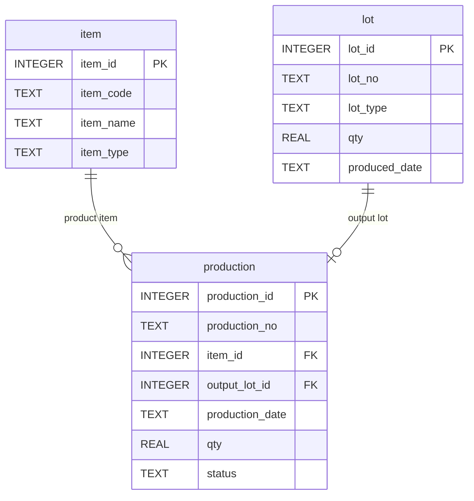
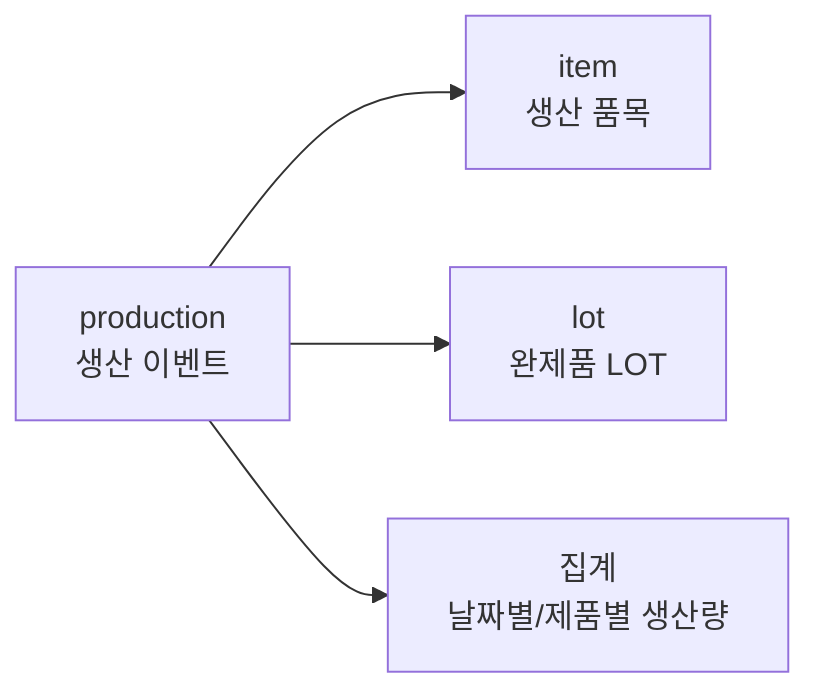

# Chapter 8. 생산 실적 조회

## 1. 학습 목표

이 장을 마치면 다음을 할 수 있다.

- `production` 테이블이 생산 이벤트를 저장하는 방식으로 이해할 수 있다.
- 생산일자별 생산 실적을 조회할 수 있다.
- 생산 상태 `status`의 의미를 설명할 수 있다.
- 제품별 생산량을 집계할 수 있다.
- 생산 실적과 완제품 LOT를 연결해서 조회할 수 있다.

생산 실적은 MES의 핵심 데이터다. 공장에서 실제로 무엇을, 언제, 얼마나 만들었는지를 기록하기 때문이다. 이 장에서는 생산 실적을 단순 목록으로 보는 것에서 시작해, 완제품 LOT와 연결해서 해석하는 방법까지 다룬다.

## 2. 현장 상황

라면공장 생산 관리자가 하루 생산 현황을 확인하려고 한다. 관리자가 알고 싶은 내용은 다음과 같다.

| 현장 질문 | 필요한 데이터 |
| --- | --- |
| 오늘 어떤 제품을 생산했는가? | 생산일자, 생산 품목 |
| 얼마나 생산했는가? | `production.qty` |
| 생산이 완료되었는가? | `production.status` |
| 생산 결과로 어떤 LOT가 생겼는가? | `production.output_lot_id`, `lot.lot_no` |
| 제품별 누적 생산량은 얼마인가? | 제품별 `SUM(qty)` |

생산 실적은 현장 작업의 결과 기록이다. 하지만 생산 실적만 보면 완제품 LOT 번호가 바로 보이지 않을 수 있다. 그래서 `production`과 `lot`을 연결해서 생산 이벤트와 생산 결과물을 함께 봐야 한다.

예를 들어 `PRD-20260710-001` 생산 실적은 `2026-07-10에 봉지라면 매운맛 3,000개를 생산했다`는 이벤트다. 이 생산의 결과로 `FG-RAMEN-HOT-20260710-001` 완제품 LOT가 생긴다.

## 3. 핵심 개념

### 생산 실적

생산 실적은 특정 날짜에 어떤 제품을 얼마나 생산했는지 기록한 데이터다. 이 교재에서는 `production` 테이블에 저장한다.

| 컬럼 | 의미 | 예시 |
| --- | --- | --- |
| `production_id` | 생산 실적 내부 식별자 | `1` |
| `production_no` | 현장에서 사용하는 생산번호 | `PRD-20260710-001` |
| `item_id` | 생산한 제품 품목 | `1` |
| `output_lot_id` | 생산 결과 완제품 LOT | `5` |
| `production_date` | 생산일자 | `2026-07-10` |
| `qty` | 생산 수량 | `3000` |
| `status` | 생산 상태 | `COMPLETED` |

### 생산 상태

`status`는 생산 실적의 상태를 나타낸다.

| 상태 | 의미 |
| --- | --- |
| `PLANNED` | 생산 예정 |
| `COMPLETED` | 생산 완료 |
| `CANCELED` | 생산 취소 |

현재 샘플 데이터는 모두 `COMPLETED` 상태다. 하지만 실제 현장에서는 계획, 완료, 취소 상태가 섞일 수 있다. 생산량 집계에서는 보통 완료된 생산만 계산한다.

### 생산 이벤트와 완제품 LOT

생산 이벤트와 완제품 LOT는 연결되어 있지만 같은 개념은 아니다.

| 구분 | 테이블 | 의미 |
| --- | --- | --- |
| 생산 이벤트 | `production` | 언제 어떤 제품을 얼마나 만들었는가 |
| 완제품 LOT | `lot` | 생산 결과로 생긴 재고 묶음 |

`production.output_lot_id`가 `lot.lot_id`를 참조한다. 이 연결을 통해 생산 실적에서 완제품 LOT 번호를 찾을 수 있다.

### 생산량 집계

생산 실적은 행 단위 기록이고, 집계는 여러 행을 묶어 합계를 내는 작업이다.

| 집계 기준 | 예시 질문 |
| --- | --- |
| 생산일자 | 날짜별로 얼마나 생산했는가? |
| 제품 | 제품별로 얼마나 생산했는가? |
| 상태 | 완료된 생산은 몇 건인가? |

`GROUP BY`와 `SUM(qty)`를 사용하면 생산량을 집계할 수 있다.

## 4. 모델링 설명

생산 실적 조회에서 중심이 되는 테이블은 `production`이다. 하지만 생산 품목명과 완제품 LOT 번호를 보려면 `item`, `lot`과 연결해야 한다.



생산 실적 조회 흐름은 다음과 같다.



`production.item_id`는 생산한 제품을 가리킨다. `production.output_lot_id`는 생산 결과로 만들어진 완제품 LOT를 가리킨다. 이 두 연결을 같이 봐야 생산 실적을 현장 언어로 해석할 수 있다.

## 5. SQL 예제

### 5.1 생산 실적 전체 조회

```sql
SELECT
    production_id,
    production_no,
    item_id,
    output_lot_id,
    production_date,
    qty,
    status
FROM production
ORDER BY production_date, production_no;
```

이 SQL은 `production` 테이블의 기본 데이터를 보여 준다.

### 5.2 완료된 생산 실적 조회

```sql
SELECT
    production_no,
    production_date,
    item_id,
    qty
FROM production
WHERE status = 'COMPLETED'
ORDER BY production_date;
```

완료된 생산 실적만 조회한다. 실제 집계에서는 완료 상태를 기준으로 잡는 경우가 많다.

### 5.3 생산 품목명과 함께 조회

```sql
SELECT
    p.production_no,
    p.production_date,
    i.item_code,
    i.item_name,
    p.qty,
    p.status
FROM production AS p
JOIN item AS i ON p.item_id = i.item_id
ORDER BY p.production_date, p.production_no;
```

`item`과 연결하면 `item_id` 대신 품목 코드와 품목명을 볼 수 있다.

### 5.4 생산 실적과 완제품 LOT 연결 조회

```sql
SELECT
    p.production_no,
    p.production_date,
    i.item_name AS product_name,
    p.qty AS production_qty,
    l.lot_no AS output_lot_no,
    l.qty AS lot_qty
FROM production AS p
JOIN item AS i ON p.item_id = i.item_id
JOIN lot AS l ON p.output_lot_id = l.lot_id
ORDER BY p.production_date, p.production_no;
```

이 SQL은 생산 이벤트와 생산 결과물인 완제품 LOT를 함께 보여 준다.

### 5.5 생산일자별 생산량 집계

```sql
SELECT
    production_date,
    COUNT(*) AS production_count,
    SUM(qty) AS total_qty
FROM production
WHERE status = 'COMPLETED'
GROUP BY production_date
ORDER BY production_date;
```

날짜별 생산 건수와 생산 수량 합계를 계산한다.

### 5.6 제품별 생산량 집계

```sql
SELECT
    i.item_code,
    i.item_name,
    COUNT(p.production_id) AS production_count,
    SUM(p.qty) AS total_qty
FROM production AS p
JOIN item AS i ON p.item_id = i.item_id
WHERE p.status = 'COMPLETED'
GROUP BY i.item_id, i.item_code, i.item_name
ORDER BY total_qty DESC, i.item_code;
```

제품별 생산 횟수와 생산량 합계를 보여 준다.

### 5.7 생산 상태별 건수 조회

```sql
SELECT
    status,
    COUNT(*) AS production_count
FROM production
GROUP BY status
ORDER BY status;
```

현재 샘플 데이터는 모두 `COMPLETED`지만, 상태별 건수를 확인하는 습관은 중요하다.

### 5.8 특정 기간 생산 실적 조회

```sql
SELECT
    production_no,
    production_date,
    item_id,
    qty,
    status
FROM production
WHERE production_date BETWEEN '2026-07-10' AND '2026-07-11'
ORDER BY production_date, production_no;
```

날짜를 `YYYY-MM-DD` 형식으로 저장했기 때문에 기간 조건을 사용할 수 있다.

### 5.9 생산 수량과 LOT 수량 비교

```sql
SELECT
    p.production_no,
    p.qty AS production_qty,
    l.lot_no,
    l.qty AS output_lot_qty
FROM production AS p
JOIN lot AS l ON p.output_lot_id = l.lot_id
ORDER BY p.production_no;
```

학습용 데이터에서는 생산 수량과 완제품 LOT 수량이 같게 입력되어 있다. 실제 현장에서는 검사, 폐기, 조정 때문에 차이가 생길 수 있다.

## 6. 데이터 해석

생산 실적 조회 결과에서 한 행은 생산 이벤트 1건을 의미한다.

| `production_no` | `production_date` | 제품 | 생산 수량 | 상태 |
| --- | --- | --- | ---: | --- |
| `PRD-20260710-001` | `2026-07-10` | 봉지라면 매운맛 | 3,000 | `COMPLETED` |

이 행은 완제품 LOT 자체가 아니라 생산 이벤트다. 생산 결과 LOT는 `output_lot_id`를 따라 `lot` 테이블에서 확인한다.

제품별 생산량 집계는 생산 흐름을 요약해서 보여 준다. 예제 데이터에서는 매운맛 라면 생산이 두 번 있고, 순한맛 라면 생산이 한 번 있다.

| 제품 | 해석 |
| --- | --- |
| 봉지라면 매운맛 | 여러 번 생산될 수 있다 |
| 봉지라면 순한맛 | 다른 생산일자에 별도 생산될 수 있다 |

생산 상태도 해석에 중요하다. `COMPLETED`는 생산이 완료된 실적이다. `PLANNED`나 `CANCELED`가 섞인 데이터에서 무조건 `SUM(qty)`를 하면 실제 생산량이 아닌 계획 수량이나 취소 수량까지 포함될 수 있다.

## 7. 잘못된 설계 사례

### 7.1 생산일자를 문자열 메모로만 적는 경우

생산일자를 `7월 10일 오전`처럼 자유로운 문장으로 적으면 기간 조회와 정렬이 어렵다. 이 교재에서는 `production_date`를 `YYYY-MM-DD` 형식의 `TEXT`로 저장한다.

### 7.2 생산 실적에 제품명을 직접 적는 경우

생산 실적에 제품명을 직접 적으면 표기 차이가 생길 수 있다. `production.item_id`로 `item`을 참조하면 같은 제품을 일관되게 관리할 수 있다.

### 7.3 생산 이벤트와 완제품 LOT를 구분하지 않는 경우

생산번호와 LOT 번호를 같은 값처럼 사용하면 다음 차이를 표현하기 어렵다.

| 생산 이벤트 | 완제품 LOT |
| --- | --- |
| 생산 상태가 있다 | 유통기한이 있다 |
| 생산일자가 있다 | LOT 수량이 있다 |
| 생산 작업을 의미한다 | 재고 묶음을 의미한다 |

생산 이벤트는 `production`, 완제품 LOT는 `lot`에 저장하고 `output_lot_id`로 연결한다.

## 8. 실습

### 실습 1. 생산 실적을 날짜 순서로 조회하기

```sql
SELECT
    production_no,
    production_date,
    qty,
    status
FROM production
ORDER BY production_date;
```

확인할 내용:

- 생산 실적은 몇 건인가?
- 가장 먼저 생산된 날짜는 언제인가?

### 실습 2. 제품명과 함께 생산 실적 조회하기

```sql
SELECT
    p.production_no,
    i.item_name,
    p.production_date,
    p.qty
FROM production AS p
JOIN item AS i ON p.item_id = i.item_id
ORDER BY p.production_no;
```

확인할 내용:

- `item_id`만 볼 때보다 어떤 점이 읽기 쉬운가?
- 같은 제품이 여러 생산 실적에 등장하는가?

### 실습 3. 제품별 생산량 집계하기

```sql
SELECT
    i.item_name,
    SUM(p.qty) AS total_qty
FROM production AS p
JOIN item AS i ON p.item_id = i.item_id
WHERE p.status = 'COMPLETED'
GROUP BY i.item_id, i.item_name
ORDER BY total_qty DESC;
```

확인할 내용:

- 생산량이 가장 많은 제품은 무엇인가?
- `WHERE p.status = 'COMPLETED'` 조건은 왜 필요한가?

### 실습 4. 생산 결과 LOT 찾기

```sql
SELECT
    p.production_no,
    l.lot_no AS output_lot_no,
    l.lot_type,
    l.produced_date,
    l.qty
FROM production AS p
JOIN lot AS l ON p.output_lot_id = l.lot_id
ORDER BY p.production_no;
```

확인할 내용:

- 각 생산번호의 결과 LOT는 무엇인가?
- 결과 LOT의 `lot_type`은 무엇인가?

## 9. 확인 문제

1. `production` 테이블은 어떤 업무 이벤트를 저장하는가?
2. `production.item_id`와 `production.output_lot_id`의 차이를 설명하시오.
3. 생산 상태 `COMPLETED`는 무엇을 의미하는가?
4. 제품별 생산량 합계를 구할 때 사용하는 SQL 함수는 무엇인가?
5. 생산 이벤트와 완제품 LOT를 구분해야 하는 이유를 설명하시오.
6. 완료된 생산만 집계해야 하는 이유를 설명하시오.

## 10. 핵심 정리

- `production`은 생산 이벤트를 저장한다.
- 생산 결과로 생긴 완제품 LOT는 `production.output_lot_id`로 연결한다.
- `production.qty`는 생산 수량을 의미한다.
- 생산 상태는 실제 생산량 집계에서 중요한 조건이 된다.
- 제품별, 일자별 생산량은 `GROUP BY`와 `SUM(qty)`로 집계할 수 있다.
- 생산 실적을 제대로 해석하려면 `item`과 `lot`을 함께 연결해서 봐야 한다.
