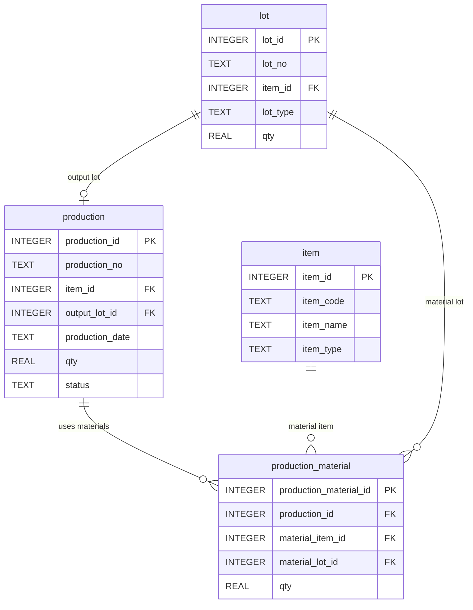
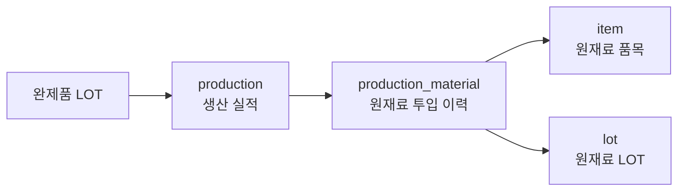

# Chapter 9. 원재료 투입 이력 조회

## 1. 학습 목표

이 장을 마치면 다음을 할 수 있다.

- `production_material` 테이블이 생산에 사용된 원재료 이력을 저장한다는 것을 설명할 수 있다.
- 생산 실적별로 투입된 원재료를 조회할 수 있다.
- 완제품 LOT를 만들 때 사용한 원재료 LOT를 추적할 수 있다.
- 원재료별 투입 수량 합계를 계산할 수 있다.
- 원재료 LOT에서 어떤 생산 실적에 사용되었는지 역추적할 수 있다.

원재료 투입 이력은 추적성의 시작점이다. 완제품에 문제가 생겼을 때 어떤 원재료 LOT가 사용되었는지 확인하려면 생산 실적과 투입 원재료 이력을 연결해서 봐야 한다.

## 2. 현장 상황

라면공장에서 `FG-RAMEN-HOT-20260710-001` 완제품 LOT를 검사하던 중 품질 담당자가 사용 원재료를 확인하려고 한다. 단순히 매운맛 라면을 3,000개 만들었다는 생산 실적만으로는 부족하다. 어떤 면 블록 LOT, 어떤 스프 LOT, 어떤 포장재 LOT를 사용했는지 알아야 한다.

| 현장 질문 | 필요한 데이터 |
| --- | --- |
| 특정 생산에 어떤 원재료가 들어갔는가? | `production_material.production_id` |
| 투입된 원재료 품목은 무엇인가? | `production_material.material_item_id`, `item.item_name` |
| 어떤 원재료 LOT를 사용했는가? | `production_material.material_lot_id`, `lot.lot_no` |
| 원재료를 얼마나 사용했는가? | `production_material.qty` |
| 특정 원재료 LOT가 어디에 사용되었는가? | 원재료 LOT 기준 역추적 |

예를 들어 `PRD-20260710-001` 생산 실적에는 면 블록, 매운맛 스프, 봉지 포장재가 각각 3,000개씩 투입된다. 이 기록이 있어야 완제품 LOT에서 원재료 LOT까지 거슬러 올라갈 수 있다.

## 3. 핵심 개념

### 원재료 투입 이력

원재료 투입 이력은 생산 1건에 어떤 원재료 LOT를 얼마나 사용했는지 기록한 데이터다. 이 교재에서는 `production_material` 테이블에 저장한다.

| 컬럼 | 의미 | 예시 |
| --- | --- | --- |
| `production_material_id` | 원재료 투입 이력 내부 식별자 | `1` |
| `production_id` | 연결된 생산 실적 | `1` |
| `material_item_id` | 투입된 원재료 품목 | `3` |
| `material_lot_id` | 투입된 원재료 LOT | `1` |
| `qty` | 투입 수량 | `3000` |

한 생산 실적에는 여러 원재료가 들어갈 수 있다. 그래서 `production` 1건에 `production_material` 여러 건이 연결된다.

### 투입 품목과 투입 LOT

원재료 투입 이력에서는 품목과 LOT를 구분해야 한다.

| 구분 | 컬럼 | 의미 |
| --- | --- | --- |
| 투입 품목 | `material_item_id` | 어떤 종류의 원재료인가 |
| 투입 LOT | `material_lot_id` | 그 원재료 중 어떤 묶음을 사용했는가 |

`면 블록`은 품목이고, `RM-NOODLE-20260701-001`은 LOT다. 같은 면 블록이라도 입고일이 다르면 다른 LOT가 될 수 있다.

### 정추적과 역추적

추적성은 방향에 따라 두 가지로 볼 수 있다.

| 구분 | 질문 | 조회 방향 |
| --- | --- | --- |
| 정추적 | 이 완제품 LOT는 어떤 원재료 LOT로 만들었는가? | 완제품 LOT → 생산 실적 → 원재료 LOT |
| 역추적 | 이 원재료 LOT는 어떤 완제품 생산에 사용되었는가? | 원재료 LOT → 생산 실적 → 완제품 LOT |

이 장에서는 두 방향 모두 기초 수준으로 조회한다.

## 4. 모델링 설명

원재료 투입 이력 조회의 중심 테이블은 `production_material`이다. 하지만 이 테이블만 보면 숫자 식별자만 보이므로 `production`, `item`, `lot`과 함께 연결해서 해석해야 한다.



`production_material.production_id`는 어떤 생산 실적에 투입되었는지를 나타낸다. `production_material.material_item_id`는 투입 원재료의 품목을 가리킨다. `production_material.material_lot_id`는 실제 사용한 원재료 LOT를 가리킨다.

조회 흐름은 다음과 같다.



완제품 LOT에서 원재료 LOT까지 한 번에 보려면 `production.output_lot_id`와 `production_material.production_id`를 차례로 따라가야 한다.

## 5. SQL 예제

### 5.1 원재료 투입 이력 전체 조회

```sql
SELECT
    production_material_id,
    production_id,
    material_item_id,
    material_lot_id,
    qty
FROM production_material
ORDER BY production_id, production_material_id;
```

이 SQL은 `production_material` 테이블의 기본 데이터를 보여 준다.

### 5.2 생산번호별 원재료 투입 이력 조회

```sql
SELECT
    p.production_no,
    p.production_date,
    pm.material_item_id,
    pm.material_lot_id,
    pm.qty
FROM production_material AS pm
JOIN production AS p ON pm.production_id = p.production_id
ORDER BY p.production_no, pm.production_material_id;
```

`production`과 연결하면 `production_id` 대신 생산번호와 생산일자를 함께 볼 수 있다.

### 5.3 원재료 품목명과 함께 조회

```sql
SELECT
    p.production_no,
    i.item_code AS material_code,
    i.item_name AS material_name,
    pm.qty AS input_qty
FROM production_material AS pm
JOIN production AS p ON pm.production_id = p.production_id
JOIN item AS i ON pm.material_item_id = i.item_id
ORDER BY p.production_no, i.item_code;
```

`item`과 연결하면 투입된 원재료가 면 블록인지, 스프인지, 포장재인지 알 수 있다.

### 5.4 원재료 LOT 번호와 함께 조회

```sql
SELECT
    p.production_no,
    i.item_name AS material_name,
    l.lot_no AS material_lot_no,
    pm.qty AS input_qty
FROM production_material AS pm
JOIN production AS p ON pm.production_id = p.production_id
JOIN item AS i ON pm.material_item_id = i.item_id
JOIN lot AS l ON pm.material_lot_id = l.lot_id
ORDER BY p.production_no, i.item_code;
```

이 SQL은 생산번호별로 어떤 원재료 LOT가 투입되었는지 보여 준다.

### 5.5 특정 생산 실적의 원재료 투입 조회

```sql
SELECT
    p.production_no,
    i.item_name AS material_name,
    l.lot_no AS material_lot_no,
    pm.qty AS input_qty
FROM production_material AS pm
JOIN production AS p ON pm.production_id = p.production_id
JOIN item AS i ON pm.material_item_id = i.item_id
JOIN lot AS l ON pm.material_lot_id = l.lot_id
WHERE p.production_no = 'PRD-20260710-001'
ORDER BY i.item_code;
```

특정 생산번호에 사용된 원재료만 확인한다.

### 5.6 완제품 LOT에서 원재료 LOT 추적하기

```sql
SELECT
    output_lot.lot_no AS output_lot_no,
    p.production_no,
    material_item.item_name AS material_name,
    material_lot.lot_no AS material_lot_no,
    pm.qty AS input_qty
FROM production AS p
JOIN lot AS output_lot ON p.output_lot_id = output_lot.lot_id
JOIN production_material AS pm ON p.production_id = pm.production_id
JOIN item AS material_item ON pm.material_item_id = material_item.item_id
JOIN lot AS material_lot ON pm.material_lot_id = material_lot.lot_id
WHERE output_lot.lot_no = 'FG-RAMEN-HOT-20260710-001'
ORDER BY material_item.item_code;
```

완제품 LOT 번호를 기준으로 생산 실적을 찾고, 그 생산에 투입된 원재료 LOT를 조회한다.

### 5.7 원재료별 투입 수량 합계

```sql
SELECT
    i.item_code,
    i.item_name,
    SUM(pm.qty) AS total_input_qty
FROM production_material AS pm
JOIN item AS i ON pm.material_item_id = i.item_id
GROUP BY i.item_id, i.item_code, i.item_name
ORDER BY total_input_qty DESC, i.item_code;
```

샘플 데이터 전체에서 원재료별로 얼마나 투입되었는지 합계한다.

### 5.8 원재료 LOT별 투입 수량 합계

```sql
SELECT
    l.lot_no AS material_lot_no,
    i.item_name AS material_name,
    SUM(pm.qty) AS total_input_qty
FROM production_material AS pm
JOIN lot AS l ON pm.material_lot_id = l.lot_id
JOIN item AS i ON pm.material_item_id = i.item_id
GROUP BY l.lot_id, l.lot_no, i.item_name
ORDER BY l.lot_no;
```

같은 원재료 LOT가 여러 생산에 나누어 사용되었는지 확인할 수 있다.

### 5.9 원재료 LOT에서 완제품 LOT 역추적하기

```sql
SELECT
    material_lot.lot_no AS material_lot_no,
    material_item.item_name AS material_name,
    p.production_no,
    output_lot.lot_no AS output_lot_no,
    p.production_date,
    pm.qty AS input_qty
FROM production_material AS pm
JOIN lot AS material_lot ON pm.material_lot_id = material_lot.lot_id
JOIN item AS material_item ON pm.material_item_id = material_item.item_id
JOIN production AS p ON pm.production_id = p.production_id
JOIN lot AS output_lot ON p.output_lot_id = output_lot.lot_id
WHERE material_lot.lot_no = 'RM-SOUP-HOT-20260701-001'
ORDER BY p.production_date, p.production_no;
```

특정 원재료 LOT가 어떤 생산에 사용되었고, 그 결과 어떤 완제품 LOT가 만들어졌는지 확인한다.

## 6. 데이터 해석

원재료 투입 이력 조회 결과에서 한 행은 한 원재료 LOT의 투입 기록 1건을 의미한다.

| `production_no` | 원재료 | 원재료 LOT | 투입 수량 |
| --- | --- | --- | ---: |
| `PRD-20260710-001` | 면 블록 | `RM-NOODLE-20260701-001` | 3,000 |
| `PRD-20260710-001` | 매운맛 스프 | `RM-SOUP-HOT-20260701-001` | 3,000 |
| `PRD-20260710-001` | 봉지 포장재 | `RM-PACK-20260701-001` | 3,000 |

이 세 행은 `PRD-20260710-001` 생산 실적에 세 종류의 원재료가 투입되었다는 뜻이다. 생산 실적 1건이 원재료 투입 이력 3건과 연결되는 구조다.

완제품 LOT에서 원재료 LOT를 추적하면 품질 문제의 범위를 좁힐 수 있다. 예를 들어 `FG-RAMEN-HOT-20260710-001` 완제품 LOT에 문제가 있다면, 해당 LOT를 만든 생산 실적을 찾고 그 생산에 사용된 원재료 LOT를 확인한다.

반대로 원재료 LOT에서 완제품 LOT를 역추적하면 특정 원재료 문제가 어느 완제품에 영향을 줄 수 있는지 확인할 수 있다. 예를 들어 `RM-SOUP-HOT-20260701-001` 스프 LOT에 문제가 있으면, 이 LOT를 사용한 생산 실적과 완제품 LOT를 찾아야 한다.

## 7. 잘못된 설계 사례

### 7.1 생산 실적에 원재료명을 글자로 적는 경우

생산 실적에 `면 블록, 매운맛 스프, 포장재`처럼 글자로 적으면 원재료별 집계와 LOT 추적이 어렵다. 원재료는 `production_material`에 행 단위로 저장하고, 품목은 `material_item_id`로 연결해야 한다.

### 7.2 원재료 LOT를 기록하지 않는 경우

원재료 품목만 기록하고 `material_lot_id`를 저장하지 않으면 추적성이 약해진다. `매운맛 스프를 사용했다`는 정보만으로는 어떤 입고 LOT가 사용되었는지 알 수 없다.

### 7.3 생산 1건에 원재료 컬럼을 여러 개 만드는 경우

다음처럼 생산 테이블에 원재료 컬럼을 계속 추가하면 원재료 종류가 바뀔 때마다 테이블 구조를 바꿔야 한다.

| 잘못된 컬럼 예 | 문제점 |
| --- | --- |
| `material1_lot_id` | 원재료 개수가 고정된다 |
| `material2_lot_id` | 빈 컬럼이 생길 수 있다 |
| `material3_lot_id` | 집계 SQL이 복잡해진다 |

원재료 투입 이력은 `production_material`에 여러 행으로 저장하는 것이 더 자연스럽다.

## 8. 실습

### 실습 1. 생산번호별 원재료 투입 이력 조회하기

```sql
SELECT
    p.production_no,
    pm.material_item_id,
    pm.material_lot_id,
    pm.qty
FROM production_material AS pm
JOIN production AS p ON pm.production_id = p.production_id
ORDER BY p.production_no, pm.production_material_id;
```

확인할 내용:

- 생산 실적 1건에 원재료 투입 이력이 몇 건씩 연결되는가?
- `production_id`만 볼 때보다 `production_no`를 함께 볼 때 어떤 점이 읽기 쉬운가?

### 실습 2. 원재료 LOT 번호와 함께 조회하기

```sql
SELECT
    p.production_no,
    i.item_name AS material_name,
    l.lot_no AS material_lot_no,
    pm.qty AS input_qty
FROM production_material AS pm
JOIN production AS p ON pm.production_id = p.production_id
JOIN item AS i ON pm.material_item_id = i.item_id
JOIN lot AS l ON pm.material_lot_id = l.lot_id
ORDER BY p.production_no, i.item_code;
```

확인할 내용:

- `PRD-20260710-001`에는 어떤 원재료 LOT가 투입되었는가?
- 매운맛 스프와 순한맛 스프는 서로 다른 LOT를 사용하는가?

### 실습 3. 원재료별 투입 수량 합계 구하기

```sql
SELECT
    i.item_name,
    SUM(pm.qty) AS total_input_qty
FROM production_material AS pm
JOIN item AS i ON pm.material_item_id = i.item_id
GROUP BY i.item_id, i.item_name
ORDER BY total_input_qty DESC;
```

확인할 내용:

- 가장 많이 투입된 원재료는 무엇인가?
- 면 블록과 포장재의 투입 수량이 같은 이유는 무엇인가?

### 실습 4. 원재료 LOT에서 완제품 LOT 역추적하기

```sql
SELECT
    material_lot.lot_no AS material_lot_no,
    p.production_no,
    output_lot.lot_no AS output_lot_no,
    pm.qty AS input_qty
FROM production_material AS pm
JOIN lot AS material_lot ON pm.material_lot_id = material_lot.lot_id
JOIN production AS p ON pm.production_id = p.production_id
JOIN lot AS output_lot ON p.output_lot_id = output_lot.lot_id
WHERE material_lot.lot_no = 'RM-NOODLE-20260701-001'
ORDER BY p.production_no;
```

확인할 내용:

- `RM-NOODLE-20260701-001`은 몇 개 생산 실적에 사용되었는가?
- 이 원재료 LOT가 영향을 줄 수 있는 완제품 LOT는 무엇인가?

## 9. 확인 문제

1. `production_material` 테이블은 어떤 업무 이력을 저장하는가?
2. `material_item_id`와 `material_lot_id`의 차이를 설명하시오.
3. 생산 실적 1건에 원재료 투입 이력이 여러 건 연결될 수 있는 이유를 설명하시오.
4. 완제품 LOT에서 원재료 LOT를 찾으려면 어떤 테이블들을 연결해야 하는가?
5. 원재료 LOT를 기록하지 않으면 어떤 문제가 생기는가?
6. 원재료 LOT에서 완제품 LOT를 찾는 역추적이 필요한 상황을 예로 들어 설명하시오.

## 10. 핵심 정리

- `production_material`은 생산에 투입된 원재료 이력을 저장한다.
- `production_material.production_id`는 생산 실적과 연결된다.
- `production_material.material_item_id`는 원재료 품목을 나타낸다.
- `production_material.material_lot_id`는 실제 사용한 원재료 LOT를 나타낸다.
- 완제품 LOT에서 원재료 LOT까지 추적하려면 `production`, `production_material`, `lot`, `item`을 함께 조회해야 한다.
- 원재료 LOT 기준 역추적은 품질 문제와 리콜 범위 확인의 기초가 된다.
