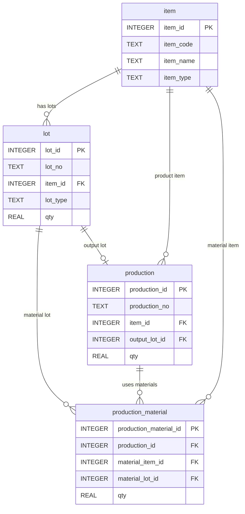

# Chapter 10. JOIN 기초

## 1. 학습 목표

이 장을 마치면 다음을 할 수 있다.

- `JOIN`이 필요한 이유를 설명할 수 있다.
- 외래키를 기준으로 두 테이블을 연결할 수 있다.
- 테이블 별칭을 사용해 SQL을 읽기 쉽게 작성할 수 있다.
- 생산 실적과 품목명, LOT 번호를 함께 조회할 수 있다.
- 생산 실적과 투입 원재료 이력을 한 번에 조회할 수 있다.

앞 장까지는 `item`, `lot`, `production`, `production_material`을 각각 조회하거나 간단히 연결해 보았다. 이 장에서는 `JOIN` 자체를 중심 주제로 다룬다. MES 데이터는 여러 테이블에 나누어 저장되므로, 현장 질문에 답하려면 테이블을 올바르게 연결해야 한다.

## 2. 현장 상황

라면공장 생산 관리자가 다음과 같은 보고서를 요청했다고 생각해 보자.

| 현장 질문 | 필요한 테이블 |
| --- | --- |
| 생산번호별 제품명은 무엇인가? | `production`, `item` |
| LOT 번호별 품목명은 무엇인가? | `lot`, `item` |
| 생산번호별 완제품 LOT는 무엇인가? | `production`, `lot` |
| 생산번호별 투입 원재료 LOT는 무엇인가? | `production`, `production_material`, `item`, `lot` |

한 테이블만 보면 숫자 식별자만 보이는 경우가 많다. 예를 들어 `production.item_id` 값이 `1`이라는 것만 보면 어떤 제품인지 바로 알기 어렵다. 이때 `item` 테이블과 연결하면 `봉지라면 매운맛`이라는 품목명을 함께 볼 수 있다.

`JOIN`은 나누어 저장된 데이터를 현장 사람이 읽을 수 있는 정보로 합치는 도구다.

## 3. 핵심 개념

### JOIN

`JOIN`은 두 테이블의 관련된 행을 연결해서 한 결과로 보여 주는 SQL 문법이다.

```sql
SELECT
    p.production_no,
    i.item_name
FROM production AS p
JOIN item AS i ON p.item_id = i.item_id;
```

위 SQL은 `production.item_id`와 `item.item_id`가 같은 행을 연결한다. 결과에서는 생산번호와 품목명을 함께 볼 수 있다.

### 연결 기준

`JOIN`에서 가장 중요한 부분은 `ON`이다. `ON`은 어떤 컬럼을 기준으로 두 테이블을 연결할지 정한다.

| 연결하려는 정보 | 연결 조건 |
| --- | --- |
| 생산 실적과 생산 품목 | `production.item_id = item.item_id` |
| LOT와 품목 | `lot.item_id = item.item_id` |
| 생산 실적과 완제품 LOT | `production.output_lot_id = lot.lot_id` |
| 생산 실적과 원재료 투입 이력 | `production.production_id = production_material.production_id` |
| 투입 이력과 원재료 LOT | `production_material.material_lot_id = lot.lot_id` |

외래키로 저장한 컬럼은 다른 테이블의 기본키를 가리킨다. 그래서 외래키와 기본키를 `ON` 조건에 쓰는 경우가 많다.

### 테이블 별칭

테이블 별칭은 긴 테이블 이름을 짧게 줄여 쓰는 방법이다.

| 테이블 | 자주 쓰는 별칭 |
| --- | --- |
| `item` | `i` |
| `lot` | `l` |
| `production` | `p` |
| `production_material` | `pm` |

별칭을 사용하면 `production.production_no` 대신 `p.production_no`처럼 짧게 쓸 수 있다. 여러 테이블에 같은 이름의 컬럼이 있을 때도 어느 테이블의 컬럼인지 분명해진다.

### INNER JOIN

이 교재에서 사용하는 기본 `JOIN`은 `INNER JOIN`이다. SQLite에서는 `JOIN`이라고 쓰면 보통 `INNER JOIN`으로 이해하면 된다.

`INNER JOIN`은 연결 조건에 맞는 행만 결과에 보여 준다. 예를 들어 생산 실적에 없는 `item_id`는 품목명과 연결될 수 없으므로 결과에 나오지 않는다.

## 4. 모델링 설명

Mini MES의 네 테이블은 서로 따로 떨어진 목록이 아니라 외래키로 연결된 구조다.



`item`은 품목 기준정보다. `lot`은 품목별 LOT 재고다. `production`은 완제품 생산 실적이다. `production_material`은 생산에 들어간 원재료 이력이다.


`JOIN`을 작성할 때는 먼저 질문을 확인하고, 필요한 테이블과 연결 기준을 찾는다. 그다음 `SELECT`에 현장에서 읽을 컬럼을 배치한다.

## 5. SQL 예제

### 5.1 생산 실적과 품목명 함께 보기

```sql
SELECT
    p.production_no,
    p.production_date,
    i.item_code,
    i.item_name,
    p.qty,
    p.status
FROM production AS p
JOIN item AS i ON p.item_id = i.item_id
ORDER BY p.production_date, p.production_no;
```

`production.item_id`와 `item.item_id`를 연결한다. 생산 실적의 숫자 품목 ID 대신 품목 코드와 품목명을 볼 수 있다.

### 5.2 LOT와 품목 기준정보 연결하기

```sql
SELECT
    l.lot_no,
    i.item_code,
    i.item_name,
    i.item_type,
    l.lot_type,
    l.qty,
    l.expire_date
FROM lot AS l
JOIN item AS i ON l.item_id = i.item_id
ORDER BY i.item_code, l.lot_no;
```

`lot.item_id`와 `item.item_id`를 연결한다. LOT 번호와 품목명을 함께 보면 창고 재고를 읽기 쉬워진다.

### 5.3 생산 실적과 완제품 LOT 연결하기

```sql
SELECT
    p.production_no,
    p.production_date,
    i.item_name AS product_name,
    p.qty AS production_qty,
    l.lot_no AS output_lot_no,
    l.qty AS output_lot_qty
FROM production AS p
JOIN item AS i ON p.item_id = i.item_id
JOIN lot AS l ON p.output_lot_id = l.lot_id
ORDER BY p.production_no;
```

생산 실적은 `production`에 있고, 생산 결과 LOT 번호는 `lot`에 있다. `production.output_lot_id`와 `lot.lot_id`를 연결하면 생산번호와 완제품 LOT 번호를 함께 볼 수 있다.

### 5.4 원재료 투입 이력과 생산번호 연결하기

```sql
SELECT
    p.production_no,
    p.production_date,
    pm.material_item_id,
    pm.material_lot_id,
    pm.qty AS input_qty
FROM production_material AS pm
JOIN production AS p ON pm.production_id = p.production_id
ORDER BY p.production_no, pm.production_material_id;
```

`production_material.production_id`와 `production.production_id`를 연결한다. 원재료 투입 이력이 어떤 생산 실적에 속하는지 확인할 수 있다.

### 5.5 생산 실적과 투입 원재료 한 번에 조회하기

```sql
SELECT
    p.production_no,
    p.production_date,
    product_item.item_name AS product_name,
    material_item.item_name AS material_name,
    material_lot.lot_no AS material_lot_no,
    pm.qty AS input_qty
FROM production AS p
JOIN item AS product_item ON p.item_id = product_item.item_id
JOIN production_material AS pm ON p.production_id = pm.production_id
JOIN item AS material_item ON pm.material_item_id = material_item.item_id
JOIN lot AS material_lot ON pm.material_lot_id = material_lot.lot_id
ORDER BY p.production_no, material_item.item_code;
```

이 SQL은 여러 테이블을 연결한다. `item` 테이블을 두 번 사용하는 점에 주의해야 한다.

| 별칭 | 의미 |
| --- | --- |
| `product_item` | 생산한 완제품 품목 |
| `material_item` | 투입된 원재료 품목 |

같은 `item` 테이블이라도 역할이 다르면 별칭을 다르게 붙여야 결과를 정확히 읽을 수 있다.

### 5.6 완제품 LOT와 원재료 LOT 함께 보기

```sql
SELECT
    output_lot.lot_no AS output_lot_no,
    p.production_no,
    material_item.item_name AS material_name,
    material_lot.lot_no AS material_lot_no,
    pm.qty AS input_qty
FROM production AS p
JOIN lot AS output_lot ON p.output_lot_id = output_lot.lot_id
JOIN production_material AS pm ON p.production_id = pm.production_id
JOIN item AS material_item ON pm.material_item_id = material_item.item_id
JOIN lot AS material_lot ON pm.material_lot_id = material_lot.lot_id
ORDER BY output_lot.lot_no, material_item.item_code;
```

`lot` 테이블도 두 번 사용한다. 하나는 생산 결과 완제품 LOT이고, 다른 하나는 투입 원재료 LOT다.

| 별칭 | 의미 |
| --- | --- |
| `output_lot` | 생산 결과로 생긴 완제품 LOT |
| `material_lot` | 생산에 투입된 원재료 LOT |

### 5.7 특정 완제품 LOT의 원재료 추적

```sql
SELECT
    output_lot.lot_no AS output_lot_no,
    p.production_no,
    material_item.item_name AS material_name,
    material_lot.lot_no AS material_lot_no,
    pm.qty AS input_qty
FROM production AS p
JOIN lot AS output_lot ON p.output_lot_id = output_lot.lot_id
JOIN production_material AS pm ON p.production_id = pm.production_id
JOIN item AS material_item ON pm.material_item_id = material_item.item_id
JOIN lot AS material_lot ON pm.material_lot_id = material_lot.lot_id
WHERE output_lot.lot_no = 'FG-RAMEN-HOT-20260710-001'
ORDER BY material_item.item_code;
```

`WHERE` 조건을 추가하면 특정 완제품 LOT에 대한 원재료 투입 내역만 볼 수 있다.

### 5.8 특정 원재료 LOT가 사용된 생산 찾기

```sql
SELECT
    material_lot.lot_no AS material_lot_no,
    material_item.item_name AS material_name,
    p.production_no,
    output_lot.lot_no AS output_lot_no,
    pm.qty AS input_qty
FROM production_material AS pm
JOIN lot AS material_lot ON pm.material_lot_id = material_lot.lot_id
JOIN item AS material_item ON pm.material_item_id = material_item.item_id
JOIN production AS p ON pm.production_id = p.production_id
JOIN lot AS output_lot ON p.output_lot_id = output_lot.lot_id
WHERE material_lot.lot_no = 'RM-NOODLE-20260701-001'
ORDER BY p.production_no;
```

원재료 LOT를 기준으로 연결하면 이 원재료가 어떤 생산과 완제품 LOT에 사용되었는지 확인할 수 있다.

## 6. 데이터 해석

`JOIN` 결과는 여러 테이블의 정보를 한 행에 모아 보여 준다. 예를 들어 생산 실적과 품목명을 연결한 결과에서 다음 행을 볼 수 있다.

| `production_no` | `production_date` | `item_name` | `qty` |
| --- | --- | --- | ---: |
| `PRD-20260710-001` | `2026-07-10` | 봉지라면 매운맛 | 3,000 |

이 행은 `production`의 생산 실적과 `item`의 품목 기준정보를 연결한 결과다. `production`에는 품목명이 직접 저장되어 있지 않다. 품목명은 `item_id`를 따라 `item`에서 가져온다.

생산 실적과 투입 원재료를 함께 조회하면 한 생산번호가 여러 행으로 반복될 수 있다.

| `production_no` | 완제품 | 원재료 | 원재료 LOT | 투입 수량 |
| --- | --- | --- | --- | ---: |
| `PRD-20260710-001` | 봉지라면 매운맛 | 면 블록 | `RM-NOODLE-20260701-001` | 3,000 |
| `PRD-20260710-001` | 봉지라면 매운맛 | 매운맛 스프 | `RM-SOUP-HOT-20260701-001` | 3,000 |
| `PRD-20260710-001` | 봉지라면 매운맛 | 봉지 포장재 | `RM-PACK-20260701-001` | 3,000 |

이것은 중복 오류가 아니다. 생산 실적 1건에 원재료 투입 이력이 3건 연결되어 있기 때문에 결과 행도 3개가 된다.

## 7. 잘못된 설계 사례

### 7.1 ON 조건 없이 JOIN하는 경우

`JOIN`에 연결 조건을 잘못 쓰거나 빠뜨리면 서로 관련 없는 행까지 섞일 수 있다.

```sql
SELECT
    p.production_no,
    i.item_name
FROM production AS p
JOIN item AS i;
```

이 SQL은 교육용으로도 사용하지 않는 것이 좋다. 생산 실적과 모든 품목이 조합되어 실제보다 훨씬 많은 행이 나올 수 있다.

### 7.2 연결 컬럼을 잘못 고르는 경우

생산 실적과 완제품 LOT를 연결해야 하는데 `production.item_id = lot.item_id`로 연결하면 의미가 달라진다.

```sql
SELECT
    p.production_no,
    l.lot_no
FROM production AS p
JOIN lot AS l ON p.item_id = l.item_id;
```

이 SQL은 같은 품목의 여러 LOT가 모두 연결될 수 있다. 생산 결과 LOT를 보려면 `p.output_lot_id = l.lot_id`를 사용해야 한다.

### 7.3 같은 테이블을 두 번 쓰면서 별칭을 구분하지 않는 경우

완제품 LOT와 원재료 LOT를 함께 보려면 `lot` 테이블을 두 번 사용한다. 이때 별칭을 역할에 맞게 붙이지 않으면 SQL을 읽기 어렵고 실수하기 쉽다.

| 좋은 별칭 | 의미 |
| --- | --- |
| `output_lot` | 완제품 LOT |
| `material_lot` | 원재료 LOT |

별칭은 짧게 쓰는 것만이 목적이 아니다. 같은 테이블이 여러 역할로 등장할 때 의미를 구분하는 역할도 한다.

## 8. 실습

### 실습 1. 생산 실적과 품목명 연결하기

```sql
SELECT
    p.production_no,
    i.item_name,
    p.production_date,
    p.qty
FROM production AS p
JOIN item AS i ON p.item_id = i.item_id
ORDER BY p.production_no;
```

확인할 내용:

- `production.item_id`와 `item.item_id` 중 어느 컬럼이 연결 기준인가?
- 생산번호별 제품명을 바로 읽을 수 있는가?

### 실습 2. LOT와 품목 기준정보 연결하기

```sql
SELECT
    l.lot_no,
    i.item_name,
    l.lot_type,
    l.qty
FROM lot AS l
JOIN item AS i ON l.item_id = i.item_id
ORDER BY l.lot_no;
```

확인할 내용:

- 원재료 LOT와 완제품 LOT가 함께 조회되는가?
- `lot_type`과 `item_name`을 함께 보면 어떤 점이 읽기 쉬운가?

### 실습 3. 생산 결과 LOT 조회하기

```sql
SELECT
    p.production_no,
    p.production_date,
    l.lot_no AS output_lot_no,
    l.qty AS output_lot_qty
FROM production AS p
JOIN lot AS l ON p.output_lot_id = l.lot_id
ORDER BY p.production_no;
```

확인할 내용:

- 각 생산번호의 결과 LOT는 무엇인가?
- `p.item_id = l.item_id`가 아니라 `p.output_lot_id = l.lot_id`를 쓰는 이유는 무엇인가?

### 실습 4. 생산번호별 투입 원재료 LOT 조회하기

```sql
SELECT
    p.production_no,
    material_item.item_name AS material_name,
    material_lot.lot_no AS material_lot_no,
    pm.qty AS input_qty
FROM production AS p
JOIN production_material AS pm ON p.production_id = pm.production_id
JOIN item AS material_item ON pm.material_item_id = material_item.item_id
JOIN lot AS material_lot ON pm.material_lot_id = material_lot.lot_id
ORDER BY p.production_no, material_item.item_code;
```

확인할 내용:

- 생산번호 1개가 여러 행으로 나오는 이유는 무엇인가?
- `material_item`과 `material_lot` 별칭은 각각 무엇을 의미하는가?

## 9. 확인 문제

1. `JOIN`은 어떤 상황에서 필요한가?
2. `ON` 조건은 어떤 역할을 하는가?
3. `production`과 `item`을 연결할 때 사용하는 컬럼을 쓰시오.
4. `lot`과 `item`을 연결할 때 사용하는 컬럼을 쓰시오.
5. 생산 결과 LOT를 조회할 때 `production.output_lot_id`와 연결해야 하는 컬럼은 무엇인가?
6. 같은 `item` 테이블을 완제품 품목과 원재료 품목으로 두 번 사용할 때 별칭이 필요한 이유를 설명하시오.
7. 생산 실적 1건이 원재료 투입 이력 여러 행으로 조회되는 이유를 설명하시오.

## 10. 핵심 정리

- `JOIN`은 나누어 저장된 테이블을 연결해서 읽을 수 있는 결과로 만드는 SQL 문법이다.
- `ON` 조건은 두 테이블을 어떤 컬럼으로 연결할지 정한다.
- 외래키와 기본키를 기준으로 연결하는 경우가 많다.
- 테이블 별칭은 SQL을 짧고 명확하게 만든다.
- 같은 테이블을 두 번 사용할 때는 역할이 드러나는 별칭을 붙이는 것이 좋다.
- 생산 실적, 품목명, 완제품 LOT, 원재료 LOT를 함께 보려면 여러 테이블을 단계적으로 `JOIN`해야 한다.
