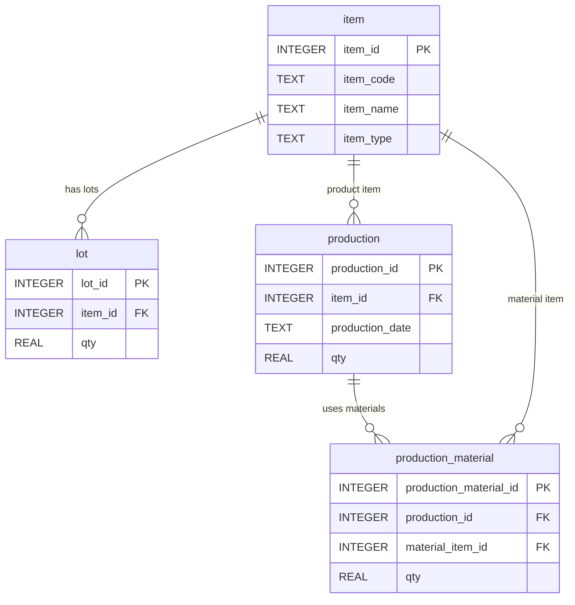

# Chapter 11. GROUP BY와 집계

## 1. 학습 목표

이 장을 마치면 다음을 할 수 있다.

- `GROUP BY`가 여러 행을 기준별로 묶는 문법임을 설명할 수 있다.
- `SUM`, `COUNT`, `AVG` 같은 집계 함수를 사용할 수 있다.
- 품목별 재고 수량, 일자별 생산 수량, 원재료별 사용 수량을 계산할 수 있다.
- 집계 결과를 현장 지표로 해석할 수 있다.
- `WHERE`와 `HAVING`의 차이를 기초 수준에서 설명할 수 있다.

앞 장에서는 `JOIN`으로 여러 테이블을 연결했다. 이 장에서는 연결한 데이터를 기준별로 묶어 합계와 건수를 구한다. MES 현장에서는 개별 LOT도 중요하지만, 하루 생산량이나 품목별 재고처럼 묶어서 보는 지표도 자주 필요하다.

## 2. 현장 상황

라면공장 관리자가 다음 질문을 한다고 생각해 보자.

| 현장 질문 | 필요한 집계 |
| --- | --- |
| 품목별 현재 재고는 몇 개인가? | `lot.qty` 합계 |
| 날짜별로 얼마나 생산했는가? | `production.qty` 합계 |
| 어떤 원재료를 가장 많이 사용했는가? | `production_material.qty` 합계 |
| 생산 품목별 생산 건수는 몇 건인가? | `production` 행 개수 |

한 행씩 보는 조회만으로는 이런 질문에 답하기 어렵다. LOT가 여러 개 있으면 품목별로 묶어서 재고를 합산해야 한다. 생산 실적도 날짜별, 품목별로 묶어야 현장 흐름을 읽을 수 있다.

## 3. 핵심 개념

### 집계 함수

집계 함수는 여러 행의 값을 하나의 결과로 계산한다.

| 함수 | 의미 | 예시 |
| --- | --- | --- |
| `SUM` | 합계 | 전체 생산 수량 |
| `COUNT` | 행 개수 | 생산 실적 건수 |
| `AVG` | 평균 | 생산 1건당 평균 수량 |
| `MIN` | 최솟값 | 가장 빠른 유통기한 |
| `MAX` | 최댓값 | 가장 늦은 생산일자 |

예를 들어 전체 LOT 재고 수량은 다음처럼 구한다.

```sql
SELECT
    SUM(qty) AS total_lot_qty
FROM lot;
```

### GROUP BY

`GROUP BY`는 같은 값을 가진 행을 하나의 묶음으로 만든다.

```sql
SELECT
    item_id,
    SUM(qty) AS total_qty
FROM lot
GROUP BY item_id
ORDER BY item_id;
```

이 SQL은 `lot`을 `item_id`별로 묶고, 각 묶음의 `qty` 합계를 계산한다.

### WHERE와 HAVING

`WHERE`는 집계하기 전의 행을 걸러낸다. `HAVING`은 집계한 뒤의 결과 묶음을 걸러낸다.

| 구분 | 처리 시점 | 예시 |
| --- | --- | --- |
| `WHERE` | 묶기 전 | 완제품 LOT만 집계 |
| `HAVING` | 묶은 뒤 | 재고 합계가 3,000 이상인 품목만 표시 |

초급 단계에서는 먼저 `WHERE`로 대상 행을 줄이고, `GROUP BY`로 묶은 뒤, 필요할 때 `HAVING`을 사용한다고 이해하면 된다.

## 4. 모델링 설명

집계는 보통 한 테이블의 수량을 더하는 것에서 시작한다. 하지만 결과를 현장 사람이 읽으려면 `item`과 연결해 품목 코드와 품목명을 함께 보여 주는 것이 좋다.



집계 기준은 질문에 따라 달라진다.

| 질문 | 묶는 기준 | 더하는 수량 |
| --- | --- | --- |
| 품목별 재고 | `lot.item_id` | `lot.qty` |
| 일자별 생산 | `production.production_date` | `production.qty` |
| 제품별 생산 | `production.item_id` | `production.qty` |
| 원재료별 사용 | `production_material.material_item_id` | `production_material.qty` |

`qty`는 여러 테이블에서 사용된다. 그래서 집계할 때는 `l.qty`, `p.qty`, `pm.qty`처럼 별칭을 붙여 어떤 수량인지 분명히 해야 한다.

## 5. SQL 예제

### 5.1 전체 LOT 재고 수량 합계

```sql
SELECT
    SUM(qty) AS total_lot_qty
FROM lot;
```

`lot` 전체의 현재 수량을 합산한다. 원재료 LOT와 완제품 LOT가 모두 포함된다.

### 5.2 품목별 재고 수량

```sql
SELECT
    i.item_code,
    i.item_name,
    i.item_type,
    SUM(l.qty) AS total_stock_qty
FROM lot AS l
JOIN item AS i ON l.item_id = i.item_id
GROUP BY i.item_id, i.item_code, i.item_name, i.item_type
ORDER BY i.item_code;
```

`lot`을 품목별로 묶고 `qty`를 합산한다. `item`과 연결했기 때문에 숫자 ID가 아니라 품목 코드와 품목명을 함께 볼 수 있다.

### 5.3 완제품 재고만 집계하기

```sql
SELECT
    i.item_code,
    i.item_name,
    SUM(l.qty) AS product_stock_qty
FROM lot AS l
JOIN item AS i ON l.item_id = i.item_id
WHERE i.item_type = 'PRODUCT'
GROUP BY i.item_id, i.item_code, i.item_name
ORDER BY i.item_code;
```

`WHERE i.item_type = 'PRODUCT'`는 집계 전에 완제품 품목만 남긴다.

### 5.4 원재료 재고만 집계하기

```sql
SELECT
    i.item_code,
    i.item_name,
    SUM(l.qty) AS material_stock_qty
FROM lot AS l
JOIN item AS i ON l.item_id = i.item_id
WHERE i.item_type = 'MATERIAL'
GROUP BY i.item_id, i.item_code, i.item_name
ORDER BY i.item_code;
```

원재료 재고만 따로 보면 생산 준비 상태를 확인할 수 있다.

### 5.5 일자별 생산 수량

```sql
SELECT
    production_date,
    COUNT(production_id) AS production_count,
    SUM(qty) AS total_production_qty
FROM production
GROUP BY production_date
ORDER BY production_date;
```

생산일자별로 생산 건수와 생산 수량 합계를 계산한다.

### 5.6 제품별 생산 수량

```sql
SELECT
    i.item_code,
    i.item_name,
    COUNT(p.production_id) AS production_count,
    SUM(p.qty) AS total_production_qty
FROM production AS p
JOIN item AS i ON p.item_id = i.item_id
GROUP BY i.item_id, i.item_code, i.item_name
ORDER BY total_production_qty DESC, i.item_code;
```

제품별 생산 수량을 비교한다. 매운맛 라면과 순한맛 라면의 생산량 차이를 확인할 수 있다.

### 5.7 원재료별 사용 수량

```sql
SELECT
    i.item_code,
    i.item_name,
    SUM(pm.qty) AS total_input_qty
FROM production_material AS pm
JOIN item AS i ON pm.material_item_id = i.item_id
GROUP BY i.item_id, i.item_code, i.item_name
ORDER BY total_input_qty DESC, i.item_code;
```

`production_material`을 원재료 품목별로 묶는다. 어떤 원재료가 많이 사용되었는지 볼 수 있다.

### 5.8 원재료 LOT별 사용 수량

```sql
SELECT
    material_lot.lot_no AS material_lot_no,
    material_item.item_name AS material_name,
    SUM(pm.qty) AS total_input_qty
FROM production_material AS pm
JOIN lot AS material_lot ON pm.material_lot_id = material_lot.lot_id
JOIN item AS material_item ON pm.material_item_id = material_item.item_id
GROUP BY material_lot.lot_id, material_lot.lot_no, material_item.item_name
ORDER BY material_lot.lot_no;
```

같은 원재료 LOT가 여러 생산에 나누어 사용되었는지 확인할 수 있다.

### 5.9 재고 합계가 3,000 이상인 품목

```sql
SELECT
    i.item_code,
    i.item_name,
    SUM(l.qty) AS total_stock_qty
FROM lot AS l
JOIN item AS i ON l.item_id = i.item_id
GROUP BY i.item_id, i.item_code, i.item_name
HAVING SUM(l.qty) >= 3000
ORDER BY total_stock_qty DESC, i.item_code;
```

`HAVING`은 집계 결과를 기준으로 행을 걸러낸다. 여기서는 품목별 재고 합계가 3,000 이상인 품목만 보여 준다.

## 6. 데이터 해석

품목별 재고 집계 결과가 다음과 같다고 하자.

| `item_code` | `item_name` | `total_stock_qty` |
| --- | --- | ---: |
| `FG-RAMEN-001` | 봉지라면 매운맛 | 5,500 |
| `FG-RAMEN-002` | 봉지라면 순한맛 | 2,000 |

이 결과는 LOT별 수량을 품목 기준으로 합산한 것이다. 매운맛 라면은 완제품 LOT가 2개이므로 두 LOT의 수량을 더한 값이 나온다.

일자별 생산 집계에서는 한 날짜에 생산 실적이 여러 건이면 `production_count`가 2 이상이 될 수 있다. `SUM(qty)`는 그 날짜에 생산된 완제품 수량 합계다.

원재료별 사용 수량은 생산 실적이 아니라 투입 이력 기준이다. 면 블록과 포장재는 매운맛과 순한맛 생산 모두에 들어가므로 사용 수량이 크게 나올 수 있다.

## 7. 잘못된 설계 사례

### 7.1 GROUP BY 없이 일반 컬럼과 집계 함수를 함께 쓰는 경우

```sql
SELECT
    item_id,
    SUM(qty) AS total_qty
FROM lot;
```

이 SQL은 `item_id`별 합계를 의도한 것처럼 보이지만 `GROUP BY`가 없다. 품목별 합계를 원한다면 `GROUP BY item_id`를 작성해야 한다.

### 7.2 집계 전 필터와 집계 후 필터를 혼동하는 경우

완제품만 집계하려면 `WHERE`를 사용한다.

```sql
SELECT
    i.item_name,
    SUM(l.qty) AS total_stock_qty
FROM lot AS l
JOIN item AS i ON l.item_id = i.item_id
WHERE i.item_type = 'PRODUCT'
GROUP BY i.item_id, i.item_name;
```

반대로 합계가 일정 수량 이상인 결과만 보고 싶다면 `HAVING`을 사용한다.

### 7.3 수량의 의미를 구분하지 않는 경우

`lot.qty`, `production.qty`, `production_material.qty`는 모두 수량이지만 의미가 다르다.

| 컬럼 | 의미 |
| --- | --- |
| `lot.qty` | 현재 LOT 재고 수량 |
| `production.qty` | 생산 결과 수량 |
| `production_material.qty` | 투입 원재료 수량 |

집계 결과를 해석할 때는 어떤 테이블의 `qty`를 더했는지 먼저 확인해야 한다.

## 8. 실습

### 실습 1. 품목별 재고 수량 구하기

```sql
SELECT
    i.item_name,
    SUM(l.qty) AS total_stock_qty
FROM lot AS l
JOIN item AS i ON l.item_id = i.item_id
GROUP BY i.item_id, i.item_name
ORDER BY total_stock_qty DESC;
```

확인할 내용:

- 재고 수량이 가장 많은 품목은 무엇인가?
- 완제품과 원재료가 함께 집계되는가?

### 실습 2. 일자별 생산 수량 구하기

```sql
SELECT
    production_date,
    SUM(qty) AS total_production_qty
FROM production
GROUP BY production_date
ORDER BY production_date;
```

확인할 내용:

- `2026-07-10`에는 몇 개를 생산했는가?
- 날짜별 집계 결과는 생산 계획 확인에 어떻게 사용할 수 있는가?

### 실습 3. 원재료별 사용 수량 구하기

```sql
SELECT
    i.item_name AS material_name,
    SUM(pm.qty) AS total_input_qty
FROM production_material AS pm
JOIN item AS i ON pm.material_item_id = i.item_id
GROUP BY i.item_id, i.item_name
ORDER BY total_input_qty DESC;
```

확인할 내용:

- 가장 많이 사용된 원재료는 무엇인가?
- 매운맛 스프와 순한맛 스프의 사용 수량이 다른 이유는 무엇인가?

### 실습 4. 재고 합계가 5,000 이상인 품목 찾기

```sql
SELECT
    i.item_code,
    i.item_name,
    SUM(l.qty) AS total_stock_qty
FROM lot AS l
JOIN item AS i ON l.item_id = i.item_id
GROUP BY i.item_id, i.item_code, i.item_name
HAVING SUM(l.qty) >= 5000
ORDER BY total_stock_qty DESC;
```

확인할 내용:

- `HAVING`은 어떤 값을 기준으로 결과를 걸러내는가?
- 같은 조건을 `WHERE SUM(l.qty) >= 5000`으로 쓰면 안 되는 이유는 무엇인가?

## 9. 확인 문제

1. `GROUP BY`는 어떤 역할을 하는가?
2. `SUM(qty)`는 어떤 값을 계산하는가?
3. 품목별 재고 수량을 구할 때 묶는 기준은 무엇인가?
4. 일자별 생산 수량을 구할 때 묶는 기준은 무엇인가?
5. `WHERE`와 `HAVING`의 차이를 설명하시오.
6. `lot.qty`와 `production_material.qty`의 의미 차이를 설명하시오.

## 10. 핵심 정리

- 집계 함수는 여러 행을 하나의 계산 결과로 만든다.
- `GROUP BY`는 같은 기준을 가진 행을 묶는다.
- 품목별 재고는 `lot.qty`를 품목 기준으로 합산한다.
- 일자별 생산 수량은 `production.qty`를 생산일자 기준으로 합산한다.
- 원재료별 사용 수량은 `production_material.qty`를 원재료 품목 기준으로 합산한다.
- `WHERE`는 집계 전 행을 거르고, `HAVING`은 집계 후 결과를 거른다.
