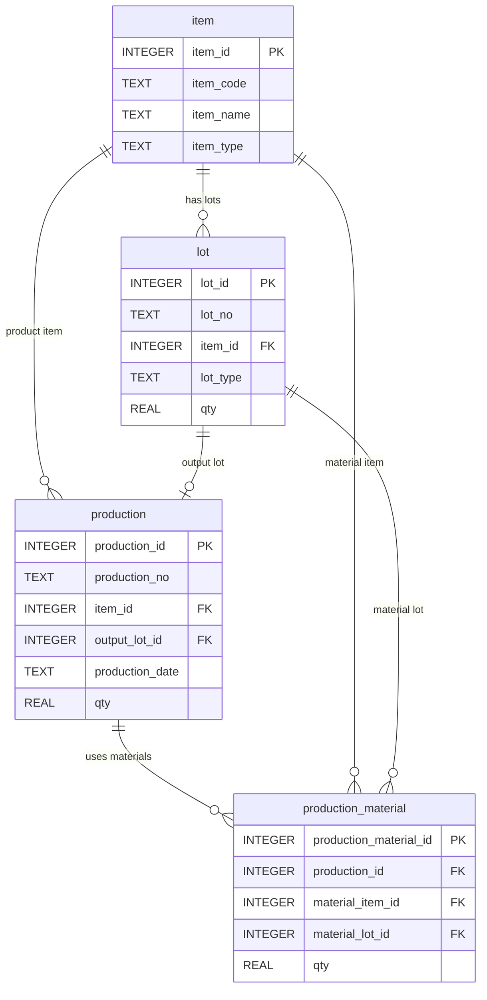

# Chapter 12. 추적성 실습

## 1. 학습 목표

이 장을 마치면 다음을 할 수 있다.

- 완제품 LOT에서 생산 실적을 찾을 수 있다.
- 생산 실적에서 투입 원재료 LOT를 찾을 수 있다.
- 원재료 LOT에서 영향을 받은 완제품 LOT를 찾을 수 있다.
- 간단한 리콜 범위 조회 SQL을 작성할 수 있다.
- 추적성 조회 결과를 품질 대응 관점에서 해석할 수 있다.

앞 장까지는 조회, `JOIN`, 집계를 각각 배웠다. 이 장에서는 그 내용을 묶어 LOT 추적성 실습을 한다. 추적성은 어떤 완제품이 어떤 원재료로 만들어졌는지, 또는 어떤 원재료가 어떤 완제품에 영향을 주었는지 따라가는 능력이다.

## 2. 현장 상황

품질 담당자가 다음 상황을 확인해야 한다고 생각해 보자.

| 상황 | 필요한 조회 |
| --- | --- |
| 완제품 LOT에 클레임이 들어왔다 | 완제품 LOT → 생산 실적 → 원재료 LOT |
| 원재료 LOT에 문제가 발견되었다 | 원재료 LOT → 생산 실적 → 완제품 LOT |
| 리콜 범위를 정해야 한다 | 영향받은 완제품 LOT 목록 |
| 보고서를 만들어야 한다 | 품목명, LOT 번호, 생산일자, 투입 수량 |

예를 들어 `FG-RAMEN-HOT-20260710-001` 완제품 LOT에서 문제가 발견되면, 먼저 이 LOT를 만든 생산 실적을 찾는다. 그다음 그 생산 실적에 투입된 원재료 LOT를 확인한다.

반대로 `RM-SOUP-HOT-20260701-001` 원재료 LOT에 문제가 있으면, 이 LOT가 사용된 생산 실적과 완제품 LOT를 찾아야 한다. 이것이 리콜 범위 조회의 기초다.

## 3. 핵심 개념

### 정추적

정추적은 완제품에서 원재료 방향으로 따라가는 조회다.


질문은 보통 다음과 같다.

- 이 완제품 LOT는 어떤 생산에서 만들어졌는가?
- 그 생산에는 어떤 원재료 LOT가 투입되었는가?
- 투입 수량은 얼마인가?

### 역추적

역추적은 원재료에서 완제품 방향으로 따라가는 조회다.


질문은 보통 다음과 같다.

- 이 원재료 LOT는 어떤 생산에 사용되었는가?
- 그 생산으로 만들어진 완제품 LOT는 무엇인가?
- 영향받은 완제품 LOT는 몇 개인가?

### 리콜 범위

리콜 범위는 문제가 있는 원재료나 완제품과 관련되어 회수 또는 확인이 필요한 대상이다. 이 교재에서는 원재료 LOT 1개가 영향을 줄 수 있는 완제품 LOT 목록을 조회하는 수준으로 다룬다.

## 4. 모델링 설명

추적성 조회는 네 테이블의 관계를 순서대로 따라간다.



핵심 연결은 두 가지다.

| 연결 | 의미 |
| --- | --- |
| `production.output_lot_id = lot.lot_id` | 생산 결과 완제품 LOT 찾기 |
| `production_material.material_lot_id = lot.lot_id` | 투입 원재료 LOT 찾기 |

`lot` 테이블은 완제품 LOT와 원재료 LOT를 모두 저장한다. 그래서 추적성 SQL에서는 `lot`을 두 번 사용하는 경우가 많다. 이때 `output_lot`, `material_lot`처럼 역할이 드러나는 별칭을 붙인다.

## 5. SQL 예제

### 5.1 완제품 LOT에서 생산 실적 찾기

```sql
SELECT
    output_lot.lot_no AS output_lot_no,
    product_item.item_code AS product_code,
    product_item.item_name AS product_name,
    p.production_no,
    p.production_date,
    p.qty AS production_qty,
    p.status
FROM production AS p
JOIN lot AS output_lot ON p.output_lot_id = output_lot.lot_id
JOIN item AS product_item ON p.item_id = product_item.item_id
WHERE output_lot.lot_no = 'FG-RAMEN-HOT-20260710-001';
```

완제품 LOT 번호를 기준으로 그 LOT를 만든 생산 실적을 찾는다.

### 5.2 생산 실적에서 투입 원재료 LOT 찾기

```sql
SELECT
    p.production_no,
    material_item.item_code AS material_code,
    material_item.item_name AS material_name,
    material_lot.lot_no AS material_lot_no,
    pm.qty AS input_qty
FROM production AS p
JOIN production_material AS pm ON p.production_id = pm.production_id
JOIN item AS material_item ON pm.material_item_id = material_item.item_id
JOIN lot AS material_lot ON pm.material_lot_id = material_lot.lot_id
WHERE p.production_no = 'PRD-20260710-001'
ORDER BY material_item.item_code;
```

생산번호를 알고 있을 때 해당 생산에 투입된 원재료 LOT를 조회한다.

### 5.3 완제품 LOT에서 원재료 LOT까지 한 번에 추적하기

```sql
SELECT
    output_lot.lot_no AS output_lot_no,
    product_item.item_name AS product_name,
    p.production_no,
    p.production_date,
    material_item.item_name AS material_name,
    material_lot.lot_no AS material_lot_no,
    pm.qty AS input_qty
FROM production AS p
JOIN lot AS output_lot ON p.output_lot_id = output_lot.lot_id
JOIN item AS product_item ON p.item_id = product_item.item_id
JOIN production_material AS pm ON p.production_id = pm.production_id
JOIN item AS material_item ON pm.material_item_id = material_item.item_id
JOIN lot AS material_lot ON pm.material_lot_id = material_lot.lot_id
WHERE output_lot.lot_no = 'FG-RAMEN-HOT-20260710-001'
ORDER BY material_item.item_code;
```

정추적 SQL이다. 완제품 LOT 1개에서 출발해 생산 실적과 원재료 LOT 목록까지 확인한다.

### 5.4 원재료 LOT에서 사용된 생산 실적 찾기

```sql
SELECT
    material_lot.lot_no AS material_lot_no,
    material_item.item_name AS material_name,
    p.production_no,
    p.production_date,
    pm.qty AS input_qty
FROM production_material AS pm
JOIN lot AS material_lot ON pm.material_lot_id = material_lot.lot_id
JOIN item AS material_item ON pm.material_item_id = material_item.item_id
JOIN production AS p ON pm.production_id = p.production_id
WHERE material_lot.lot_no = 'RM-SOUP-HOT-20260701-001'
ORDER BY p.production_date, p.production_no;
```

원재료 LOT가 어느 생산에 사용되었는지 찾는다.

### 5.5 원재료 LOT에서 영향을 받은 완제품 LOT 찾기

```sql
SELECT
    material_lot.lot_no AS material_lot_no,
    material_item.item_name AS material_name,
    p.production_no,
    p.production_date,
    output_lot.lot_no AS output_lot_no,
    product_item.item_name AS product_name,
    pm.qty AS input_qty
FROM production_material AS pm
JOIN lot AS material_lot ON pm.material_lot_id = material_lot.lot_id
JOIN item AS material_item ON pm.material_item_id = material_item.item_id
JOIN production AS p ON pm.production_id = p.production_id
JOIN lot AS output_lot ON p.output_lot_id = output_lot.lot_id
JOIN item AS product_item ON p.item_id = product_item.item_id
WHERE material_lot.lot_no = 'RM-SOUP-HOT-20260701-001'
ORDER BY p.production_date, p.production_no;
```

역추적 SQL이다. 원재료 LOT 1개에서 출발해 영향받은 완제품 LOT를 찾는다.

### 5.6 간단한 리콜 범위 조회

```sql
SELECT
    output_lot.lot_no AS recall_lot_no,
    product_item.item_code,
    product_item.item_name,
    p.production_date,
    output_lot.qty AS current_stock_qty
FROM production_material AS pm
JOIN lot AS material_lot ON pm.material_lot_id = material_lot.lot_id
JOIN production AS p ON pm.production_id = p.production_id
JOIN lot AS output_lot ON p.output_lot_id = output_lot.lot_id
JOIN item AS product_item ON p.item_id = product_item.item_id
WHERE material_lot.lot_no = 'RM-NOODLE-20260701-001'
ORDER BY p.production_date, output_lot.lot_no;
```

문제가 있는 원재료 LOT를 사용해 만든 완제품 LOT 목록을 조회한다. 이 결과가 간단한 리콜 검토 대상이 된다.

### 5.7 리콜 대상 LOT 개수와 재고 수량 합계

```sql
SELECT
    COUNT(output_lot.lot_id) AS recall_lot_count,
    SUM(output_lot.qty) AS recall_stock_qty
FROM production_material AS pm
JOIN lot AS material_lot ON pm.material_lot_id = material_lot.lot_id
JOIN production AS p ON pm.production_id = p.production_id
JOIN lot AS output_lot ON p.output_lot_id = output_lot.lot_id
WHERE material_lot.lot_no = 'RM-NOODLE-20260701-001';
```

리콜 검토 대상 LOT가 몇 개이고 현재 재고 수량이 얼마인지 집계한다.

### 5.8 원재료 LOT별 영향받은 완제품 LOT 수

```sql
SELECT
    material_lot.lot_no AS material_lot_no,
    material_item.item_name AS material_name,
    COUNT(output_lot.lot_id) AS affected_output_lot_count,
    SUM(output_lot.qty) AS affected_stock_qty
FROM production_material AS pm
JOIN lot AS material_lot ON pm.material_lot_id = material_lot.lot_id
JOIN item AS material_item ON pm.material_item_id = material_item.item_id
JOIN production AS p ON pm.production_id = p.production_id
JOIN lot AS output_lot ON p.output_lot_id = output_lot.lot_id
GROUP BY material_lot.lot_id, material_lot.lot_no, material_item.item_name
ORDER BY affected_output_lot_count DESC, material_lot.lot_no;
```

원재료 LOT별로 영향을 줄 수 있는 완제품 LOT 개수를 비교한다. 문제가 발생했을 때 영향 범위가 큰 원재료 LOT를 빠르게 확인할 수 있다.

## 6. 데이터 해석

완제품 LOT `FG-RAMEN-HOT-20260710-001`을 정추적하면 다음과 같은 결과가 나온다.

| 완제품 LOT | 생산번호 | 원재료 | 원재료 LOT | 투입 수량 |
| --- | --- | --- | --- | ---: |
| `FG-RAMEN-HOT-20260710-001` | `PRD-20260710-001` | 면 블록 | `RM-NOODLE-20260701-001` | 3,000 |
| `FG-RAMEN-HOT-20260710-001` | `PRD-20260710-001` | 매운맛 스프 | `RM-SOUP-HOT-20260701-001` | 3,000 |
| `FG-RAMEN-HOT-20260710-001` | `PRD-20260710-001` | 봉지 포장재 | `RM-PACK-20260701-001` | 3,000 |

이 결과는 해당 완제품 LOT가 어떤 원재료 LOT로 만들어졌는지 보여 준다.

원재료 LOT `RM-SOUP-HOT-20260701-001`을 역추적하면 매운맛 스프가 들어간 생산과 완제품 LOT를 찾을 수 있다. 이 결과는 품질 문제가 원재료에서 시작되었을 때 영향을 받은 완제품 범위를 정하는 데 사용된다.

## 7. 잘못된 설계 사례

### 7.1 완제품 LOT와 원재료 LOT를 같은 별칭으로 보는 경우

추적성 SQL에서는 `lot` 테이블을 두 번 사용할 수 있다. 하나는 완제품 LOT이고 다른 하나는 원재료 LOT다. 둘을 모두 `l` 같은 별칭으로만 생각하면 SQL을 읽기 어렵다.

| 별칭 | 역할 |
| --- | --- |
| `output_lot` | 생산 결과 완제품 LOT |
| `material_lot` | 투입 원재료 LOT |

역할이 드러나는 별칭을 사용해야 추적 방향을 이해하기 쉽다.

### 7.2 품목만 보고 LOT를 보지 않는 경우

`매운맛 스프`라는 품목명만 보면 어느 입고 LOT가 사용되었는지 알 수 없다. 추적성에서는 반드시 `material_lot_id`와 `lot_no`를 확인해야 한다.

### 7.3 리콜 범위를 제품명으로만 정하는 경우

원재료 LOT 하나에 문제가 있다고 해서 모든 라면을 리콜해야 하는 것은 아니다. 실제로 그 원재료 LOT가 투입된 생산과 완제품 LOT를 조회해야 범위를 좁힐 수 있다.

## 8. 실습

### 실습 1. 완제품 LOT의 생산 실적 찾기

```sql
SELECT
    output_lot.lot_no AS output_lot_no,
    p.production_no,
    p.production_date,
    p.qty AS production_qty
FROM production AS p
JOIN lot AS output_lot ON p.output_lot_id = output_lot.lot_id
WHERE output_lot.lot_no = 'FG-RAMEN-MILD-20260711-001';
```

확인할 내용:

- 이 완제품 LOT는 어떤 생산번호에서 만들어졌는가?
- 생산일자는 언제인가?

### 실습 2. 특정 생산의 원재료 LOT 조회하기

```sql
SELECT
    p.production_no,
    material_item.item_name AS material_name,
    material_lot.lot_no AS material_lot_no,
    pm.qty AS input_qty
FROM production AS p
JOIN production_material AS pm ON p.production_id = pm.production_id
JOIN item AS material_item ON pm.material_item_id = material_item.item_id
JOIN lot AS material_lot ON pm.material_lot_id = material_lot.lot_id
WHERE p.production_no = 'PRD-20260711-001'
ORDER BY material_item.item_code;
```

확인할 내용:

- 순한맛 라면 생산에는 어떤 스프 LOT가 들어갔는가?
- 원재료 투입 이력은 몇 행인가?

### 실습 3. 원재료 LOT에서 완제품 LOT 역추적하기

```sql
SELECT
    material_lot.lot_no AS material_lot_no,
    p.production_no,
    output_lot.lot_no AS output_lot_no,
    p.production_date,
    pm.qty AS input_qty
FROM production_material AS pm
JOIN lot AS material_lot ON pm.material_lot_id = material_lot.lot_id
JOIN production AS p ON pm.production_id = p.production_id
JOIN lot AS output_lot ON p.output_lot_id = output_lot.lot_id
WHERE material_lot.lot_no = 'RM-PACK-20260701-001'
ORDER BY p.production_date, p.production_no;
```

확인할 내용:

- 이 포장재 LOT는 몇 개 완제품 LOT에 영향을 줄 수 있는가?
- 영향받은 완제품 LOT 번호를 모두 적어 보시오.

### 실습 4. 리콜 검토 대상 수량 집계하기

```sql
SELECT
    COUNT(output_lot.lot_id) AS recall_lot_count,
    SUM(output_lot.qty) AS recall_stock_qty
FROM production_material AS pm
JOIN lot AS material_lot ON pm.material_lot_id = material_lot.lot_id
JOIN production AS p ON pm.production_id = p.production_id
JOIN lot AS output_lot ON p.output_lot_id = output_lot.lot_id
WHERE material_lot.lot_no = 'RM-PACK-20260701-001';
```

확인할 내용:

- 리콜 검토 대상 완제품 LOT는 몇 개인가?
- 현재 재고 수량 합계는 얼마인가?

## 9. 확인 문제

1. 정추적과 역추적의 차이를 설명하시오.
2. 완제품 LOT에서 생산 실적을 찾을 때 사용하는 연결 조건은 무엇인가?
3. 생산 실적에서 원재료 LOT를 찾을 때 사용하는 중심 테이블은 무엇인가?
4. 원재료 LOT에서 완제품 LOT를 찾으려면 어떤 테이블들을 연결해야 하는가?
5. 리콜 범위를 제품명만으로 정하면 어떤 문제가 생기는가?
6. 추적성 SQL에서 `output_lot`과 `material_lot` 별칭을 구분해야 하는 이유를 설명하시오.

## 10. 핵심 정리

- 정추적은 완제품 LOT에서 생산 실적과 원재료 LOT를 찾아가는 흐름이다.
- 역추적은 원재료 LOT에서 생산 실적과 완제품 LOT를 찾아가는 흐름이다.
- 완제품 LOT는 `production.output_lot_id`를 통해 생산 실적과 연결된다.
- 원재료 LOT는 `production_material.material_lot_id`를 통해 투입 이력과 연결된다.
- 리콜 범위 조회는 문제가 있는 원재료 LOT가 영향을 준 완제품 LOT를 찾는 작업이다.
- 추적성 조회에서는 `lot` 테이블의 역할을 별칭으로 명확히 구분해야 한다.
