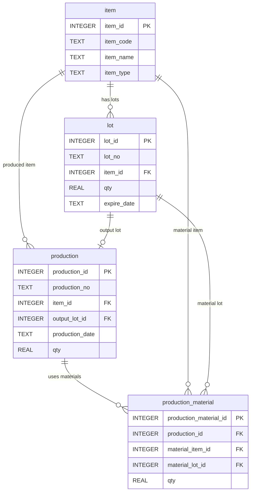

# Chapter 13. Mini MES 분석 과제

## 1. 학습 목표

이 장을 마치면 다음을 할 수 있다.

- 재고 부족이 예상되는 품목을 SQL로 찾을 수 있다.
- 생산량이 많은 제품을 집계할 수 있다.
- 특정 기간의 원재료 사용량을 계산할 수 있다.
- 완제품 LOT 기준 추적 보고서를 만들 수 있다.
- 현장 질문을 SQL 조회 조건과 연결할 수 있다.

이 장은 앞에서 배운 내용을 종합하는 과제 장이다. 새로운 테이블을 만들지 않고 `item`, `lot`, `production`, `production_material` 네 테이블만 사용한다.

## 2. 현장 상황

라면공장 관리자가 하루 마감 회의 전에 간단한 분석 자료를 요청했다.

| 요청 | 필요한 SQL |
| --- | --- |
| 재고가 부족해 보이는 품목을 알려 달라 | 품목별 재고 합계 |
| 생산량이 많은 제품을 알려 달라 | 제품별 생산 수량 합계 |
| 특정 기간에 원재료를 얼마나 썼는지 알려 달라 | 생산일자 조건과 원재료 투입 합계 |
| 특정 완제품 LOT의 추적 보고서를 만들어 달라 | 완제품 LOT, 생산 실적, 원재료 LOT 연결 |

현장에서는 SQL 문법 자체보다 질문을 데이터로 바꾸는 능력이 중요하다. 예를 들어 `재고가 부족한가?`라는 질문은 `품목별로 lot.qty를 합산하고 기준 수량보다 작은 품목을 찾는다`는 SQL 문제로 바꿀 수 있다.

## 3. 핵심 개념

### 분석 질문을 SQL로 바꾸기

분석 SQL을 작성할 때는 먼저 질문을 작게 나눈다.

| 확인할 것 | 예시 |
| --- | --- |
| 조회 대상 | 재고, 생산, 원재료 투입, LOT 추적 |
| 기준 컬럼 | 품목, 날짜, LOT 번호 |
| 계산 방법 | 합계, 건수, 평균 |
| 조건 | 기간, 품목 유형, 특정 LOT |
| 정렬 | 수량이 많은 순, 날짜 순 |

### 기준 수량

재고 부족을 판단하려면 기준 수량이 필요하다. 이 교재에서는 학습을 위해 SQL 안에 기준 수량을 직접 적는다.

| 품목 구분 | 예시 기준 |
| --- | ---: |
| 완제품 | 3,000개 미만이면 부족 |
| 원재료 | 5,000개 미만이면 부족 |

실제 현장에서는 품목별 안전재고가 별도 기준정보로 관리될 수 있다. 하지만 이 교재의 테이블은 네 개로 고정되어 있으므로, 여기서는 SQL 조건으로만 연습한다.

### 분석 결과 해석

SQL 결과는 숫자 목록으로 끝나지 않는다. 결과를 보고 어떤 업무 판단을 할 수 있는지 해석해야 한다.

| 결과 | 해석 예 |
| --- | --- |
| 완제품 재고가 적다 | 추가 생산 검토 |
| 원재료 재고가 적다 | 구매 또는 입고 확인 |
| 특정 제품 생산량이 많다 | 원재료 사용량 증가 가능 |
| 특정 원재료 LOT 영향 범위가 넓다 | 품질 점검 우선순위 상승 |

## 4. 모델링 설명

분석 과제는 네 테이블의 관계를 모두 활용한다.



각 과제의 출발 테이블은 다르다.

| 과제 | 출발 테이블 | 연결 테이블 |
| --- | --- | --- |
| 재고 부족 예상 품목 | `lot` | `item` |
| 생산량이 많은 제품 | `production` | `item` |
| 기간별 원재료 사용량 | `production_material` | `production`, `item` |
| LOT 추적 보고서 | `production` | `lot`, `item`, `production_material` |

출발 테이블을 먼저 정하면 SQL 구조를 잡기 쉽다.

## 5. SQL 예제

### 5.1 품목별 현재 재고 조회

```sql
SELECT
    i.item_code,
    i.item_name,
    i.item_type,
    SUM(l.qty) AS total_stock_qty
FROM lot AS l
JOIN item AS i ON l.item_id = i.item_id
GROUP BY i.item_id, i.item_code, i.item_name, i.item_type
ORDER BY i.item_type, i.item_code;
```

재고 분석의 기본 조회다. LOT별 수량을 품목별로 합산한다.

### 5.2 완제품 재고 부족 예상 품목 찾기

```sql
SELECT
    i.item_code,
    i.item_name,
    SUM(l.qty) AS total_stock_qty
FROM lot AS l
JOIN item AS i ON l.item_id = i.item_id
WHERE i.item_type = 'PRODUCT'
GROUP BY i.item_id, i.item_code, i.item_name
HAVING SUM(l.qty) < 3000
ORDER BY total_stock_qty, i.item_code;
```

완제품 재고 합계가 3,000개 미만인 품목을 찾는다. 기준 수량은 실습을 위한 예시다.

### 5.3 원재료 재고 부족 예상 품목 찾기

```sql
SELECT
    i.item_code,
    i.item_name,
    SUM(l.qty) AS total_stock_qty
FROM lot AS l
JOIN item AS i ON l.item_id = i.item_id
WHERE i.item_type = 'MATERIAL'
GROUP BY i.item_id, i.item_code, i.item_name
HAVING SUM(l.qty) < 5000
ORDER BY total_stock_qty, i.item_code;
```

원재료 재고 합계가 5,000개 미만인 품목을 찾는다.

### 5.4 생산량이 많은 제품 찾기

```sql
SELECT
    i.item_code,
    i.item_name,
    COUNT(p.production_id) AS production_count,
    SUM(p.qty) AS total_production_qty
FROM production AS p
JOIN item AS i ON p.item_id = i.item_id
WHERE p.status = 'COMPLETED'
GROUP BY i.item_id, i.item_code, i.item_name
ORDER BY total_production_qty DESC, i.item_code;
```

완료된 생산 실적만 대상으로 제품별 생산량을 합산한다.

### 5.5 일자별 생산량과 생산 건수

```sql
SELECT
    production_date,
    COUNT(production_id) AS production_count,
    SUM(qty) AS total_production_qty
FROM production
WHERE status = 'COMPLETED'
GROUP BY production_date
ORDER BY production_date;
```

하루별 생산 실적을 요약한다. `production_count`는 생산 이벤트 건수이고, `total_production_qty`는 생산 수량 합계다.

### 5.6 특정 기간의 원재료 사용량 계산

```sql
SELECT
    material_item.item_code AS material_code,
    material_item.item_name AS material_name,
    SUM(pm.qty) AS total_input_qty
FROM production_material AS pm
JOIN production AS p ON pm.production_id = p.production_id
JOIN item AS material_item ON pm.material_item_id = material_item.item_id
WHERE p.production_date BETWEEN '2026-07-10' AND '2026-07-12'
GROUP BY material_item.item_id, material_item.item_code, material_item.item_name
ORDER BY total_input_qty DESC, material_item.item_code;
```

생산일자가 `2026-07-10`부터 `2026-07-12`까지인 생산에 투입된 원재료 수량을 합산한다.

### 5.7 제품별 원재료 사용량 보기

```sql
SELECT
    product_item.item_name AS product_name,
    material_item.item_name AS material_name,
    SUM(pm.qty) AS total_input_qty
FROM production AS p
JOIN item AS product_item ON p.item_id = product_item.item_id
JOIN production_material AS pm ON p.production_id = pm.production_id
JOIN item AS material_item ON pm.material_item_id = material_item.item_id
WHERE p.status = 'COMPLETED'
GROUP BY product_item.item_id, product_item.item_name,
         material_item.item_id, material_item.item_name
ORDER BY product_item.item_name, material_item.item_name;
```

제품별로 어떤 원재료가 얼마나 사용되었는지 보여 준다.

### 5.8 LOT 추적 보고서 만들기

```sql
SELECT
    output_lot.lot_no AS output_lot_no,
    product_item.item_name AS product_name,
    p.production_no,
    p.production_date,
    p.qty AS production_qty,
    material_item.item_name AS material_name,
    material_lot.lot_no AS material_lot_no,
    pm.qty AS input_qty
FROM production AS p
JOIN lot AS output_lot ON p.output_lot_id = output_lot.lot_id
JOIN item AS product_item ON p.item_id = product_item.item_id
JOIN production_material AS pm ON p.production_id = pm.production_id
JOIN item AS material_item ON pm.material_item_id = material_item.item_id
JOIN lot AS material_lot ON pm.material_lot_id = material_lot.lot_id
WHERE output_lot.lot_no = 'FG-RAMEN-HOT-20260710-001'
ORDER BY material_item.item_code;
```

완제품 LOT 하나에 대한 생산 정보와 원재료 LOT 정보를 한 번에 보여 준다.

### 5.9 원재료 LOT 영향 범위 보고서

```sql
SELECT
    material_lot.lot_no AS material_lot_no,
    material_item.item_name AS material_name,
    p.production_no,
    p.production_date,
    output_lot.lot_no AS output_lot_no,
    product_item.item_name AS product_name,
    output_lot.qty AS output_lot_qty
FROM production_material AS pm
JOIN lot AS material_lot ON pm.material_lot_id = material_lot.lot_id
JOIN item AS material_item ON pm.material_item_id = material_item.item_id
JOIN production AS p ON pm.production_id = p.production_id
JOIN lot AS output_lot ON p.output_lot_id = output_lot.lot_id
JOIN item AS product_item ON p.item_id = product_item.item_id
WHERE material_lot.lot_no = 'RM-NOODLE-20260701-001'
ORDER BY p.production_date, output_lot.lot_no;
```

특정 원재료 LOT가 영향을 줄 수 있는 완제품 LOT 목록을 만든다.

### 5.10 원재료 LOT 영향 수량 집계

```sql
SELECT
    material_lot.lot_no AS material_lot_no,
    COUNT(output_lot.lot_id) AS affected_lot_count,
    SUM(output_lot.qty) AS affected_stock_qty
FROM production_material AS pm
JOIN lot AS material_lot ON pm.material_lot_id = material_lot.lot_id
JOIN production AS p ON pm.production_id = p.production_id
JOIN lot AS output_lot ON p.output_lot_id = output_lot.lot_id
WHERE material_lot.lot_no = 'RM-NOODLE-20260701-001'
GROUP BY material_lot.lot_id, material_lot.lot_no;
```

영향받을 수 있는 완제품 LOT 개수와 현재 재고 수량 합계를 계산한다.

## 6. 데이터 해석

완제품 재고 부족 조회에서 `FG-RAMEN-002`가 나온다면 순한맛 라면 재고가 기준 수량보다 낮다는 뜻이다. 이 결과만으로 바로 생산 지시를 내리기보다는 판매 계획, 실제 출하 예정, 원재료 재고를 함께 확인해야 한다.

생산량이 많은 제품 조회에서 매운맛 라면의 생산량이 가장 크다면, 매운맛 스프와 공통 원재료인 면 블록, 봉지 포장재의 사용량도 커질 가능성이 높다.

원재료 LOT 영향 범위 보고서는 품질 문제가 발생했을 때 중요하다. 특정 원재료 LOT가 여러 완제품 LOT에 들어갔다면, 점검 대상도 그만큼 넓어진다.

## 7. 잘못된 설계 사례

### 7.1 기준 수량 없이 부족 여부를 말하는 경우

`재고가 부족하다`는 말에는 기준이 필요하다. 2,000개가 부족한지 충분한지는 품목과 현장 상황에 따라 다르다. SQL에서는 `HAVING SUM(l.qty) < 3000`처럼 기준을 명확히 적어야 한다.

### 7.2 생산 수량과 재고 수량을 같은 의미로 보는 경우

`production.qty`는 생산한 수량이고, `lot.qty`는 현재 LOT 재고 수량이다. 생산 후 출하나 조정이 있었다면 두 값은 달라질 수 있다. 이 교재의 샘플 데이터는 단순하지만, 의미는 구분해서 읽어야 한다.

### 7.3 LOT 추적 보고서에서 원재료 LOT를 빼는 경우

품목명만 있으면 `면 블록을 사용했다`는 정도만 알 수 있다. 추적 보고서에는 `material_lot_no`가 있어야 실제 문제 원재료 묶음을 확인할 수 있다.

## 8. 실습

### 실습 1. 완제품 재고 부족 예상 품목 찾기

```sql
SELECT
    i.item_name,
    SUM(l.qty) AS total_stock_qty
FROM lot AS l
JOIN item AS i ON l.item_id = i.item_id
WHERE i.item_type = 'PRODUCT'
GROUP BY i.item_id, i.item_name
HAVING SUM(l.qty) < 4000
ORDER BY total_stock_qty;
```

확인할 내용:

- 기준을 4,000개로 바꾸면 어떤 완제품이 조회되는가?
- 기준 수량을 바꾸면 결과가 달라지는가?

### 실습 2. 가장 많이 생산한 제품 찾기

```sql
SELECT
    i.item_name,
    SUM(p.qty) AS total_production_qty
FROM production AS p
JOIN item AS i ON p.item_id = i.item_id
GROUP BY i.item_id, i.item_name
ORDER BY total_production_qty DESC
LIMIT 1;
```

확인할 내용:

- 가장 많이 생산한 제품은 무엇인가?
- `LIMIT 1`은 어떤 역할을 하는가?

### 실습 3. 특정 기간 원재료 사용량 계산하기

```sql
SELECT
    i.item_name AS material_name,
    SUM(pm.qty) AS total_input_qty
FROM production_material AS pm
JOIN production AS p ON pm.production_id = p.production_id
JOIN item AS i ON pm.material_item_id = i.item_id
WHERE p.production_date BETWEEN '2026-07-11' AND '2026-07-12'
GROUP BY i.item_id, i.item_name
ORDER BY total_input_qty DESC;
```

확인할 내용:

- `2026-07-11`부터 `2026-07-12`까지 가장 많이 사용된 원재료는 무엇인가?
- 매운맛 스프와 순한맛 스프가 모두 조회되는가?

### 실습 4. LOT 추적 보고서 작성하기

```sql
SELECT
    output_lot.lot_no AS output_lot_no,
    p.production_no,
    material_item.item_name AS material_name,
    material_lot.lot_no AS material_lot_no,
    pm.qty AS input_qty
FROM production AS p
JOIN lot AS output_lot ON p.output_lot_id = output_lot.lot_id
JOIN production_material AS pm ON p.production_id = pm.production_id
JOIN item AS material_item ON pm.material_item_id = material_item.item_id
JOIN lot AS material_lot ON pm.material_lot_id = material_lot.lot_id
WHERE output_lot.lot_no = 'FG-RAMEN-MILD-20260711-001'
ORDER BY material_item.item_code;
```

확인할 내용:

- 순한맛 라면 완제품 LOT에 사용된 원재료 LOT는 무엇인가?
- 매운맛 스프가 포함되는가?

## 9. 확인 문제

1. 재고 부족 예상 품목을 찾을 때 왜 기준 수량이 필요한가?
2. 제품별 생산량을 구할 때 사용하는 수량 컬럼은 무엇인가?
3. 품목별 현재 재고를 구할 때 사용하는 수량 컬럼은 무엇인가?
4. 특정 기간 원재료 사용량을 계산하려면 어떤 테이블들을 연결해야 하는가?
5. LOT 추적 보고서에 완제품 LOT 번호와 원재료 LOT 번호가 모두 필요한 이유를 설명하시오.
6. `LIMIT 1`을 사용할 때 `ORDER BY`가 중요한 이유를 설명하시오.

## 10. 핵심 정리

- 현장 질문은 조회 대상, 기준, 조건, 계산 방법으로 나누어 SQL로 바꿀 수 있다.
- 재고 부족 예상 품목은 `lot.qty`를 품목별로 합산하고 기준 수량과 비교한다.
- 생산량이 많은 제품은 `production.qty`를 제품별로 합산해 찾는다.
- 기간별 원재료 사용량은 `production`의 생산일자와 `production_material`의 투입 수량을 함께 사용한다.
- LOT 추적 보고서는 완제품 LOT, 생산 실적, 원재료 LOT를 연결해 작성한다.
- 분석 결과는 숫자만 읽는 것이 아니라 현장 조치 가능성까지 함께 해석해야 한다.
