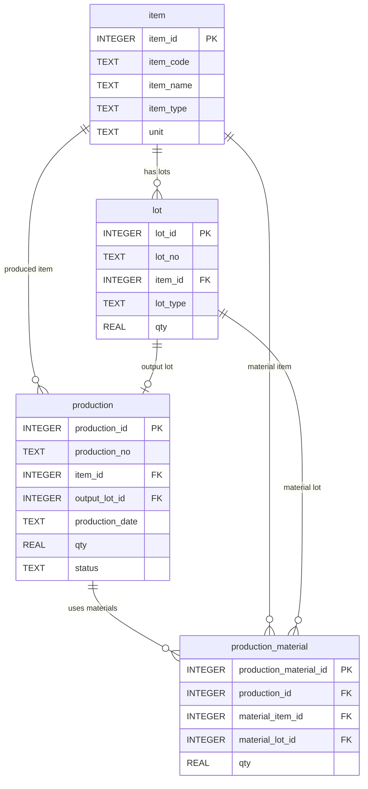

# Chapter 14. 마무리

## 1. 학습 목표

이 장을 마치면 다음을 할 수 있다.

- Mini MES 교재에서 배운 네 테이블의 역할을 정리할 수 있다.
- SQL 관점에서 MES 데이터를 읽는 흐름을 설명할 수 있다.
- 재고, 생산, 원재료 투입, LOT 추적 조회를 구분할 수 있다.
- 다음 학습 주제를 스스로 선택할 수 있다.

이 장은 전체 교재의 마무리다. 새로운 문법을 많이 추가하기보다, 지금까지 배운 내용을 라면공장 Mini MES 흐름으로 다시 정리한다.

## 2. 현장 상황

교육생이 Mini MES 실습을 마치고 현장 데이터를 처음 조회하게 되었다고 생각해 보자. 이제 단순히 `SELECT * FROM item;`을 실행하는 것에서 끝나지 않고, 다음 질문에 답할 수 있어야 한다.

| 현장 질문 | 확인할 데이터 |
| --- | --- |
| 어떤 품목을 관리하는가? | `item` |
| 현재 LOT 재고는 얼마인가? | `lot` |
| 언제 어떤 제품을 생산했는가? | `production` |
| 생산에 어떤 원재료 LOT가 들어갔는가? | `production_material` |
| 특정 LOT에 문제가 생기면 어디까지 영향이 있는가? | 네 테이블 연결 조회 |

MES는 현장 이벤트를 데이터로 남기는 시스템이다. SQL은 그 데이터를 다시 업무 질문에 맞게 읽어 내는 도구다.

## 3. 핵심 개념

### 네 테이블의 역할

이 교재는 처음부터 끝까지 네 테이블만 사용했다.

| 테이블 | 역할 |
| --- | --- |
| `item` | 제품과 원재료의 기준정보 |
| `lot` | 입고 또는 생산으로 생긴 LOT 재고 |
| `production` | 완제품 생산 실적 |
| `production_material` | 생산에 투입된 원재료 LOT 이력 |

테이블을 많이 만드는 것보다, 각 테이블의 책임을 분명히 이해하는 것이 먼저다.

### SQL 학습 흐름

이 교재의 SQL 학습 흐름은 다음과 같다.


기본 조회로 데이터를 보고, `WHERE`로 필요한 행을 찾고, `JOIN`으로 테이블을 연결하고, `GROUP BY`로 집계했다. 마지막에는 이 문법을 묶어 추적성과 분석 과제를 수행했다.

### MES 데이터 읽기

MES 데이터를 읽을 때는 다음 순서로 생각하면 좋다.

| 순서 | 질문 |
| --- | --- |
| 1 | 어떤 업무 질문인가? |
| 2 | 어떤 테이블에서 출발하는가? |
| 3 | 어떤 테이블과 연결해야 하는가? |
| 4 | 어떤 조건이 필요한가? |
| 5 | 행 단위 조회인가, 집계 조회인가? |
| 6 | 결과를 현장 말로 어떻게 해석할 것인가? |

SQL은 문법 암기만으로는 오래가지 않는다. 현장 질문을 테이블과 컬럼으로 바꾸는 연습이 중요하다.

## 4. 모델링 설명

Mini MES의 전체 관계는 다음과 같다.



이 관계에서 특히 중요한 연결은 다음 네 가지다.

| 연결 | 의미 |
| --- | --- |
| `lot.item_id = item.item_id` | LOT가 어떤 품목인지 확인 |
| `production.item_id = item.item_id` | 어떤 제품을 생산했는지 확인 |
| `production.output_lot_id = lot.lot_id` | 생산 결과 완제품 LOT 확인 |
| `production_material.production_id = production.production_id` | 생산 실적과 원재료 투입 이력 연결 |

추적성 조회에서는 여기에 `production_material.material_lot_id = lot.lot_id` 연결이 더해진다.

## 5. SQL 예제

### 5.1 네 테이블 행 수 확인

```sql
SELECT 'item' AS table_name, COUNT(*) AS row_count FROM item
UNION ALL
SELECT 'lot' AS table_name, COUNT(*) AS row_count FROM lot
UNION ALL
SELECT 'production' AS table_name, COUNT(*) AS row_count FROM production
UNION ALL
SELECT 'production_material' AS table_name, COUNT(*) AS row_count FROM production_material;
```

실습 데이터가 정상적으로 들어갔는지 확인하는 기본 SQL이다.

### 5.2 품목 기준정보 최종 확인

```sql
SELECT
    item_code,
    item_name,
    item_type,
    unit,
    is_active
FROM item
ORDER BY item_type, item_code;
```

`item`은 다른 테이블이 참조하는 기준정보다. 품목 코드, 품목명, 품목 유형을 먼저 확인한다.

### 5.3 현재 LOT 재고 요약

```sql
SELECT
    i.item_code,
    i.item_name,
    i.item_type,
    SUM(l.qty) AS total_stock_qty
FROM lot AS l
JOIN item AS i ON l.item_id = i.item_id
GROUP BY i.item_id, i.item_code, i.item_name, i.item_type
ORDER BY i.item_type, i.item_code;
```

품목별 현재 재고 수량을 요약한다.

### 5.4 생산 실적 요약

```sql
SELECT
    p.production_no,
    p.production_date,
    i.item_name AS product_name,
    p.qty AS production_qty,
    output_lot.lot_no AS output_lot_no,
    p.status
FROM production AS p
JOIN item AS i ON p.item_id = i.item_id
JOIN lot AS output_lot ON p.output_lot_id = output_lot.lot_id
ORDER BY p.production_date, p.production_no;
```

생산번호, 생산일자, 제품명, 완제품 LOT를 함께 확인한다.

### 5.5 원재료 투입 이력 요약

```sql
SELECT
    p.production_no,
    material_item.item_name AS material_name,
    material_lot.lot_no AS material_lot_no,
    pm.qty AS input_qty
FROM production_material AS pm
JOIN production AS p ON pm.production_id = p.production_id
JOIN item AS material_item ON pm.material_item_id = material_item.item_id
JOIN lot AS material_lot ON pm.material_lot_id = material_lot.lot_id
ORDER BY p.production_no, material_item.item_code;
```

어떤 생산에 어떤 원재료 LOT가 투입되었는지 확인한다.

### 5.6 최종 LOT 추적 조회

```sql
SELECT
    output_lot.lot_no AS output_lot_no,
    product_item.item_name AS product_name,
    p.production_no,
    p.production_date,
    material_item.item_name AS material_name,
    material_lot.lot_no AS material_lot_no,
    pm.qty AS input_qty
FROM production AS p
JOIN lot AS output_lot ON p.output_lot_id = output_lot.lot_id
JOIN item AS product_item ON p.item_id = product_item.item_id
JOIN production_material AS pm ON p.production_id = pm.production_id
JOIN item AS material_item ON pm.material_item_id = material_item.item_id
JOIN lot AS material_lot ON pm.material_lot_id = material_lot.lot_id
ORDER BY output_lot.lot_no, material_item.item_code;
```

완제품 LOT와 원재료 LOT의 연결을 전체적으로 보여 주는 조회다.

## 6. 데이터 해석

네 테이블 행 수를 보면 샘플 데이터의 구조를 빠르게 확인할 수 있다. `production`이 3행이고 `production_material`이 9행이라면, 생산 실적 1건마다 원재료 투입 이력이 평균 3건 있다는 뜻이다.

품목별 재고 요약은 창고 상태를 보여 준다. 하지만 현재 재고 수량만으로 충분 여부를 판단하려면 기준 수량이나 생산 계획이 필요하다.

LOT 추적 조회는 품질 대응의 핵심이다. 완제품 LOT에서 원재료 LOT를 찾을 수 있고, 원재료 LOT에서 영향받은 완제품 LOT도 찾을 수 있다. 이 능력이 있어야 문제 범위를 좁힐 수 있다.

## 7. 잘못된 설계 사례

### 7.1 품목명만 복사해서 여러 테이블에 저장하는 경우

품목명을 여러 테이블에 직접 저장하면 오타와 이름 변경 문제가 생긴다. 이 교재에서는 `item_id`로 `item`을 참조한다.

### 7.2 LOT 번호를 기록하지 않는 경우

수량만 저장하고 LOT 번호를 기록하지 않으면 추적성이 사라진다. 생산에 어떤 원재료 LOT가 들어갔는지 확인하려면 `production_material.material_lot_id`가 필요하다.

### 7.3 집계 결과를 원본 행처럼 해석하는 경우

`GROUP BY` 결과의 한 행은 원본 행 하나가 아니다. 여러 LOT나 여러 생산 실적을 묶은 결과일 수 있다. 집계 결과를 볼 때는 묶는 기준을 먼저 확인해야 한다.

## 8. 실습

### 실습 1. 전체 데이터 흐름 확인하기

```sql
SELECT
    p.production_no,
    product_item.item_name AS product_name,
    output_lot.lot_no AS output_lot_no,
    COUNT(pm.production_material_id) AS material_row_count
FROM production AS p
JOIN item AS product_item ON p.item_id = product_item.item_id
JOIN lot AS output_lot ON p.output_lot_id = output_lot.lot_id
JOIN production_material AS pm ON p.production_id = pm.production_id
GROUP BY p.production_id, p.production_no,
         product_item.item_name, output_lot.lot_no
ORDER BY p.production_no;
```

확인할 내용:

- 각 생산 실적에는 원재료 투입 행이 몇 개씩 연결되는가?
- 완제품 LOT 번호가 생산 실적과 함께 조회되는가?

### 실습 2. 원재료 LOT별 영향 범위 확인하기

```sql
SELECT
    material_lot.lot_no AS material_lot_no,
    COUNT(output_lot.lot_id) AS affected_lot_count,
    SUM(output_lot.qty) AS affected_stock_qty
FROM production_material AS pm
JOIN lot AS material_lot ON pm.material_lot_id = material_lot.lot_id
JOIN production AS p ON pm.production_id = p.production_id
JOIN lot AS output_lot ON p.output_lot_id = output_lot.lot_id
GROUP BY material_lot.lot_id, material_lot.lot_no
ORDER BY affected_lot_count DESC, material_lot.lot_no;
```

확인할 내용:

- 가장 많은 완제품 LOT에 영향을 줄 수 있는 원재료 LOT는 무엇인가?
- 영향 수량은 어떻게 계산되는가?

### 실습 3. 직접 질문 만들기

아래 질문 중 하나를 골라 SQL을 작성해 보자.

- 매운맛 라면 완제품 LOT만 조회하기
- 유통기한이 있는 LOT만 조회하기
- 생산일자별 원재료 투입 수량 합계 구하기
- 특정 원재료 LOT가 들어간 완제품 LOT 목록 만들기

먼저 출발 테이블을 정하고, 필요한 `JOIN`과 `WHERE` 조건을 적어 본다.

## 9. 확인 문제

1. `item` 테이블이 기준정보 역할을 하는 이유를 설명하시오.
2. `production`과 `lot`을 연결해야 완제품 LOT 번호를 볼 수 있는 이유를 설명하시오.
3. `production_material`이 없으면 원재료 추적에서 어떤 문제가 생기는가?
4. `GROUP BY` 결과를 해석할 때 먼저 확인해야 하는 것은 무엇인가?
5. LOT 추적 조회에서 같은 `lot` 테이블을 두 번 사용할 수 있는 이유를 설명하시오.
6. 이 교재의 네 테이블 중 현장 질문을 받았을 때 가장 먼저 출발 테이블을 정해야 하는 이유를 설명하시오.

## 10. 핵심 정리

- 이 교재는 `item`, `lot`, `production`, `production_material` 네 테이블로 Mini MES 흐름을 설명했다.
- `item`은 기준정보, `lot`은 재고 단위, `production`은 생산 실적, `production_material`은 원재료 투입 이력이다.
- SQL은 현장 질문을 데이터 조건과 연결하는 도구다.
- `JOIN`은 나누어진 테이블을 업무 의미에 맞게 연결한다.
- `GROUP BY`는 여러 행을 기준별로 묶어 현장 지표를 만든다.
- LOT 추적은 완제품과 원재료의 연결을 따라가며 품질 문제의 범위를 좁히는 작업이다.
- 다음 단계에서는 더 많은 샘플 데이터, 화면 설계, 권한 관리, 실제 MES 업무 흐름을 추가로 학습할 수 있다.
