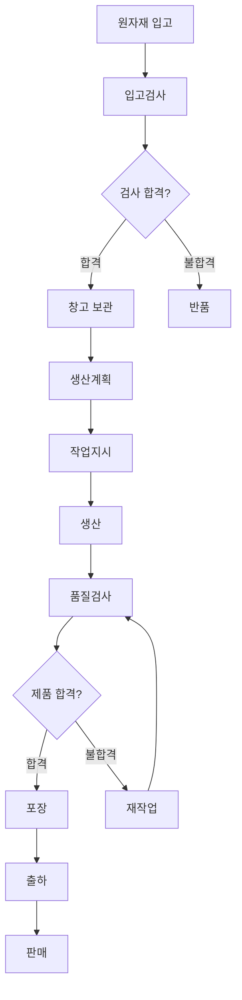

# Chapter 2. 제조업의 흐름 이해

---

# 학습목표

이번 장을 학습한 후 학생들은 다음 내용을 설명할 수 있다.

* 제조업의 전체 업무 흐름을 설명할 수 있다.
* 원자재 입고부터 판매까지 각 단계의 역할을 구분할 수 있다.
* 각 제조 단계에서 어떤 데이터가 발생하는지 설명할 수 있다.
* ERP, MES, WMS, QMS가 제조 흐름에서 담당하는 역할을 이해할 수 있다.
* 간단한 제조공정 흐름도를 작성할 수 있다.
* 제조 흐름을 데이터 관점에서 해석할 수 있다.

---

# 1. 제조업의 전체 흐름

제조업은 단순히 공장에서 제품을 만드는 활동만을 의미하지 않는다.

제품을 생산하기 위해서는 원자재 구매, 생산계획, 작업지시, 생산, 검사, 포장, 출하, 판매까지 여러 업무가 연결되어야 한다.

일반적인 제조업의 흐름은 다음과 같다.

```text
원자재 입고

    ↓

생산계획

    ↓

작업지시

    ↓

생산

    ↓

검사

    ↓

포장

    ↓

출하

    ↓

판매
```

각 단계는 독립적으로 수행되는 것이 아니라 앞 단계의 데이터를 다음 단계가 전달받는 구조로 연결된다.

예를 들어 생산계획이 없으면 어떤 제품을 얼마나 생산해야 하는지 알 수 없다.

작업지시가 없으면 작업자는 오늘 어떤 제품을 생산해야 하는지 판단하기 어렵다.

검사 결과가 없으면 생산된 제품을 출하해도 되는지 결정할 수 없다.

따라서 제조업은 다음과 같이 이해할 수 있다.

> 제조업은 재료, 사람, 설비, 작업, 품질, 물류 데이터를 연결하여 제품을 생산하고 고객에게 전달하는 과정이다.

---

# 2. 제조 흐름과 정보시스템

제조업의 각 단계에서는 다양한 정보시스템이 사용된다.

| 시스템 | 영문                               | 주요 역할                     |
| --- | -------------------------------- | ------------------------- |
| ERP | Enterprise Resource Planning     | 구매, 자재, 생산계획, 회계, 판매 관리   |
| MES | Manufacturing Execution System   | 작업지시, 생산실적, 공정, 설비, 추적 관리 |
| WMS | Warehouse Management System      | 창고, 재고, 입출고, 위치 관리        |
| QMS | Quality Management System        | 검사, 품질기준, 부적합, 개선조치 관리    |
| SCM | Supply Chain Management          | 공급망, 구매, 수요, 납기 관리        |
| CRM | Customer Relationship Management | 고객, 영업, 판매, 고객 대응 관리      |

제조기업마다 시스템의 구분은 다를 수 있다.

규모가 작은 기업에서는 하나의 ERP가 여러 기능을 함께 담당하기도 한다.

규모가 큰 기업에서는 ERP, MES, WMS, QMS를 각각 구축하고 서로 데이터를 연동한다.

---

# 3. 원자재 입고

## 3.1 원자재 입고란?

원자재 입고는 생산에 필요한 재료나 부품이 외부 공급업체로부터 공장 또는 창고에 도착하는 단계이다.

원자재는 제품을 만들기 위한 시작점이다.

예를 들어 다음과 같은 것들이 원자재가 될 수 있다.

* 자동차 제조업의 철판, 타이어, 볼트
* 전자제품 제조업의 반도체, PCB, 디스플레이
* 식품 제조업의 밀가루, 설탕, 식용유
* 배터리 제조업의 양극재, 음극재, 전해액
* 철강 제조업의 철광석, 석탄, 합금철

---

## 3.2 원자재 입고 업무

원자재가 공장에 도착하면 일반적으로 다음 업무를 수행한다.

```text
발주 확인

    ↓

입고 수량 확인

    ↓

외관 검사

    ↓

품질 검사

    ↓

합격 또는 불합격 판정

    ↓

창고 적재

    ↓

재고 등록
```

---

## 3.3 원자재 입고 시 필요한 데이터

| 데이터    | 설명            | 예시            |
| ------ | ------------- | ------------- |
| 입고번호   | 입고 건을 구분하는 번호 | RCV-2026-001  |
| 자재코드   | 원자재를 구분하는 코드  | MAT-STEEL-001 |
| 자재명    | 원자재 이름        | 냉연강판          |
| 공급업체   | 원자재를 납품한 회사   | 대한철강          |
| 발주번호   | 구매 주문 번호      | PO-2026-1001  |
| 입고일자   | 원자재가 도착한 날짜   | 2026-07-13    |
| 입고수량   | 실제 입고된 수량     | 1,000kg       |
| 단위     | 수량 단위         | EA, kg, L     |
| LOT 번호 | 원자재 생산 단위 번호  | LOT-A260713   |
| 유효기간   | 사용할 수 있는 기간   | 2027-07-13    |
| 검사결과   | 합격 또는 불합격     | 합격            |
| 창고위치   | 자재를 보관한 위치    | A창고-01-03     |

---

## 3.4 LOT 관리

LOT는 같은 조건에서 생산되거나 입고된 제품 또는 자재의 묶음을 의미한다.

예를 들어 동일한 날짜와 동일한 설비에서 생산된 자재를 하나의 LOT로 관리할 수 있다.

```text
원자재 LOT 번호: RM-20260713-001
```

LOT를 관리하면 다음 정보를 추적할 수 있다.

* 어떤 공급업체에서 들어왔는가?
* 언제 입고되었는가?
* 어떤 제품 생산에 사용되었는가?
* 품질 문제가 발생했는가?
* 문제가 발생한 제품은 어디로 출하되었는가?

LOT 추적은 식품, 제약, 자동차, 배터리, 반도체 산업에서 매우 중요하다.

---

## 3.5 원자재 입고 단계의 핵심 질문

* 필요한 원자재가 제때 도착했는가?
* 주문한 수량과 실제 입고 수량이 일치하는가?
* 품질검사에 합격했는가?
* 원자재 LOT를 추적할 수 있는가?
* 어느 창고에 보관되어 있는가?
* 현재 사용할 수 있는 재고는 얼마인가?

---

# 4. 생산계획

## 4.1 생산계획이란?

생산계획은 어떤 제품을 언제, 얼마나 생산할지 결정하는 활동이다.

생산계획은 고객 주문, 판매예측, 현재 재고, 설비능력, 작업자 수, 자재 재고 등을 고려하여 작성한다.

```text
고객 주문

판매 예측

제품 재고

원자재 재고

설비 생산능력

작업자 수

    ↓

생산계획 수립
```

---

## 4.2 생산계획의 주요 목적

* 고객 납기를 지킨다.
* 필요한 수량만큼 생산한다.
* 과잉재고를 줄인다.
* 설비와 작업자를 효율적으로 활용한다.
* 원자재 부족을 예방한다.
* 생산공정의 혼잡을 줄인다.

---

## 4.3 생산계획의 종류

### 장기 생산계획

수개월 또는 1년 이상의 생산 방향을 결정한다.

주요 내용은 다음과 같다.

* 공장 증설
* 설비 투자
* 인력 충원
* 생산능력 확대
* 신규 제품 생산 준비

### 중기 생산계획

월간 또는 분기 단위로 생산량을 계획한다.

```text
7월 생산계획: 제품 A 10,000개
8월 생산계획: 제품 A 12,000개
```

### 단기 생산계획

일간 또는 주간 단위의 구체적인 생산일정을 결정한다.

```text
월요일: 제품 A 500개
화요일: 제품 A 300개, 제품 B 200개
수요일: 제품 B 500개
```

---

## 4.4 생산계획 시 필요한 데이터

| 데이터    | 설명              | 예시             |
| ------ | --------------- | -------------- |
| 생산계획번호 | 생산계획 식별번호       | PLAN-2026-0713 |
| 제품코드   | 생산할 제품의 코드      | PROD-A001      |
| 제품명    | 생산할 제품 이름       | 스마트센서 A형       |
| 계획수량   | 생산 예정 수량        | 1,000개         |
| 계획시작일  | 생산 시작 예정일       | 2026-07-14     |
| 계획완료일  | 생산 완료 예정일       | 2026-07-16     |
| 납기일    | 고객에게 전달해야 하는 날짜 | 2026-07-18     |
| 고객주문번호 | 생산 근거가 되는 주문번호  | SO-2026-1004   |
| 생산라인   | 생산 예정 라인        | 조립 1라인         |
| 우선순위   | 생산 순서의 중요도      | 긴급             |
| 재고수량   | 현재 완제품 재고       | 200개           |
| 부족수량   | 추가 생산 필요 수량     | 800개           |

---

## 4.5 생산능력과 생산계획

생산계획은 설비와 작업자의 생산능력을 고려해야 한다.

예를 들어 하루 최대 생산량이 500개인 생산라인에 하루 1,000개를 생산하도록 계획하면 계획을 달성하기 어렵다.

```text
하루 생산능력: 500개

계획수량: 1,000개

필요 생산일수: 2일
```

생산능력은 다음 요소에 영향을 받는다.

* 설비 수
* 설비 속도
* 작업시간
* 작업자 수
* 제품 종류
* 교체시간
* 고장시간
* 불량률

---

## 4.6 생산계획 단계의 핵심 질문

* 무엇을 생산해야 하는가?
* 몇 개를 생산해야 하는가?
* 언제 생산해야 하는가?
* 어느 생산라인에서 생산할 것인가?
* 원자재가 충분한가?
* 설비 생산능력이 충분한가?
* 고객 납기를 지킬 수 있는가?

---

# 5. 작업지시

## 5.1 작업지시란?

작업지시는 생산계획을 실제 제조 현장에서 수행할 수 있도록 구체적인 작업 단위로 전달하는 것이다.

생산계획이 전체 방향이라면 작업지시는 현장 실행 명령에 해당한다.

```text
생산계획

제품 A 1,000개 생산

    ↓

작업지시 1

1라인에서 오전에 500개 생산

    ↓

작업지시 2

2라인에서 오후에 500개 생산
```

---

## 5.2 작업지시의 목적

* 작업자가 수행할 업무를 명확하게 한다.
* 생산 대상과 수량을 지정한다.
* 사용할 설비를 지정한다.
* 작업 시작시간과 종료시간을 지정한다.
* 사용할 원자재와 공정을 지정한다.
* 생산실적을 계획과 비교할 수 있게 한다.

---

## 5.3 작업지시서에 포함되는 데이터

| 데이터     | 설명          | 예시               |
| ------- | ----------- | ---------------- |
| 작업지시번호  | 작업지시 식별번호   | WO-2026-0713-001 |
| 생산계획번호  | 관련 생산계획 번호  | PLAN-2026-0713   |
| 제품코드    | 생산할 제품      | PROD-A001        |
| 지시수량    | 생산 지시 수량    | 500개             |
| 작업일자    | 작업 예정 날짜    | 2026-07-14       |
| 시작시간    | 작업 시작 예정시간  | 09:00            |
| 종료시간    | 작업 종료 예정시간  | 12:00            |
| 공정코드    | 수행할 공정      | ASSY-01          |
| 설비코드    | 사용할 설비      | MC-ASSY-01       |
| 생산라인    | 작업할 생산라인    | 조립 1라인           |
| 작업자     | 담당 작업자      | 홍길동              |
| 원자재 LOT | 사용할 원자재 LOT | RM-20260713-001  |
| 작업상태    | 대기, 진행, 완료  | 대기               |

---

## 5.4 작업지시 상태

MES에서는 작업지시의 진행 상태를 관리한다.

```text
계획

↓

대기

↓

작업 시작

↓

진행 중

↓

작업 완료

↓

마감
```

대표적인 작업지시 상태는 다음과 같다.

| 상태 | 의미              |
| -- | --------------- |
| 계획 | 생산계획만 생성된 상태    |
| 대기 | 작업 시작 전 상태      |
| 진행 | 현재 생산 중인 상태     |
| 중지 | 생산이 일시 정지된 상태   |
| 완료 | 지시수량 생산이 완료된 상태 |
| 취소 | 작업지시가 취소된 상태    |
| 마감 | 실적 확인까지 완료된 상태  |

---

## 5.5 작업지시 단계의 핵심 질문

* 어떤 제품을 생산해야 하는가?
* 몇 개를 생산해야 하는가?
* 누가 작업하는가?
* 어느 설비에서 작업하는가?
* 어떤 원자재 LOT를 사용하는가?
* 작업은 언제 시작하고 종료하는가?
* 현재 작업 상태는 무엇인가?

---

# 6. 생산

## 6.1 생산 단계란?

생산 단계는 원자재나 부품을 가공 또는 조립하여 제품을 만드는 실제 제조 활동이다.

생산은 제조업의 핵심 활동이지만, MES 관점에서는 단순히 제품을 만드는 것뿐 아니라 생산 중 발생하는 데이터를 기록하는 것이 중요하다.

---

## 6.2 생산 단계에서 발생하는 활동

* 작업 시작
* 원자재 투입
* 설비 가동
* 제품 가공
* 제품 조립
* 공정 이동
* 작업 중지
* 설비 고장
* 생산수량 기록
* 불량수량 기록
* 작업 완료

---

## 6.3 생산실적

생산실적은 실제로 생산된 결과를 의미한다.

생산계획과 작업지시는 예정된 수량이고, 생산실적은 실제 생산된 수량이다.

```text
계획수량: 1,000개

실제 생산수량: 950개

정상품: 920개

불량품: 30개
```

---

## 6.4 생산 단계에서 필요한 데이터

| 데이터    | 설명          | 예시               |
| ------ | ----------- | ---------------- |
| 생산실적번호 | 생산실적 식별번호   | RESULT-001       |
| 작업지시번호 | 관련 작업지시     | WO-2026-0713-001 |
| 제품코드   | 생산한 제품      | PROD-A001        |
| 생산 LOT | 생산된 제품의 LOT | FG-20260714-001  |
| 투입수량   | 생산에 투입한 수량  | 1,000개           |
| 생산수량   | 실제 생산한 총수량  | 950개             |
| 양품수량   | 정상 제품 수량    | 920개             |
| 불량수량   | 불량 제품 수량    | 30개              |
| 작업시작시간 | 실제 시작시간     | 09:05            |
| 작업종료시간 | 실제 종료시간     | 12:20            |
| 설비코드   | 사용한 설비      | MC-ASSY-01       |
| 작업자    | 작업 담당자      | 홍길동              |
| 비가동시간  | 설비가 멈춘 시간   | 20분              |
| 불량코드   | 불량 유형       | 조립불량             |
| 작업상태   | 현재 작업상태     | 완료               |

---

## 6.5 생산실적의 기본 계산

### 생산달성률

```text
생산달성률 = 실제 생산수량 ÷ 계획수량 × 100
```

예시:

```text
계획수량 = 1,000개
실제 생산수량 = 950개

생산달성률 = 950 ÷ 1,000 × 100
            = 95%
```

### 불량률

```text
불량률 = 불량수량 ÷ 생산수량 × 100
```

예시:

```text
생산수량 = 950개
불량수량 = 30개

불량률 = 30 ÷ 950 × 100
        ≒ 3.16%
```

### 양품률

```text
양품률 = 양품수량 ÷ 생산수량 × 100
```

예시:

```text
양품수량 = 920개
생산수량 = 950개

양품률 = 920 ÷ 950 × 100
        ≒ 96.84%
```

---

## 6.6 설비 데이터

생산 중에는 설비에서도 다양한 데이터가 발생한다.

| 설비 데이터 | 설명             |
| ------ | -------------- |
| 설비상태   | 가동, 정지, 고장, 대기 |
| 가동시간   | 실제 생산에 사용된 시간  |
| 정지시간   | 설비가 멈춘 시간      |
| 고장코드   | 고장 원인          |
| 온도     | 설비 또는 공정 온도    |
| 압력     | 공정 압력          |
| 속도     | 설비 생산속도        |
| 전류     | 설비 전류값         |
| 진동     | 설비 진동값         |
| 생산카운트  | 설비가 생산한 수량     |

---

## 6.7 생산 단계의 핵심 질문

* 현재 무엇을 생산하고 있는가?
* 계획 대비 얼마나 생산했는가?
* 양품과 불량품은 각각 몇 개인가?
* 어떤 원자재 LOT가 사용되었는가?
* 어떤 설비와 작업자가 생산했는가?
* 설비가 중지된 이유는 무엇인가?
* 제품이 현재 어느 공정에 있는가?

---

# 7. 검사

## 7.1 검사란?

검사는 생산된 제품이 정해진 품질기준을 만족하는지 확인하는 활동이다.

검사는 원자재 입고 시점, 생산공정 중간, 생산 완료 후 등 여러 단계에서 수행할 수 있다.

---

## 7.2 검사의 종류

### 수입검사

공급업체로부터 입고된 원자재나 부품을 검사한다.

```text
원자재 입고 → 수입검사 → 창고 입고
```

### 공정검사

제품이 생산되는 중간 단계에서 검사한다.

```text
가공 → 공정검사 → 조립
```

### 최종검사

완성된 제품이 출하 가능한 상태인지 검사한다.

```text
생산 완료 → 최종검사 → 포장
```

### 출하검사

고객에게 출하하기 전에 최종적으로 제품 상태를 검사한다.

---

## 7.3 검사 단계에서 필요한 데이터

| 데이터    | 설명             | 예시              |
| ------ | -------------- | --------------- |
| 검사번호   | 검사 식별번호        | INS-2026-001    |
| 검사일자   | 검사를 수행한 날짜     | 2026-07-14      |
| 검사유형   | 수입, 공정, 최종, 출하 | 최종검사            |
| 제품코드   | 검사 대상 제품       | PROD-A001       |
| 생산 LOT | 검사 대상 LOT      | FG-20260714-001 |
| 검사수량   | 검사한 수량         | 100개            |
| 합격수량   | 검사 합격 수량       | 97개             |
| 불합격수량  | 검사 불합격 수량      | 3개              |
| 검사기준   | 품질 판단 기준       | 길이 100±0.5mm    |
| 측정값    | 실제 측정 결과       | 100.2mm         |
| 검사결과   | 합격 또는 불합격      | 합격              |
| 불량코드   | 불량 유형          | 치수불량            |
| 검사자    | 검사 담당자         | 김품질             |
| 측정장비   | 사용한 검사장비       | 버니어캘리퍼스         |

---

## 7.4 검사 판정

검사 결과는 일반적으로 다음과 같이 처리된다.

```text
검사

├─ 합격 → 다음 공정 또는 포장
│
└─ 불합격
      ├─ 재작업
      ├─ 수리
      ├─ 폐기
      └─ 특채
```

특채는 품질기준을 완전히 만족하지는 않지만 고객이나 품질 책임자의 승인을 받아 제한적으로 사용하는 것을 의미한다.

---

## 7.5 불량 관리

불량이 발생하면 단순히 불량수량만 기록하는 것이 아니라 원인을 관리해야 한다.

대표적인 불량 원인은 다음과 같다.

* 원자재 불량
* 설비 이상
* 작업자 실수
* 작업방법 오류
* 온도 또는 압력 조건 이탈
* 설계 오류
* 측정 오류

---

## 7.6 검사 단계의 핵심 질문

* 제품이 품질기준을 만족하는가?
* 검사 결과는 합격인가 불합격인가?
* 어떤 항목에서 불량이 발생했는가?
* 불량 원인은 무엇인가?
* 재작업이 가능한가?
* 어떤 생산 LOT에서 문제가 발생했는가?
* 동일한 원자재를 사용한 다른 제품에도 문제가 있는가?

---

# 8. 포장

## 8.1 포장이란?

포장은 생산과 검사가 완료된 제품을 운송하고 보관하기 좋은 형태로 만드는 활동이다.

포장은 단순히 제품을 상자에 넣는 작업이 아니다.

제품 보호, 제품 식별, 수량 확인, 고객 정보 표시, 추적성 확보를 위한 중요한 과정이다.

---

## 8.2 포장의 주요 목적

* 운송 중 제품을 보호한다.
* 제품의 오염과 손상을 방지한다.
* 제품 수량을 구분한다.
* 제품 정보를 표시한다.
* 고객 주문과 제품을 연결한다.
* 바코드 또는 QR 코드로 추적할 수 있게 한다.

---

## 8.3 포장 단계에서 필요한 데이터

| 데이터    | 설명          | 예시              |
| ------ | ----------- | --------------- |
| 포장번호   | 포장 식별번호     | PKG-2026-001    |
| 제품코드   | 포장 대상 제품    | PROD-A001       |
| 생산 LOT | 포장 제품 LOT   | FG-20260714-001 |
| 포장수량   | 포장한 제품 수량   | 100개            |
| 박스번호   | 개별 포장 박스 번호 | BOX-001         |
| 팔레트번호  | 팔레트 식별번호    | PLT-001         |
| 포장일자   | 포장한 날짜      | 2026-07-15      |
| 포장작업자  | 포장 담당자      | 이포장             |
| 포장규격   | 포장 방법 또는 규격 | 10개 × 10박스      |
| 라벨번호   | 제품 라벨 번호    | LABEL-001       |
| 고객정보   | 납품 대상 고객    | ABC전자           |
| 출하대기위치 | 포장 완료 후 위치  | 출하장-02          |

---

## 8.4 포장 단위

제품은 여러 단계의 포장 단위를 가질 수 있다.

```text
제품 1개

    ↓

소포장 10개

    ↓

박스 10개

    ↓

팔레트 20박스
```

예를 들어 하나의 팔레트에 총 몇 개의 제품이 들어가는지 계산할 수 있다.

```text
제품 수량 = 10개 × 10박스 × 20박스
          = 2,000개
```

---

## 8.5 포장 라벨 정보

제품 라벨에는 일반적으로 다음 정보가 포함된다.

* 제품명
* 제품코드
* 생산일자
* 유효기간
* 생산 LOT
* 수량
* 바코드
* QR 코드
* 고객명
* 공급업체명

---

## 8.6 포장 단계의 핵심 질문

* 어떤 제품을 몇 개 포장했는가?
* 생산 LOT와 포장번호가 연결되어 있는가?
* 포장 규격이 고객 요구사항과 일치하는가?
* 라벨 정보가 정확한가?
* 어느 출하대기 위치에 보관되어 있는가?
* 박스와 팔레트별 제품 수량은 얼마인가?

---

# 9. 출하

## 9.1 출하란?

출하는 생산과 포장이 완료된 제품을 고객에게 보내는 활동이다.

출하 단계에서는 고객 주문, 제품, 수량, 납기, 차량, 배송지 정보가 정확하게 연결되어야 한다.

---

## 9.2 출하 업무 흐름

```text
고객 주문 확인

    ↓

출하 대상 제품 확인

    ↓

재고 할당

    ↓

출하검사

    ↓

상차

    ↓

출하 처리

    ↓

고객 배송
```

---

## 9.3 출하 단계에서 필요한 데이터

| 데이터    | 설명           | 예시              |
| ------ | ------------ | --------------- |
| 출하번호   | 출하 식별번호      | SHIP-2026-001   |
| 판매주문번호 | 고객 주문번호      | SO-2026-1004    |
| 고객코드   | 고객 식별코드      | CUST-001        |
| 고객명    | 납품 대상 고객     | ABC전자           |
| 제품코드   | 출하 제품        | PROD-A001       |
| 출하수량   | 출하 제품 수량     | 1,000개          |
| 생산 LOT | 출하 대상 제품 LOT | FG-20260714-001 |
| 포장번호   | 관련 포장번호      | PKG-2026-001    |
| 출하일자   | 공장에서 출발한 날짜  | 2026-07-16      |
| 납기일    | 고객과 약속한 날짜   | 2026-07-18      |
| 배송지    | 제품 도착 장소     | 부산광역시           |
| 차량번호   | 운송 차량 번호     | 12가3456         |
| 운송업체   | 배송 담당 업체     | 대한물류            |
| 출하상태   | 대기, 상차, 출하완료 | 출하완료            |

---

## 9.4 선입선출

선입선출은 먼저 입고되거나 먼저 생산된 제품을 먼저 출하하는 방식이다.

영어로 FIFO라고 한다.

```text
FIFO = First In, First Out
```

예를 들어 다음 두 LOT가 있다.

```text
LOT-A: 7월 1일 생산
LOT-B: 7월 5일 생산
```

일반적으로 LOT-A를 먼저 출하한다.

선입선출은 식품, 의약품, 화학제품처럼 유효기간이 있는 제품에서 특히 중요하다.

---

## 9.5 납기준수율

납기준수율은 약속한 날짜 안에 제품을 출하한 비율이다.

```text
납기준수율 = 납기 내 출하 건수 ÷ 전체 출하 건수 × 100
```

예시:

```text
전체 출하 건수 = 100건
납기 내 출하 건수 = 95건

납기준수율 = 95 ÷ 100 × 100
            = 95%
```

---

## 9.6 출하 단계의 핵심 질문

* 어떤 고객에게 출하하는가?
* 어떤 제품을 몇 개 출하하는가?
* 고객 주문과 출하수량이 일치하는가?
* 어떤 생산 LOT가 출하되는가?
* 납기일을 지킬 수 있는가?
* 출하 제품의 품질검사가 완료되었는가?
* 운송 차량과 배송지는 정확한가?

---

# 10. 판매

## 10.1 판매란?

판매는 고객에게 제품을 제공하고 대금을 청구하는 활동이다.

판매는 제조업 흐름의 마지막 단계처럼 보이지만, 실제로는 다음 생산계획을 만드는 시작점이 된다.

```text
고객 주문

    ↓

생산

    ↓

출하

    ↓

판매

    ↓

다음 주문과 생산계획
```

---

## 10.2 판매 단계에서 필요한 데이터

| 데이터     | 설명           | 예시            |
| ------- | ------------ | ------------- |
| 판매주문번호  | 고객 주문 식별번호   | SO-2026-1004  |
| 고객코드    | 고객 식별코드      | CUST-001      |
| 제품코드    | 판매 제품        | PROD-A001     |
| 주문수량    | 고객 주문 수량     | 1,000개        |
| 판매단가    | 제품 한 개의 가격   | 10,000원       |
| 판매금액    | 전체 판매금액      | 10,000,000원   |
| 주문일자    | 고객이 주문한 날짜   | 2026-07-10    |
| 납기일     | 고객 요청 납기     | 2026-07-18    |
| 출하번호    | 관련 출하번호      | SHIP-2026-001 |
| 세금계산서번호 | 매출 증빙번호      | TAX-2026-001  |
| 결제조건    | 대금 지급 조건     | 납품 후 30일      |
| 판매상태    | 주문, 출하, 매출완료 | 매출완료          |

---

## 10.3 판매정보와 생산계획

판매정보는 다음 생산계획을 수립하는 데 활용된다.

예를 들어 특정 제품의 주문량이 계속 증가하면 생산계획도 증가해야 한다.

```text
제품 A 판매량 증가

    ↓

제품 A 재고 감소

    ↓

추가 생산 필요

    ↓

생산계획 증가
```

따라서 제조업의 흐름은 직선으로 끝나는 것이 아니라 반복되는 순환구조이다.

```text
판매

    ↓

수요예측

    ↓

생산계획

    ↓

생산

    ↓

출하

    ↓

판매
```

---

# 11. 제조 단계별 데이터 정리

| 단계     | 주요 업무            | 핵심 데이터               |
| ------ | ---------------- | -------------------- |
| 원자재 입고 | 자재 수령, 검사, 창고 적재 | 자재코드, 수량, 공급업체, LOT  |
| 생산계획   | 생산 제품과 수량 결정     | 제품코드, 계획수량, 생산일정     |
| 작업지시   | 현장 작업 명령         | 작업지시번호, 설비, 작업자      |
| 생산     | 제품 가공 및 조립       | 생산수량, 양품, 불량, 생산 LOT |
| 검사     | 품질기준 확인          | 검사값, 판정, 불량코드        |
| 포장     | 제품 보호 및 식별       | 포장번호, 박스, 팔레트, 라벨    |
| 출하     | 고객에게 제품 전달       | 고객, 출하수량, 차량, 배송지    |
| 판매     | 주문과 매출 관리        | 주문번호, 판매단가, 판매금액     |

---

# 12. 데이터가 연결되는 구조

제조업에서 중요한 것은 각 단계의 데이터가 서로 연결되는 것이다.

다음과 같은 연결관계를 생각할 수 있다.

```text
판매주문번호
    ↓
생산계획번호
    ↓
작업지시번호
    ↓
생산실적번호
    ↓
생산 LOT
    ↓
검사번호
    ↓
포장번호
    ↓
출하번호
```

이 연결이 잘 구성되어 있으면 제품에 문제가 발생했을 때 원인을 추적할 수 있다.

---

# 13. 제품 추적성

## 13.1 정방향 추적

원자재가 어떤 제품에 사용되고 어디로 출하되었는지 추적하는 것이다.

```text
원자재 LOT

    ↓

작업지시

    ↓

생산 LOT

    ↓

포장번호

    ↓

출하번호

    ↓

고객
```

예시 질문:

> 특정 원자재 LOT를 사용하여 생산된 제품은 어느 고객에게 출하되었는가?

---

## 13.2 역방향 추적

고객에게 출하된 제품이 어떤 원자재와 생산조건으로 만들어졌는지 추적하는 것이다.

```text
고객

    ↓

출하번호

    ↓

제품 LOT

    ↓

작업지시

    ↓

사용 설비

    ↓

원자재 LOT
```

예시 질문:

> 고객이 불량을 신고한 제품은 어떤 원자재와 설비를 사용하여 생산되었는가?

---

# 14. 제조 데이터의 기본 분류

MES를 설계할 때 제조 데이터는 일반적으로 기준정보와 실적정보로 나눈다.

---

## 14.1 기준정보

기준정보는 반복적으로 사용하는 기본 데이터이다.

영어로 Master Data라고 한다.

| 기준정보  | 설명            |
| ----- | ------------- |
| 제품정보  | 제품코드, 제품명, 규격 |
| 자재정보  | 자재코드, 자재명     |
| 공정정보  | 공정코드, 공정순서    |
| 설비정보  | 설비코드, 설비명     |
| 작업자정보 | 사번, 이름, 소속    |
| 거래처정보 | 공급업체, 고객      |
| 불량정보  | 불량코드, 불량명     |
| 창고정보  | 창고코드, 위치      |

---

## 14.2 실적정보

실적정보는 실제 업무가 수행되면서 발생하는 데이터이다.

| 실적정보 | 설명           |
| ---- | ------------ |
| 입고실적 | 실제 입고된 자재    |
| 생산실적 | 실제 생산한 수량    |
| 검사실적 | 실제 검사 결과     |
| 설비실적 | 실제 가동과 정지 시간 |
| 포장실적 | 실제 포장 결과     |
| 출하실적 | 실제 출하 결과     |
| 판매실적 | 실제 매출 결과     |

---

# 15. 제조 흐름 예제

스마트센서 1,000개를 생산하는 상황을 가정해보자.

---

## 15.1 원자재 입고

```text
센서모듈 1,000개 입고
케이스 1,000개 입고
PCB 1,000개 입고
```

입고 데이터:

```text
자재코드: MAT-SENSOR
입고수량: 1,000개
원자재 LOT: RM-20260713-001
검사결과: 합격
```

---

## 15.2 생산계획

```text
제품: 스마트센서 A형
계획수량: 1,000개
생산기간: 7월 14일~7월 16일
납기일: 7월 18일
```

---

## 15.3 작업지시

```text
작업지시번호: WO-2026-001
생산라인: 조립 1라인
지시수량: 1,000개
담당자: 홍길동
```

---

## 15.4 생산

```text
투입수량: 1,000개
생산수량: 980개
양품수량: 960개
불량수량: 20개
```

---

## 15.5 검사

```text
검사수량: 960개
합격수량: 955개
불합격수량: 5개
```

---

## 15.6 포장

```text
포장수량: 955개
박스당 수량: 10개
박스 수: 96박스
```

마지막 박스에는 5개가 들어간다.

---

## 15.7 출하

```text
고객: ABC전자
출하수량: 955개
출하일자: 7월 17일
납기일: 7월 18일
```

---

# 16. 생산 흐름에서 발생할 수 있는 문제

| 단계     | 발생 가능한 문제             |
| ------ | --------------------- |
| 원자재 입고 | 입고 지연, 수량 부족, 자재 불량   |
| 생산계획   | 과잉생산, 계획 오류, 납기 계산 오류 |
| 작업지시   | 잘못된 제품 지시, 설비 배정 오류   |
| 생산     | 설비 고장, 생산량 부족, 불량 발생  |
| 검사     | 검사 누락, 측정 오류, 판정 오류   |
| 포장     | 라벨 오류, 수량 오류, 포장 손상   |
| 출하     | 오출하, 납기 지연, 배송지 오류    |
| 판매     | 주문정보 오류, 매출 누락        |

MES는 이러한 문제를 빠르게 발견하고 기록하며 추적하기 위해 사용된다.

---

# 17. MES 관점에서 보는 제조 흐름

MES는 생산계획 자체보다는 계획을 현장에서 실행하고 실적을 수집하는 역할에 집중한다.

```text
ERP

생산계획
자재계획
고객주문

    ↓

MES

작업지시
생산실적
설비상태
품질정보
LOT 추적

    ↓

현장

작업자
설비
센서
PLC
```

MES의 핵심 기능은 다음과 같다.

* 작업지시 전달
* 생산진행 현황 확인
* 생산실적 수집
* 불량정보 관리
* 설비상태 수집
* LOT 추적
* 생산이력 관리
* 공정별 재공품 관리

---

# 18. 실습: 제조공정 흐름도 작성

## 실습목표

하나의 제품을 선택하고 원자재 입고부터 출하까지의 제조 흐름을 작성한다.

---

## 실습 주제 예시

다음 제품 중 하나를 선택한다.

* 스마트폰
* 자동차
* 라면
* 생수
* 스마트센서
* 배터리
* 책상
* 노트북
* 산업용 로봇
* 철강제품

---

## 실습 1. 기본 흐름도 작성

다음 형식을 사용하여 제조 흐름을 작성한다.

```text
원자재 입고

    ↓

생산계획

    ↓

작업지시

    ↓

생산

    ↓

검사

    ↓

포장

    ↓

출하
```

---

## 실습 2. 제품별 상세 흐름 작성

예를 들어 라면 제조공정은 다음과 같이 작성할 수 있다.

```text
밀가루 입고

    ↓

원재료 검사

    ↓

반죽

    ↓

면 성형

    ↓

증숙

    ↓

튀김 또는 건조

    ↓

스프 투입

    ↓

중량 검사

    ↓

포장

    ↓

박스 포장

    ↓

출하
```

---

## 실습 3. 단계별 데이터 작성

선택한 제품의 각 단계에서 필요한 데이터를 작성한다.

| 단계     | 수행 업무 | 필요한 데이터 |
| ------ | ----- | ------- |
| 원자재 입고 |       |         |
| 생산계획   |       |         |
| 작업지시   |       |         |
| 생산     |       |         |
| 검사     |       |         |
| 포장     |       |         |
| 출하     |       |         |

---

## 실습 4. 흐름도에 조건 추가

제조공정에는 항상 정상 흐름만 있는 것은 아니다.

검사 결과에 따라 흐름이 달라질 수 있다.

```text
제품 생산

    ↓

품질검사

    ↓

합격 여부

├─ 합격 → 포장 → 출하
│
└─ 불합격 → 재작업 → 재검사
                    │
                    ├─ 합격 → 포장
                    │
                    └─ 불합격 → 폐기
```

---

## 실습 5. Mermaid를 이용한 흐름도 작성

마크다운 편집기에서 Mermaid를 지원한다면 다음과 같이 작성할 수 있다.



---

# 19. 조별 토의

다음 질문에 대해 조별로 토의한다.

1. 생산계획 없이 작업자가 임의로 생산하면 어떤 문제가 발생할까?
2. 생산실적을 기록하지 않으면 회사는 어떤 정보를 알 수 없을까?
3. 제품 LOT를 관리하지 않으면 품질 문제가 발생했을 때 어떤 문제가 생길까?
4. 검사 결과가 MES에 저장되지 않으면 어떤 문제가 발생할까?
5. 포장 라벨이 잘못 출력되면 어떤 문제가 발생할까?
6. 출하 단계에서 생산 LOT가 필요한 이유는 무엇일까?
7. ERP와 MES의 역할은 어떻게 다를까?

---

# 20. 연습문제

## 문제 1

다음 제조 흐름을 올바른 순서로 나열하시오.

```text
검사, 생산계획, 출하, 원자재 입고, 생산, 작업지시
```

---

## 문제 2

생산계획과 작업지시의 차이를 설명하시오.

---

## 문제 3

생산 단계에서 반드시 수집해야 할 데이터 세 가지를 작성하시오.

---

## 문제 4

제품 LOT를 관리해야 하는 이유를 설명하시오.

---

## 문제 5

다음 중 검사 단계에서 관리하는 데이터가 아닌 것은 무엇인가?

1. 검사수량
2. 합격수량
3. 불량코드
4. 판매단가

---

## 문제 6

원자재 입고 단계에서 공급업체, 입고수량, LOT 번호를 기록해야 하는 이유를 설명하시오.

---

## 문제 7

다음 데이터가 어느 단계에서 발생하는지 작성하시오.

| 데이터    | 발생 단계 |
| ------ | ----- |
| 작업지시번호 |       |
| 생산 LOT |       |
| 불량코드   |       |
| 팔레트번호  |       |
| 차량번호   |       |
| 판매단가   |       |

---

## 문제 8

정방향 추적과 역방향 추적의 차이를 설명하시오.

---

# 21. 핵심 내용 정리

* 제조업은 원자재 입고부터 생산, 검사, 포장, 출하, 판매까지 연결된 흐름으로 운영된다.
* 각 제조 단계에서는 서로 다른 데이터가 발생한다.
* 원자재 입고에서는 자재코드, 입고수량, 공급업체, LOT를 관리한다.
* 생산계획에서는 제품, 수량, 일정, 납기를 관리한다.
* 작업지시는 생산계획을 현장에서 실행할 수 있도록 구체화한 명령이다.
* 생산 단계에서는 생산수량, 양품수량, 불량수량, 설비, 작업자를 관리한다.
* 검사 단계에서는 측정값, 검사기준, 합격과 불합격 결과를 관리한다.
* 포장 단계에서는 박스, 팔레트, 라벨, 포장수량을 관리한다.
* 출하 단계에서는 고객, 제품, 수량, LOT, 배송지, 납기를 관리한다.
* 제조 데이터는 각 단계가 연결되어야 제품 이력과 품질 문제를 추적할 수 있다.
* MES는 작업지시, 생산실적, 설비상태, 품질정보, LOT 추적을 관리하는 시스템이다.

---

# 다음 시간 예고

## Chapter 3. 생산관리의 기본 구조

* 제품과 자재
* 품목코드
* BOM
* 공정과 공정순서
* Routing
* 생산라인
* 설비
* 작업자
* 작업장
* 생산계획과 작업지시
* 생산실적
* 기준정보와 실적정보
