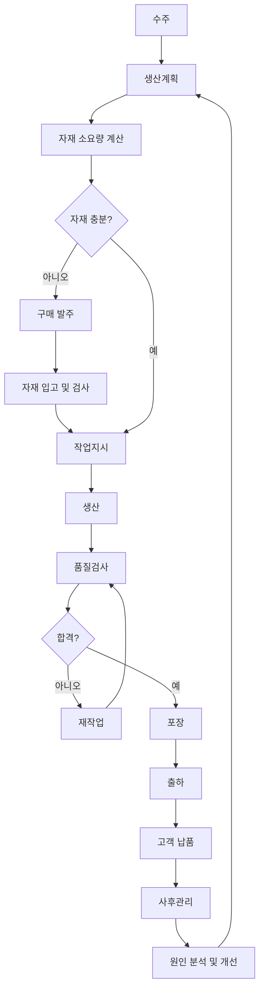

# Chapter 3. 생산 프로세스

---

# 학습목표

이번 장을 학습한 후 학생들은 다음 내용을 설명할 수 있다.

* 고객 수주부터 사후관리까지의 생산 프로세스를 설명할 수 있다.
* 수주, 생산계획, 자재조달, 작업지시의 관계를 구분할 수 있다.
* 생산과 검사 과정에서 발생하는 주요 데이터를 설명할 수 있다.
* 포장과 출하 단계에서 필요한 정보를 이해할 수 있다.
* 사후관리 데이터가 생산 개선에 활용되는 과정을 설명할 수 있다.
* 생산 프로세스에서 ERP, MES, WMS, QMS의 역할을 구분할 수 있다.

---

# 1. 생산 프로세스란?

생산 프로세스는 고객의 주문을 받아 제품을 생산하고, 검사와 포장을 거쳐 고객에게 전달한 후 사후관리까지 수행하는 전체 업무 흐름이다.

일반적인 생산 프로세스는 다음과 같다.

```text
수주

↓

생산계획

↓

자재조달

↓

작업지시

↓

생산

↓

검사

↓

포장

↓

출하

↓

사후관리
```

생산 프로세스는 단순히 공장에서 제품을 만드는 과정만을 의미하지 않는다.

고객의 요구사항을 확인하고, 필요한 자재와 설비를 준비하고, 생산 결과를 검사하며, 납품 이후 발생하는 고객의 문제까지 관리하는 전체 활동을 포함한다.

> 생산 프로세스는 고객 요구를 실제 제품으로 변환하는 과정이다.

---

# 2. 생산 프로세스의 전체 구조

생산 프로세스는 크게 세 부분으로 구분할 수 있다.

## 2.1 생산 전 단계

제품을 생산하기 전에 필요한 정보를 준비하는 단계이다.

```text
수주

↓

생산계획

↓

자재조달

↓

작업지시
```

생산 전 단계에서는 다음 질문에 답해야 한다.

* 고객이 어떤 제품을 주문했는가?
* 제품을 몇 개 생산해야 하는가?
* 언제까지 생산해야 하는가?
* 필요한 자재가 준비되어 있는가?
* 어느 생산라인에서 작업할 것인가?
* 누가 작업을 수행할 것인가?

---

## 2.2 생산 실행 단계

실제 제품을 생산하고 품질을 확인하는 단계이다.

```text
생산

↓

검사
```

이 단계에서는 생산설비, 작업자, 원자재, 작업조건, 품질정보 등이 실시간으로 발생한다.

---

## 2.3 생산 후 단계

완성된 제품을 고객에게 전달하고, 납품 이후 발생하는 문제를 관리하는 단계이다.

```text
포장

↓

출하

↓

사후관리
```

---

# 3. 수주

## 3.1 수주란?

수주는 고객으로부터 제품이나 서비스의 주문을 받는 활동이다.

영어로는 Sales Order 또는 Order Receipt라고 한다.

수주는 생산 프로세스의 시작점이다.

고객의 주문이 확정되어야 어떤 제품을 언제까지 얼마나 생산해야 하는지 결정할 수 있다.

```text
고객 요구사항

↓

견적

↓

계약

↓

수주 등록

↓

생산 준비
```

---

## 3.2 수주 방식

수주는 기업의 생산 방식에 따라 다르게 처리된다.

### 재고생산 방식

이미 생산된 제품을 재고에서 출하한다.

```text
수주

↓

완제품 재고 확인

↓

출하
```

### 주문생산 방식

고객 주문을 받은 후 생산을 시작한다.

```text
수주

↓

생산계획

↓

생산

↓

출하
```

### 주문설계 방식

고객 주문 이후 설계부터 시작한다.

```text
수주

↓

제품 설계

↓

자재 및 공정 결정

↓

생산
```

---

## 3.3 수주 단계에서 필요한 데이터

| 데이터  | 설명             | 예시          |
| ---- | -------------- | ----------- |
| 수주번호 | 주문을 구분하는 번호    | SO-2026-001 |
| 고객코드 | 고객 식별코드        | CUST-001    |
| 고객명  | 주문한 고객         | ABC전자       |
| 제품코드 | 주문 제품 코드       | PROD-A001   |
| 제품명  | 주문 제품 이름       | 스마트센서 A형    |
| 주문수량 | 고객이 주문한 수량     | 1,000개      |
| 주문일자 | 주문을 접수한 날짜     | 2026-07-13  |
| 납기일  | 고객과 약속한 날짜     | 2026-07-25  |
| 판매단가 | 제품 한 개의 가격     | 20,000원     |
| 주문금액 | 전체 주문금액        | 20,000,000원 |
| 제품규격 | 고객이 요청한 규격     | 100 × 50mm  |
| 우선순위 | 주문의 긴급 정도      | 긴급          |
| 주문상태 | 접수, 확정, 생산, 출하 | 확정          |

---

## 3.4 수주 검토

수주를 받았다고 해서 무조건 주문을 확정할 수 있는 것은 아니다.

기업은 다음 항목을 검토해야 한다.

* 생산능력이 충분한가?
* 필요한 자재가 있는가?
* 납기일까지 생산 가능한가?
* 고객 요구사항을 만족할 수 있는가?
* 제품 설계와 규격이 명확한가?
* 생산원가와 판매가격이 적절한가?

---

## 3.5 수주 단계의 핵심 질문

* 고객은 누구인가?
* 어떤 제품을 주문했는가?
* 주문수량은 얼마인가?
* 납기일은 언제인가?
* 특별한 품질 요구사항이 있는가?
* 현재 생산능력으로 납기를 맞출 수 있는가?
* 완제품 재고로 대응 가능한가?

---

# 4. 생산계획

## 4.1 생산계획이란?

생산계획은 수주정보와 판매예측을 바탕으로 어떤 제품을 언제, 얼마나 생산할지 결정하는 활동이다.

```text
수주정보

완제품 재고

자재 재고

설비능력

작업자 현황

납기일

↓

생산계획
```

---

## 4.2 생산계획의 목적

* 고객 납기를 준수한다.
* 생산량을 적절하게 결정한다.
* 설비와 작업자를 효율적으로 배정한다.
* 자재 부족을 예방한다.
* 과잉생산과 재고 증가를 방지한다.
* 여러 주문의 생산순서를 결정한다.

---

## 4.3 생산계획의 주요 고려사항

### 고객 주문

주문수량과 납기일을 확인한다.

### 현재 재고

이미 생산된 제품이 있는지 확인한다.

### 자재 재고

제품 생산에 필요한 자재가 있는지 확인한다.

### 생산능력

설비와 작업자가 하루에 생산할 수 있는 수량을 확인한다.

### 품질 요구사항

특정 고객의 특별한 품질기준이 있는지 확인한다.

### 작업순서

긴급 주문이나 납기가 빠른 제품을 우선 생산할지 결정한다.

---

## 4.4 생산계획 데이터

| 데이터    | 설명             | 예시            |
| ------ | -------------- | ------------- |
| 생산계획번호 | 생산계획 식별번호      | PLAN-2026-001 |
| 수주번호   | 관련 고객 주문번호     | SO-2026-001   |
| 제품코드   | 생산 대상 제품       | PROD-A001     |
| 계획수량   | 생산 예정 수량       | 1,000개        |
| 계획시작일  | 생산 시작 예정일      | 2026-07-16    |
| 계획완료일  | 생산 완료 예정일      | 2026-07-22    |
| 납기일    | 고객 납기일         | 2026-07-25    |
| 생산라인   | 사용할 생산라인       | 조립 1라인        |
| 우선순위   | 생산 우선순위        | 1순위           |
| 계획상태   | 계획, 확정, 진행, 완료 | 확정            |

---

## 4.5 생산계획 예시

고객이 스마트센서 1,000개를 주문했다.

현재 완제품 재고가 200개 있다.

```text
주문수량: 1,000개

현재 재고: 200개

필요 생산수량: 800개
```

따라서 생산계획은 800개로 수립할 수 있다.

```text
필요 생산수량 = 주문수량 - 완제품 재고
```

---

## 4.6 생산계획 단계의 핵심 질문

* 실제로 몇 개를 생산해야 하는가?
* 언제 생산을 시작해야 하는가?
* 어느 생산라인에서 생산할 것인가?
* 생산능력은 충분한가?
* 납기일까지 완료 가능한가?
* 생산 순서는 어떻게 결정할 것인가?

---

# 5. 자재조달

## 5.1 자재조달이란?

자재조달은 생산에 필요한 원자재, 부품, 소모품을 확보하는 활동이다.

자재가 부족하면 작업지시가 내려가더라도 실제 생산을 시작할 수 없다.

```text
생산계획

↓

필요 자재 계산

↓

현재 재고 확인

↓

부족 자재 확인

↓

구매 발주

↓

자재 입고
```

---

## 5.2 자재 소요량 계산

제품 생산에 필요한 자재 수량은 BOM을 기준으로 계산한다.

BOM은 Bill of Materials의 약자로, 하나의 제품을 만들기 위해 필요한 자재와 부품 목록이다.

예를 들어 스마트센서 1개를 생산하기 위해 다음 자재가 필요하다고 가정한다.

| 자재   | 제품 1개당 필요수량 |
| ---- | ----------: |
| 센서모듈 |          1개 |
| PCB  |          1개 |
| 케이스  |          1개 |
| 나사   |          4개 |

스마트센서 1,000개를 생산하려면 다음 자재가 필요하다.

```text
센서모듈: 1,000개

PCB: 1,000개

케이스: 1,000개

나사: 4,000개
```

---

## 5.3 자재 필요량 공식

```text
총 필요수량 = 제품 생산수량 × 제품 1개당 자재 소요량
```

현재 재고를 고려하면 구매 필요량은 다음과 같다.

```text
구매 필요량 = 총 필요수량 - 현재 재고수량
```

예시:

```text
나사 총 필요수량: 4,000개

현재 재고: 1,500개

구매 필요량: 2,500개
```

---

## 5.4 자재조달 단계에서 필요한 데이터

| 데이터    | 설명         | 예시              |
| ------ | ---------- | --------------- |
| 자재코드   | 자재 식별코드    | MAT-PCB-001     |
| 자재명    | 자재 이름      | 센서용 PCB         |
| 필요수량   | 생산에 필요한 수량 | 1,000개          |
| 현재고    | 현재 보유 수량   | 600개            |
| 부족수량   | 추가로 필요한 수량 | 400개            |
| 공급업체   | 자재 공급 회사   | 대한전자            |
| 발주번호   | 구매 주문번호    | PO-2026-001     |
| 발주일자   | 구매 주문일     | 2026-07-13      |
| 입고예정일  | 자재 도착 예정일  | 2026-07-15      |
| 단가     | 자재 한 개의 가격 | 5,000원          |
| 자재 LOT | 입고 자재 LOT  | RM-20260715-001 |
| 검사결과   | 입고검사 결과    | 합격              |

---

## 5.5 자재 부족 시 발생하는 문제

* 생산 시작 지연
* 설비 대기시간 증가
* 고객 납기 지연
* 긴급구매로 인한 원가 상승
* 생산계획 변경
* 작업자 유휴시간 발생

---

## 5.6 자재조달 단계의 핵심 질문

* 생산에 필요한 자재는 무엇인가?
* 자재별 필요수량은 얼마인가?
* 현재 재고는 충분한가?
* 부족 자재는 언제 입고되는가?
* 입고된 자재의 품질은 적합한가?
* 어느 공급업체에서 구매할 것인가?

---

# 6. 작업지시

## 6.1 작업지시란?

작업지시는 확정된 생산계획을 실제 제조 현장에서 수행할 수 있도록 구체화한 생산 명령이다.

생산계획이 전체 일정과 수량을 결정하는 단계라면, 작업지시는 현장 작업자에게 전달되는 구체적인 실행 정보이다.

```text
생산계획

↓

공정별 작업 분할

↓

설비 배정

↓

작업자 배정

↓

작업지시 발행
```

---

## 6.2 생산계획과 작업지시 비교

| 구분     | 생산계획        | 작업지시        |
| ------ | ----------- | ----------- |
| 목적     | 전체 생산 일정 수립 | 현장 실행 명령    |
| 기간     | 월, 주, 일 단위  | 시간, 작업 단위   |
| 주요 사용자 | 생산관리자       | 현장 작업자      |
| 주요 내용  | 제품, 수량, 일정  | 공정, 설비, 작업자 |
| 결과     | 생산 일정       | 생산실적        |

---

## 6.3 작업지시 데이터

| 데이터       | 설명         | 예시              |
| --------- | ---------- | --------------- |
| 작업지시번호    | 작업지시 식별번호  | WO-2026-001     |
| 생산계획번호    | 관련 생산계획    | PLAN-2026-001   |
| 제품코드      | 생산할 제품     | PROD-A001       |
| 지시수량      | 작업지시 수량    | 500개            |
| 공정코드      | 수행할 공정     | ASSY-01         |
| 설비코드      | 사용할 설비     | MC-001          |
| 생산라인      | 작업할 라인     | 조립 1라인          |
| 작업자       | 담당 작업자     | 홍길동             |
| 작업일자      | 작업 예정일     | 2026-07-16      |
| 시작예정시간    | 작업 시작시간    | 09:00           |
| 종료예정시간    | 작업 종료시간    | 17:00           |
| 사용 자재 LOT | 투입할 자재 LOT | RM-20260715-001 |
| 작업상태      | 대기, 진행, 완료 | 대기              |

---

## 6.4 작업지시 상태

```text
작성

↓

승인

↓

대기

↓

작업 시작

↓

진행 중

↓

작업 완료

↓

마감
```

대표적인 작업지시 상태는 다음과 같다.

* 작성
* 승인
* 대기
* 진행
* 일시중지
* 완료
* 취소
* 마감

---

## 6.5 작업지시 단계의 핵심 질문

* 무엇을 생산하는가?
* 몇 개를 생산하는가?
* 어떤 공정을 수행하는가?
* 어느 설비를 사용하는가?
* 누가 작업하는가?
* 어떤 자재 LOT를 사용하는가?
* 작업 시작과 종료시간은 언제인가?

---

# 7. 생산

## 7.1 생산이란?

생산은 작업지시에 따라 원자재와 부품을 가공하거나 조립하여 제품을 만드는 활동이다.

MES에서는 생산 자체뿐 아니라 생산 과정에서 발생하는 모든 실적과 상태를 기록하는 것이 중요하다.

---

## 7.2 생산 단계의 주요 활동

* 작업 시작
* 자재 투입
* 설비 가동
* 제품 가공
* 제품 조립
* 공정 이동
* 생산수량 등록
* 불량수량 등록
* 설비 정지 등록
* 작업 종료

---

## 7.3 생산실적 데이터

| 데이터    | 설명         | 예시              |
| ------ | ---------- | --------------- |
| 생산실적번호 | 생산실적 식별번호  | RESULT-2026-001 |
| 작업지시번호 | 관련 작업지시    | WO-2026-001     |
| 제품코드   | 생산 제품      | PROD-A001       |
| 생산 LOT | 생산된 제품 LOT | FG-20260716-001 |
| 투입수량   | 공정에 투입한 수량 | 500개            |
| 생산수량   | 실제 생산수량    | 490개            |
| 양품수량   | 정상 제품 수량   | 480개            |
| 불량수량   | 불량 제품 수량   | 10개             |
| 작업시작시간 | 실제 작업 시작   | 09:05           |
| 작업종료시간 | 실제 작업 종료   | 17:20           |
| 설비코드   | 사용 설비      | MC-001          |
| 작업자    | 작업 담당자     | 홍길동             |
| 비가동시간  | 설비 정지시간    | 30분             |
| 불량코드   | 불량 유형      | 조립불량            |

---

## 7.4 생산량 관계

생산수량은 일반적으로 양품수량과 불량수량으로 구성된다.

```text
생산수량 = 양품수량 + 불량수량
```

예시:

```text
양품수량: 480개

불량수량: 10개

생산수량: 490개
```

---

## 7.5 생산달성률

```text
생산달성률 = 실제 생산수량 ÷ 지시수량 × 100
```

예시:

```text
지시수량: 500개

실제 생산수량: 490개

생산달성률 = 490 ÷ 500 × 100
            = 98%
```

---

## 7.6 생산 중 발생할 수 있는 문제

* 설비 고장
* 자재 부족
* 작업자 부재
* 품질 이상
* 생산속도 저하
* 작업방법 오류
* 생산수량 부족
* 공정 대기 증가

---

## 7.7 생산 단계의 핵심 질문

* 현재 어떤 제품을 생산하고 있는가?
* 작업지시 대비 얼마나 생산했는가?
* 불량수량은 몇 개인가?
* 어떤 자재 LOT가 투입되었는가?
* 어떤 설비와 작업자가 생산했는가?
* 생산 지연의 원인은 무엇인가?

---

# 8. 검사

## 8.1 검사란?

검사는 생산된 제품이 정해진 품질기준과 고객 요구사항을 만족하는지 확인하는 활동이다.

검사 결과에 따라 제품은 다음 공정으로 이동하거나 재작업, 폐기 처리될 수 있다.

---

## 8.2 검사 종류

### 수입검사

입고된 원자재와 부품을 검사한다.

### 공정검사

생산 중간 단계에서 제품 상태를 검사한다.

### 최종검사

완성된 제품이 최종 품질기준을 만족하는지 검사한다.

### 출하검사

고객에게 보내기 직전에 제품 상태와 수량을 검사한다.

---

## 8.3 검사 프로세스

```text
검사 대상 등록

↓

검사항목 확인

↓

측정

↓

검사결과 입력

↓

합격 여부 판정
```

판정 결과는 다음과 같이 처리된다.

```text
검사

├─ 합격 → 다음 공정 또는 포장
│
└─ 불합격
      ├─ 재작업
      ├─ 수리
      ├─ 폐기
      └─ 특채
```

---

## 8.4 검사 데이터

| 데이터    | 설명             | 예시               |
| ------ | -------------- | ---------------- |
| 검사번호   | 검사 식별번호        | INS-2026-001     |
| 검사유형   | 수입, 공정, 최종, 출하 | 최종검사             |
| 제품코드   | 검사 제품          | PROD-A001        |
| 생산 LOT | 검사 대상 LOT      | FG-20260716-001  |
| 검사수량   | 검사한 수량         | 100개             |
| 합격수량   | 합격한 수량         | 98개              |
| 불합격수량  | 불합격 수량         | 2개               |
| 검사항목   | 검사 항목          | 외관, 치수           |
| 검사기준   | 합격 기준          | 100±0.5mm        |
| 측정값    | 실제 측정값         | 100.2mm          |
| 검사결과   | 합격 또는 불합격      | 합격               |
| 불량코드   | 불량 유형          | 치수불량             |
| 검사자    | 검사 담당자         | 김품질              |
| 검사일시   | 검사 시간          | 2026-07-16 18:00 |

---

## 8.5 불량률

```text
불량률 = 불량수량 ÷ 생산수량 × 100
```

예시:

```text
생산수량: 490개

불량수량: 10개

불량률 = 10 ÷ 490 × 100
        ≒ 2.04%
```

---

## 8.6 검사 단계의 핵심 질문

* 제품이 품질기준을 만족하는가?
* 불량은 몇 개 발생했는가?
* 어떤 불량이 발생했는가?
* 불량 원인은 무엇인가?
* 재작업이 가능한가?
* 동일 LOT 제품에 추가 검사가 필요한가?

---

# 9. 포장

## 9.1 포장이란?

포장은 검사에 합격한 제품을 고객에게 안전하게 전달할 수 있도록 보호하고 식별하는 활동이다.

포장은 제품 보호뿐 아니라 제품 추적과 출하 정확성을 확보하는 역할도 한다.

---

## 9.2 포장의 주요 목적

* 운송 중 제품 보호
* 습기, 먼지, 충격 방지
* 제품 수량 구분
* 고객별 제품 구분
* 바코드와 QR 코드 부착
* LOT 추적성 확보

---

## 9.3 포장 데이터

| 데이터    | 설명         | 예시              |
| ------ | ---------- | --------------- |
| 포장번호   | 포장 식별번호    | PKG-2026-001    |
| 제품코드   | 포장 제품      | PROD-A001       |
| 생산 LOT | 제품 LOT     | FG-20260716-001 |
| 포장수량   | 포장한 수량     | 480개            |
| 박스번호   | 포장 박스 번호   | BOX-001         |
| 박스당 수량 | 한 박스의 수량   | 20개             |
| 팔레트번호  | 팔레트 식별번호   | PLT-001         |
| 포장일자   | 포장한 날짜     | 2026-07-17      |
| 작업자    | 포장 담당자     | 이포장             |
| 라벨번호   | 제품 라벨 번호   | LABEL-001       |
| 출하대기위치 | 포장 후 보관 위치 | 출하장-A01         |

---

## 9.4 포장 단위 예시

```text
제품 1개

↓

소포장 10개

↓

박스 20개

↓

팔레트 10박스
```

팔레트 하나에 들어가는 총 제품 수량은 다음과 같다.

```text
10개 × 20개 × 10박스 = 2,000개
```

---

## 9.5 포장 라벨 정보

* 제품명
* 제품코드
* 수량
* 생산일자
* 생산 LOT
* 유효기간
* 고객명
* 바코드
* QR 코드

---

## 9.6 포장 단계의 핵심 질문

* 어떤 제품을 포장했는가?
* 몇 개를 포장했는가?
* 생산 LOT와 포장번호가 연결되어 있는가?
* 고객 요구 포장규격을 만족하는가?
* 라벨 내용이 정확한가?
* 어느 출하대기 위치에 보관되어 있는가?

---

# 10. 출하

## 10.1 출하란?

출하는 포장이 완료된 제품을 고객에게 전달하기 위해 공장에서 반출하는 활동이다.

출하 시에는 주문정보, 제품, 수량, LOT, 고객, 배송지 정보가 정확하게 일치해야 한다.

---

## 10.2 출하 프로세스

```text
출하요청

↓

주문 확인

↓

제품 재고 할당

↓

피킹

↓

출하검사

↓

상차

↓

출하처리

↓

고객 배송
```

---

## 10.3 출하 데이터

| 데이터    | 설명           | 예시              |
| ------ | ------------ | --------------- |
| 출하번호   | 출하 식별번호      | SHIP-2026-001   |
| 수주번호   | 관련 주문번호      | SO-2026-001     |
| 고객코드   | 고객 식별코드      | CUST-001        |
| 제품코드   | 출하 제품        | PROD-A001       |
| 출하수량   | 출하할 수량       | 480개            |
| 생산 LOT | 출하 대상 LOT    | FG-20260716-001 |
| 포장번호   | 관련 포장번호      | PKG-2026-001    |
| 출하일자   | 출하 날짜        | 2026-07-18      |
| 납기일    | 고객 납기일       | 2026-07-20      |
| 배송지    | 제품 도착 장소     | 부산광역시           |
| 차량번호   | 배송 차량 번호     | 12가3456         |
| 운송업체   | 운송 담당 업체     | 대한물류            |
| 출하상태   | 대기, 상차, 출하완료 | 출하완료            |

---

## 10.4 출하 오류의 종류

* 잘못된 제품 출하
* 수량 부족 또는 초과
* 잘못된 고객에게 출하
* 배송지 오류
* LOT 정보 오류
* 라벨 오류
* 납기 지연
* 검사 미완료 제품 출하

---

## 10.5 납기준수율

```text
납기준수율 = 납기 내 출하 건수 ÷ 전체 출하 건수 × 100
```

예시:

```text
전체 출하 건수: 100건

납기 내 출하 건수: 96건

납기준수율 = 96%
```

---

## 10.6 출하 단계의 핵심 질문

* 어떤 고객에게 출하하는가?
* 어떤 제품을 몇 개 출하하는가?
* 주문수량과 출하수량이 일치하는가?
* 품질검사가 완료되었는가?
* 어느 LOT 제품이 출하되는가?
* 납기일을 준수했는가?

---

# 11. 사후관리

## 11.1 사후관리란?

사후관리는 제품이 고객에게 전달된 이후 발생하는 문의, 고장, 불량, 반품, 수리, 고객 불만을 관리하는 활동이다.

영어로는 After-Sales Service 또는 Customer Service라고 한다.

사후관리는 단순히 고객의 불만을 처리하는 것이 아니다.

제품의 문제를 분석하고 생산공정을 개선하는 중요한 정보원이다.

---

## 11.2 사후관리의 주요 업무

* 고객 문의 접수
* 고객 불만 접수
* 제품 고장 확인
* 반품 처리
* 수리 처리
* 교환 처리
* 원인 분석
* 개선조치
* 재발 방지

---

## 11.3 사후관리 프로세스

```text
고객 문제 접수

↓

제품 및 LOT 확인

↓

생산이력 추적

↓

불량 원인 분석

↓

수리, 교환 또는 반품

↓

개선조치

↓

고객 결과 통보
```

---

## 11.4 사후관리 데이터

| 데이터     | 설명         | 예시              |
| ------- | ---------- | --------------- |
| 서비스번호   | 사후관리 식별번호  | AS-2026-001     |
| 고객코드    | 고객 식별코드    | CUST-001        |
| 제품코드    | 문제 제품      | PROD-A001       |
| 제품 일련번호 | 개별 제품 번호   | SN-260716-0001  |
| 생산 LOT  | 제품 생산 LOT  | FG-20260716-001 |
| 출하번호    | 관련 출하번호    | SHIP-2026-001   |
| 접수일자    | 문제 접수 날짜   | 2026-07-25      |
| 문제유형    | 고장, 불량, 파손 | 작동불량            |
| 문제내용    | 고객이 신고한 내용 | 전원이 켜지지 않음      |
| 원인      | 분석된 문제 원인  | 납땜불량            |
| 처리방법    | 수리, 교환, 환불 | 교환              |
| 처리완료일   | 처리 완료 날짜   | 2026-07-27      |
| 담당자     | 사후관리 담당자   | 박서비스            |

---

## 11.5 생산이력 추적

고객 불량이 발생하면 해당 제품의 생산이력을 추적해야 한다.

```text
제품 일련번호

↓

출하번호

↓

포장번호

↓

생산 LOT

↓

작업지시번호

↓

설비

↓

작업자

↓

사용 자재 LOT
```

이를 통해 다음 내용을 확인할 수 있다.

* 언제 생산되었는가?
* 어느 설비에서 생산되었는가?
* 누가 작업했는가?
* 어떤 원자재가 사용되었는가?
* 검사 결과는 정상이었는가?
* 동일 LOT 제품이 다른 고객에게도 출하되었는가?

---

## 11.6 사후관리와 생산 개선

사후관리 데이터는 생산 개선에 활용된다.

```text
고객 불량 접수

↓

원인 분석

↓

생산공정 문제 확인

↓

작업방법 개선

↓

검사기준 강화

↓

재발 방지
```

예를 들어 동일한 설비에서 생산된 제품에서 반복적으로 불량이 발생한다면 해당 설비의 상태를 점검해야 한다.

동일한 원자재 LOT를 사용한 제품에서 불량이 발생한다면 공급업체 품질 문제를 의심할 수 있다.

---

## 11.7 사후관리 단계의 핵심 질문

* 어떤 고객에게서 문제가 발생했는가?
* 어떤 제품과 LOT에서 발생했는가?
* 불량 원인은 무엇인가?
* 동일한 문제가 반복되고 있는가?
* 수리, 교환, 환불 중 어떤 처리를 할 것인가?
* 생산공정에서 무엇을 개선해야 하는가?

---

# 12. 생산 프로세스 단계별 데이터 정리

| 단계   | 주요 업무      | 핵심 데이터            |
| ---- | ---------- | ----------------- |
| 수주   | 고객 주문 접수   | 고객, 제품, 수량, 납기    |
| 생산계획 | 생산 일정 수립   | 계획수량, 생산일정, 생산라인  |
| 자재조달 | 생산 자재 확보   | 자재, 필요수량, 재고, 발주  |
| 작업지시 | 현장 생산 명령   | 작업지시, 공정, 설비, 작업자 |
| 생산   | 제품 가공 및 조립 | 생산량, 양품, 불량, LOT  |
| 검사   | 품질기준 확인    | 검사값, 판정, 불량코드     |
| 포장   | 제품 보호 및 식별 | 포장번호, 박스, 라벨      |
| 출하   | 고객에게 제품 전달 | 고객, 수량, LOT, 배송정보 |
| 사후관리 | 고객 문제 처리   | 제품번호, 문제원인, 처리결과  |

---

# 13. 생산 프로세스의 데이터 연결

각 단계의 데이터는 서로 연결되어야 한다.

```text
수주번호

↓

생산계획번호

↓

자재발주번호

↓

작업지시번호

↓

생산실적번호

↓

생산 LOT

↓

검사번호

↓

포장번호

↓

출하번호

↓

사후관리번호
```

이 연결구조가 유지되어야 제품의 전체 이력을 추적할 수 있다.

---

# 14. ERP와 MES의 역할

## 14.1 ERP의 주요 역할

ERP는 기업 전체의 계획과 자원을 관리한다.

* 고객 수주
* 판매관리
* 구매관리
* 자재관리
* 생산계획
* 재고관리
* 원가관리
* 회계관리

---

## 14.2 MES의 주요 역할

MES는 제조 현장의 실행과 실적을 관리한다.

* 작업지시
* 생산실적
* 공정진행
* 설비상태
* 작업자 실적
* 품질검사
* 불량관리
* LOT 추적

---

## 14.3 시스템 연결 구조

```text
고객

↓

ERP

수주
생산계획
구매
재고
판매

↓

MES

작업지시
생산실적
품질
설비
LOT 추적

↓

제조 현장

작업자
설비
센서
PLC
```

---

# 15. 생산 프로세스 사례

스마트센서 1,000개를 주문받은 상황을 가정한다.

## 수주

```text
고객: ABC전자
제품: 스마트센서 A형
주문수량: 1,000개
납기일: 7월 25일
```

## 생산계획

```text
현재 완제품 재고: 200개
필요 생산수량: 800개
생산기간: 7월 16일~7월 22일
```

## 자재조달

```text
센서모듈 필요수량: 800개
현재 재고: 500개
부족수량: 300개
```

## 작업지시

```text
작업지시번호: WO-2026-001
생산라인: 조립 1라인
지시수량: 800개
```

## 생산

```text
생산수량: 790개
양품수량: 780개
불량수량: 10개
```

## 검사

```text
검사수량: 780개
합격수량: 775개
불합격수량: 5개
```

## 포장

```text
포장수량: 775개
박스당 수량: 25개
총 박스 수: 31박스
```

## 출하

```text
기존 재고: 200개
신규 생산 합격품: 775개
총 출하 가능수량: 975개
```

주문수량은 1,000개이므로 25개가 부족하다.

따라서 추가 생산이 필요하다.

## 사후관리

고객이 납품 후 3개의 제품에서 작동불량을 신고했다.

MES의 생산 LOT와 작업지시를 조회하여 다음 정보를 확인한다.

* 생산설비
* 작업자
* 사용 자재 LOT
* 검사 결과
* 동일 LOT 출하 고객

---

# 16. 생산 프로세스에서 발생할 수 있는 문제

| 단계   | 주요 문제              |
| ---- | ------------------ |
| 수주   | 납기 확인 오류, 제품규격 누락  |
| 생산계획 | 과잉생산, 생산능력 초과      |
| 자재조달 | 자재 부족, 입고 지연       |
| 작업지시 | 잘못된 설비 또는 자재 지정    |
| 생산   | 설비 고장, 생산량 부족      |
| 검사   | 검사 누락, 판정 오류       |
| 포장   | 라벨 오류, 수량 오류       |
| 출하   | 오출하, 납기 지연         |
| 사후관리 | 이력 추적 불가, 원인 분석 실패 |

---

# 17. 실습: 생산 프로세스 작성

## 실습목표

하나의 제품을 선택하여 수주부터 사후관리까지의 생산 프로세스를 작성한다.

---

## 실습 제품 예시

* 스마트폰
* 자동차
* 라면
* 생수
* 배터리
* 노트북
* 스마트센서
* 산업용 로봇
* 철강제품
* 주문제작 자동화 설비

---

## 실습 1. 기본 생산 프로세스 작성

```text
수주

↓

생산계획

↓

자재조달

↓

작업지시

↓

생산

↓

검사

↓

포장

↓

출하

↓

사후관리
```

---

## 실습 2. 단계별 데이터 작성

| 단계   | 수행 업무 | 필요한 데이터 |
| ---- | ----- | ------- |
| 수주   |       |         |
| 생산계획 |       |         |
| 자재조달 |       |         |
| 작업지시 |       |         |
| 생산   |       |         |
| 검사   |       |         |
| 포장   |       |         |
| 출하   |       |         |
| 사후관리 |       |         |

---

## 실습 3. 예외 흐름 작성

정상적인 생산 흐름뿐 아니라 문제가 발생했을 때의 처리 흐름도 작성한다.

```text
생산

↓

검사

↓

합격 여부

├─ 합격 → 포장 → 출하
│
└─ 불합격 → 재작업
               ↓
             재검사
               ↓
        ├─ 합격 → 포장
        └─ 불합격 → 폐기
```

---

## 실습 4. Mermaid 흐름도 작성



---

# 18. 조별 토의

1. 고객 주문을 검토하지 않고 바로 생산하면 어떤 문제가 발생할까?
2. 생산계획과 작업지시는 왜 분리해서 관리해야 할까?
3. 자재 재고가 부족한 상태에서 작업지시를 발행하면 어떤 문제가 발생할까?
4. 생산수량과 검사 합격수량이 다른 이유는 무엇인가?
5. 포장번호와 생산 LOT를 연결해야 하는 이유는 무엇인가?
6. 사후관리 정보가 생산공정 개선에 어떻게 활용될 수 있는가?
7. 고객 불량이 발생했을 때 어떤 데이터를 먼저 조회해야 하는가?

---

# 19. 연습문제

## 문제 1

다음 생산 프로세스를 올바른 순서로 나열하시오.

```text
검사, 수주, 생산, 작업지시, 출하, 자재조달, 생산계획
```

---

## 문제 2

수주와 생산계획의 차이를 설명하시오.

---

## 문제 3

자재조달 전에 BOM이 필요한 이유를 설명하시오.

---

## 문제 4

생산계획과 작업지시의 차이를 설명하시오.

---

## 문제 5

다음 중 생산 단계에서 발생하는 데이터가 아닌 것은 무엇인가?

1. 생산수량
2. 불량수량
3. 설비코드
4. 고객 판매단가

---

## 문제 6

검사 불합격 제품이 처리될 수 있는 방법을 세 가지 작성하시오.

---

## 문제 7

사후관리에서 생산 LOT가 필요한 이유를 설명하시오.

---

## 문제 8

다음 데이터가 어느 단계에서 발생하는지 작성하시오.

| 데이터     | 발생 단계 |
| ------- | ----- |
| 고객 주문수량 |       |
| 자재 부족수량 |       |
| 작업지시번호  |       |
| 생산 LOT  |       |
| 불량코드    |       |
| 박스번호    |       |
| 차량번호    |       |
| 고객 불만내용 |       |

---

# 20. 핵심 내용 정리

* 생산 프로세스는 수주부터 사후관리까지 연결되는 전체 제조 업무 흐름이다.
* 수주는 고객 요구사항과 주문정보를 확정하는 단계이다.
* 생산계획은 제품, 수량, 일정, 생산라인을 결정하는 단계이다.
* 자재조달은 BOM과 재고를 기준으로 필요한 자재를 확보하는 단계이다.
* 작업지시는 생산계획을 현장에서 실행할 수 있도록 구체화한 명령이다.
* 생산 단계에서는 생산수량, 양품수량, 불량수량, 설비, 작업자 데이터를 기록한다.
* 검사 단계에서는 제품이 품질기준을 만족하는지 판정한다.
* 포장 단계에서는 제품을 보호하고 LOT와 수량을 식별한다.
* 출하 단계에서는 주문정보와 제품, 수량, 고객, 배송지를 확인한다.
* 사후관리는 고객의 불량과 문제를 처리하고 생산공정 개선에 활용하는 단계이다.
* 생산 프로세스의 모든 데이터가 연결되어야 제품 이력과 품질 문제를 추적할 수 있다.

---

# 다음 시간 예고

## Chapter 4. 생산 기준정보

* 제품과 자재
* 품목코드
* BOM
* 공정
* 공정순서
* Routing
* 작업장
* 생산라인
* 설비
* 작업자
* 창고
* 불량코드
* 검사기준
* 기준정보와 실적정보의 차이
