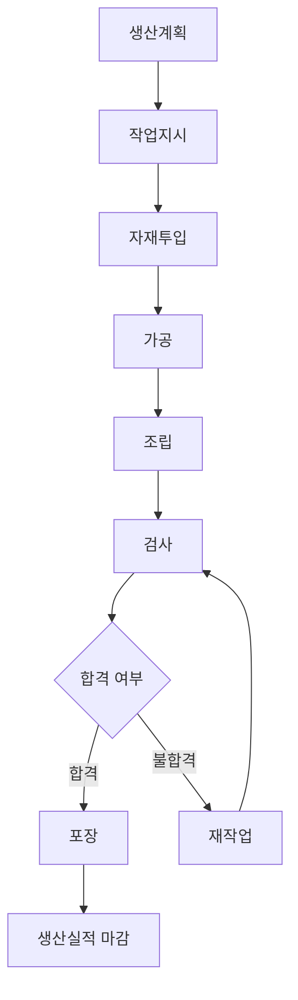

# Chapter 4. 생산관리 기초

---

# 학습목표

이번 장을 학습한 후 학생들은 다음 내용을 설명할 수 있다.

* 생산관리의 목적과 필요성을 설명할 수 있다.
* 생산계획과 생산실적의 차이를 구분할 수 있다.
* 작업지시의 구성요소와 역할을 설명할 수 있다.
* 작업표준이 품질과 생산성에 미치는 영향을 이해할 수 있다.
* 공정관리의 주요 관리대상을 설명할 수 있다.
* 생산성을 계산하고 개선 방향을 제시할 수 있다.
* MES에서 생산관리 데이터가 어떻게 연결되는지 설명할 수 있다.

---

# 1. 생산관리란?

## 1.1 생산관리의 정의

생산관리(Production Management)는 고객이 요구하는 제품을 정해진 품질, 비용, 납기에 맞추어 생산하도록 사람, 설비, 자재, 공정, 시간을 계획하고 통제하는 활동이다.

쉽게 표현하면 다음과 같다.

> 무엇을, 언제, 어디에서, 누가, 어떻게, 얼마나 생산할 것인지를 결정하고 관리하는 활동

생산관리는 제품을 많이 만드는 것만을 목표로 하지 않는다.

다음과 같은 요소를 함께 고려해야 한다.

* 품질
* 생산수량
* 생산원가
* 납기
* 설비능력
* 작업자
* 자재
* 안전
* 재고

---

## 1.2 생산관리의 기본 질문

생산관리에서는 다음 질문에 답해야 한다.

```text
무엇을 생산할 것인가?

얼마나 생산할 것인가?

언제 생산할 것인가?

어느 공정에서 생산할 것인가?

어떤 설비를 사용할 것인가?

누가 작업할 것인가?

어떤 자재를 사용할 것인가?

실제로 얼마나 생산되었는가?
```

---

## 1.3 생산관리의 주요 목표

생산관리의 핵심 목표는 제조업의 QCD와 연결된다.

| 구분       | 의미 | 생산관리 목표             |
| -------- | -- | ------------------- |
| Quality  | 품질 | 불량을 줄이고 균일한 제품을 생산  |
| Cost     | 원가 | 낭비와 비가동을 줄이고 원가 절감  |
| Delivery | 납기 | 계획한 날짜까지 제품 생산 및 출하 |

추가로 다음 항목도 중요하다.

* Safety: 안전
* Productivity: 생산성
* Flexibility: 생산 유연성

---

# 2. 생산관리의 전체 구조

생산관리는 다음과 같은 흐름으로 이루어진다.

```text
수주 및 수요예측

↓

생산계획

↓

작업지시

↓

작업표준 확인

↓

공정 실행

↓

생산실적 수집

↓

계획과 실적 비교

↓

생산성 분석

↓

개선활동
```

각 단계는 독립적이지 않고 서로 연결되어 있다.

예를 들어 생산계획이 잘못되면 작업지시도 잘못되고, 작업표준이 불명확하면 생산실적과 품질이 불안정해질 수 있다.

---

# 3. 생산계획

## 3.1 생산계획이란?

생산계획(Production Planning)은 어떤 제품을 언제, 얼마나 생산할지 결정하는 활동이다.

생산계획은 다음 정보를 기준으로 수립한다.

* 고객 주문
* 판매예측
* 완제품 재고
* 원자재 재고
* 설비 생산능력
* 작업자 수
* 고객 납기
* 과거 생산실적

---

## 3.2 생산계획의 목적

생산계획의 주요 목적은 다음과 같다.

* 고객 납기 준수
* 설비와 작업자의 효율적 활용
* 자재 부족 방지
* 과잉생산 방지
* 재고 최소화
* 공정별 작업량 조정
* 생산라인 혼잡 방지

---

## 3.3 생산계획의 종류

### 장기 생산계획

일반적으로 1년 이상의 기간을 대상으로 한다.

주요 내용은 다음과 같다.

* 신규 공장 건설
* 생산라인 증설
* 설비 투자
* 인력 충원
* 생산능력 확대
* 신제품 생산 준비

---

### 중기 생산계획

월간 또는 분기 단위로 생산량을 계획한다.

예시:

```text
7월 생산계획

제품 A: 10,000개
제품 B: 6,000개
제품 C: 3,000개
```

---

### 단기 생산계획

일간 또는 주간 단위로 구체적인 생산일정을 수립한다.

예시:

```text
월요일: 제품 A 500개
화요일: 제품 A 300개, 제품 B 200개
수요일: 제품 B 500개
```

단기 생산계획은 실제 작업지시와 직접 연결된다.

---

## 3.4 생산계획에 필요한 데이터

| 데이터    | 설명        | 예시            |
| ------ | --------- | ------------- |
| 생산계획번호 | 생산계획 식별번호 | PLAN-2026-001 |
| 제품코드   | 생산 대상 제품  | PROD-A001     |
| 제품명    | 제품 이름     | 스마트센서 A형      |
| 계획수량   | 생산 예정수량   | 1,000개        |
| 계획시작일  | 생산 시작 예정일 | 2026-07-20    |
| 계획완료일  | 생산 완료 예정일 | 2026-07-23    |
| 납기일    | 고객 납기일    | 2026-07-25    |
| 생산라인   | 생산 예정 라인  | 조립 1라인        |
| 우선순위   | 작업 우선순위   | 긴급            |
| 계획상태   | 계획 진행상태   | 확정            |

---

## 3.5 생산계획 수립 예시

고객 주문이 다음과 같다고 가정한다.

```text
주문수량: 1,000개
완제품 재고: 200개
불량 예상률: 5%
```

먼저 실제 부족수량을 계산한다.

```text
부족수량 = 주문수량 - 완제품 재고
         = 1,000 - 200
         = 800개
```

불량을 고려하면 추가 생산이 필요하다.

```text
필요 생산수량 = 부족수량 ÷ 예상 양품률
```

양품률이 95%라면 다음과 같다.

```text
필요 생산수량 = 800 ÷ 0.95
               ≒ 842.1개
```

따라서 최소 843개 정도를 생산하도록 계획할 수 있다.

---

## 3.6 생산능력

생산능력(Capacity)은 일정 시간 동안 생산할 수 있는 최대 수량을 의미한다.

예시:

```text
시간당 생산량: 100개
하루 작업시간: 8시간

하루 생산능력 = 100 × 8
               = 800개
```

그러나 실제 현장에서는 휴식시간, 설비고장, 교체시간 등이 있으므로 최대 생산능력과 실제 생산능력은 다를 수 있다.

---

## 3.7 생산계획 단계의 핵심 질문

* 어떤 제품을 생산해야 하는가?
* 몇 개를 생산해야 하는가?
* 언제까지 생산해야 하는가?
* 어느 라인에서 생산할 것인가?
* 설비 생산능력이 충분한가?
* 자재가 충분한가?
* 불량률을 고려했는가?

---

# 4. 생산실적

## 4.1 생산실적이란?

생산실적(Production Result)은 작업지시에 따라 실제로 생산한 결과를 의미한다.

생산계획과 작업지시는 예정된 정보이고, 생산실적은 실제 발생한 정보이다.

```text
계획수량: 1,000개

실제 생산수량: 950개

양품수량: 920개

불량수량: 30개
```

---

## 4.2 생산실적의 중요성

생산실적을 수집하면 다음 내용을 확인할 수 있다.

* 계획대로 생산되었는가?
* 생산량이 부족한 이유는 무엇인가?
* 불량이 얼마나 발생했는가?
* 어느 설비에서 생산했는가?
* 어떤 작업자가 작업했는가?
* 생산에 얼마나 시간이 걸렸는가?
* 설비가 얼마나 정지했는가?

---

## 4.3 생산실적 데이터

| 데이터    | 설명        | 예시               |
| ------ | --------- | ---------------- |
| 생산실적번호 | 생산실적 식별번호 | RESULT-2026-001  |
| 작업지시번호 | 관련 작업지시   | WO-2026-001      |
| 제품코드   | 생산 제품     | PROD-A001        |
| 생산 LOT | 생산 묶음 번호  | LOT-20260720-001 |
| 지시수량   | 생산 지시수량   | 1,000개           |
| 생산수량   | 실제 생산수량   | 950개             |
| 양품수량   | 정상 제품 수량  | 920개             |
| 불량수량   | 불량 제품 수량  | 30개              |
| 작업시작시간 | 실제 시작시간   | 09:00            |
| 작업종료시간 | 실제 종료시간   | 17:20            |
| 설비코드   | 사용한 설비    | MC-001           |
| 작업자    | 작업 담당자    | 홍길동              |
| 비가동시간  | 설비 정지시간   | 40분              |
| 불량코드   | 불량 유형     | 조립불량             |

---

## 4.4 생산수량 관계

생산수량은 일반적으로 양품수량과 불량수량의 합이다.

```text
생산수량 = 양품수량 + 불량수량
```

예시:

```text
양품수량: 920개
불량수량: 30개

생산수량 = 920 + 30
          = 950개
```

---

## 4.5 생산달성률

생산달성률은 계획한 수량과 실제 생산수량을 비교한 값이다.

```text
생산달성률 = 실제 생산수량 ÷ 계획수량 × 100
```

예시:

```text
계획수량: 1,000개
실제 생산수량: 950개

생산달성률 = 950 ÷ 1,000 × 100
            = 95%
```

---

## 4.6 양품률

```text
양품률 = 양품수량 ÷ 생산수량 × 100
```

예시:

```text
양품수량: 920개
생산수량: 950개

양품률 = 920 ÷ 950 × 100
        ≒ 96.84%
```

---

## 4.7 불량률

```text
불량률 = 불량수량 ÷ 생산수량 × 100
```

예시:

```text
불량수량: 30개
생산수량: 950개

불량률 = 30 ÷ 950 × 100
        ≒ 3.16%
```

---

## 4.8 생산계획과 생산실적 비교

| 구분  | 생산계획    | 생산실적     |
| --- | ------- | -------- |
| 의미  | 생산 예정정보 | 실제 생산결과  |
| 수량  | 계획수량    | 실제 생산수량  |
| 시간  | 예정시간    | 실제 작업시간  |
| 설비  | 예정 설비   | 실제 사용 설비 |
| 작업자 | 예정 작업자  | 실제 작업자   |
| 목적  | 작업 준비   | 성과 분석    |

---

# 5. 작업지시

## 5.1 작업지시란?

작업지시(Work Order)는 생산계획을 실제 제조 현장에서 실행할 수 있도록 구체화한 명령이다.

생산계획이 전체적인 일정이라면 작업지시는 작업자와 설비가 바로 실행할 수 있는 수준의 상세 정보이다.

```text
생산계획

제품 A 1,000개 생산

↓

작업지시 1

1라인에서 500개 생산

↓

작업지시 2

2라인에서 500개 생산
```

---

## 5.2 작업지시의 목적

* 생산 대상 명확화
* 작업수량 지정
* 작업공정 지정
* 설비 지정
* 작업자 배정
* 자재 지정
* 작업시간 관리
* 생산실적 수집 기준 제공

---

## 5.3 작업지시서의 구성요소

| 데이터    | 설명         | 예시              |
| ------ | ---------- | --------------- |
| 작업지시번호 | 작업지시 식별번호  | WO-2026-001     |
| 생산계획번호 | 관련 생산계획    | PLAN-2026-001   |
| 제품코드   | 생산할 제품     | PROD-A001       |
| 지시수량   | 생산 지시수량    | 500개            |
| 공정코드   | 수행 공정      | ASSY-01         |
| 설비코드   | 작업 설비      | MC-001          |
| 작업자    | 작업 담당자     | 홍길동             |
| 작업일자   | 작업 날짜      | 2026-07-20      |
| 시작예정시간 | 작업 시작시간    | 09:00           |
| 종료예정시간 | 작업 종료시간    | 13:00           |
| 자재 LOT | 사용할 자재 LOT | RM-20260718-001 |
| 우선순위   | 작업 우선순위    | 1순위             |
| 작업상태   | 진행상태       | 대기              |

---

## 5.4 작업지시 상태

```text
작성

↓

승인

↓

대기

↓

작업 시작

↓

진행 중

↓

작업 완료

↓

마감
```

대표적인 작업상태는 다음과 같다.

| 상태 | 의미                |
| -- | ----------------- |
| 작성 | 작업지시가 작성된 상태      |
| 승인 | 관리자가 작업지시를 승인한 상태 |
| 대기 | 작업 시작 전 상태        |
| 진행 | 현재 생산 중인 상태       |
| 중지 | 일시적으로 작업이 멈춘 상태   |
| 완료 | 생산이 끝난 상태         |
| 취소 | 작업지시가 취소된 상태      |
| 마감 | 실적 확인까지 완료된 상태    |

---

## 5.5 생산계획과 작업지시의 차이

| 구분    | 생산계획       | 작업지시        |
| ----- | ---------- | ----------- |
| 범위    | 전체 일정      | 개별 작업       |
| 기간    | 월, 주, 일    | 시간 또는 작업 단위 |
| 사용자   | 생산관리자      | 현장 작업자      |
| 주요 내용 | 제품, 수량, 일정 | 공정, 설비, 작업자 |
| 결과    | 계획 수립      | 생산 실행       |

---

# 6. 작업표준

## 6.1 작업표준이란?

작업표준(Standard Operating Procedure)은 작업자가 일정한 품질과 방법으로 작업할 수 있도록 작업순서, 조건, 방법, 주의사항을 정리한 기준이다.

작업표준은 작업자마다 다른 방법으로 작업하는 것을 방지한다.

> 동일한 제품은 누가 작업하더라도 동일한 방법과 조건으로 생산되어야 한다.

---

## 6.2 작업표준이 필요한 이유

작업표준이 없으면 다음 문제가 발생할 수 있다.

* 작업자마다 작업방법이 다름
* 제품 품질 편차 발생
* 불량 증가
* 작업시간 증가
* 작업자 교육 어려움
* 사고 발생 가능성 증가
* 문제 발생 시 원인 확인 어려움

---

## 6.3 작업표준의 주요 내용

작업표준서에는 일반적으로 다음 내용이 포함된다.

* 제품명
* 공정명
* 작업순서
* 사용 설비
* 사용 공구
* 사용 자재
* 작업조건
* 검사방법
* 안전 주의사항
* 표준 작업시간
* 불량 발생 시 조치방법

---

## 6.4 작업표준 예시

스마트센서 조립공정의 작업표준을 예로 들면 다음과 같다.

```text
공정명: 센서 조립

1. PCB를 작업대에 배치한다.
2. 센서모듈을 PCB 지정 위치에 삽입한다.
3. 체결 나사 4개를 조립한다.
4. 체결 토크를 2.0N·m로 설정한다.
5. 외관검사를 수행한다.
6. 전원검사를 수행한다.
7. 합격품을 다음 공정으로 이동한다.
```

---

## 6.5 작업조건

작업조건은 제품 품질에 영향을 주는 중요한 값이다.

예시:

| 작업조건  |    기준값 |
| ----- | -----: |
| 온도    |   180℃ |
| 압력    |   5bar |
| 체결 토크 | 2.0N·m |
| 가공속도  | 500rpm |
| 작업시간  |    30초 |
| 냉각시간  |    20초 |

작업조건이 기준범위를 벗어나면 제품불량이 발생할 수 있다.

---

## 6.6 표준 작업시간

표준 작업시간(Standard Time)은 정상적인 작업자가 정해진 작업방법으로 하나의 작업을 수행하는 데 필요한 기준시간이다.

예시:

```text
제품 1개 조립 표준시간: 30초
```

1시간에 생산 가능한 이론 수량은 다음과 같다.

```text
시간당 생산수량 = 3,600초 ÷ 30초
                 = 120개
```

---

## 6.7 작업표준과 MES

MES에서는 작업지시가 시작될 때 해당 제품과 공정의 작업표준을 작업자 화면에 제공할 수 있다.

예시 기능:

* 작업순서 표시
* 사진 또는 동영상 제공
* 설비 설정값 표시
* 검사기준 표시
* 안전 주의사항 표시
* 표준시간 표시
* 작업표준 개정이력 관리

---

# 7. 공정관리

## 7.1 공정이란?

공정(Process)은 원자재나 반제품이 완제품으로 변화하는 개별 작업 단계를 의미한다.

예를 들어 스마트센서 생산공정은 다음과 같이 구성할 수 있다.

```text
자재 투입

↓

PCB 조립

↓

센서 조립

↓

케이스 조립

↓

기능검사

↓

포장
```

---

## 7.2 공정관리란?

공정관리(Process Control)는 제품이 정해진 공정순서와 작업조건에 따라 생산되도록 관리하는 활동이다.

공정관리의 목적은 다음과 같다.

* 공정순서 준수
* 작업조건 유지
* 생산진행 상황 확인
* 공정별 생산실적 관리
* 공정별 불량 관리
* 재공품 관리
* 병목공정 확인

---

## 7.3 공정관리 데이터

| 데이터  | 설명          | 예시       |
| ---- | ----------- | -------- |
| 공정코드 | 공정 식별코드     | PROC-001 |
| 공정명  | 공정 이름       | 센서 조립    |
| 공정순서 | 작업 진행 순서    | 20       |
| 작업장  | 공정이 수행되는 위치 | 조립 작업장   |
| 설비코드 | 사용 설비       | MC-001   |
| 표준시간 | 기준 작업시간     | 30초      |
| 투입수량 | 공정 투입수량     | 500개     |
| 완료수량 | 공정 완료수량     | 480개     |
| 불량수량 | 공정 불량수량     | 20개      |
| 시작시간 | 작업 시작시간     | 09:00    |
| 종료시간 | 작업 종료시간     | 13:30    |

---

## 7.4 공정순서

제품은 일반적으로 정해진 공정순서에 따라 생산된다.

```text
공정 10: 절단

↓

공정 20: 가공

↓

공정 30: 조립

↓

공정 40: 검사

↓

공정 50: 포장
```

MES에서는 이전 공정이 완료되지 않은 제품이 다음 공정으로 이동하지 못하도록 제한할 수 있다.

---

## 7.5 재공품

재공품(WIP, Work In Process)은 생산공정 중간에 있는 제품을 의미한다.

아직 완제품이 아니지만 자재 상태도 아닌 중간 제품이다.

예시:

```text
PCB 조립 완료

하지만 케이스 조립 전
```

이 제품은 재공품이다.

---

## 7.6 재공품 관리의 중요성

재공품이 너무 많으면 다음 문제가 발생한다.

* 생산공간 부족
* 제품 위치 확인 어려움
* 생산리드타임 증가
* 불량 추적 어려움
* 재고비용 증가
* 공정 간 대기 증가

---

## 7.7 병목공정

병목공정(Bottleneck Process)은 전체 생산속도를 제한하는 가장 느린 공정을 의미한다.

예시:

| 공정 | 시간당 생산능력 |
| -- | -------: |
| 절단 |     200개 |
| 가공 |     150개 |
| 조립 |     100개 |
| 검사 |     180개 |

이 경우 조립공정이 시간당 100개로 가장 느리므로 병목공정이다.

전체 생산라인의 생산량은 조립공정의 능력에 영향을 받는다.

---

## 7.8 공정관리 단계의 핵심 질문

* 제품이 현재 어느 공정에 있는가?
* 공정순서를 정상적으로 따르고 있는가?
* 공정별 생산수량은 얼마인가?
* 공정별 불량률은 얼마인가?
* 재공품이 어느 공정에 쌓여 있는가?
* 병목공정은 어디인가?
* 작업조건이 기준범위 안에 있는가?

---

# 8. 생산성 관리

## 8.1 생산성이란?

생산성(Productivity)은 투입한 자원에 비해 얼마나 많은 결과를 만들어냈는지를 나타내는 지표이다.

기본 공식은 다음과 같다.

```text
생산성 = 산출량 ÷ 투입량
```

산출량은 생산수량이고, 투입량은 시간, 작업자, 자재, 비용 등이 될 수 있다.

---

## 8.2 시간당 생산성

```text
시간당 생산성 = 생산수량 ÷ 작업시간
```

예시:

```text
생산수량: 800개
작업시간: 8시간

시간당 생산성 = 800 ÷ 8
               = 100개/시간
```

---

## 8.3 인당 생산성

```text
인당 생산성 = 생산수량 ÷ 작업자 수
```

예시:

```text
생산수량: 1,000개
작업자 수: 5명

인당 생산성 = 1,000 ÷ 5
             = 200개/명
```

---

## 8.4 인시 생산성

인시(Man-Hour)는 작업자 수와 작업시간을 곱한 값이다.

```text
총 인시 = 작업자 수 × 작업시간
```

예시:

```text
작업자 수: 5명
작업시간: 8시간

총 인시 = 5 × 8
         = 40인시
```

인시 생산성은 다음과 같다.

```text
인시 생산성 = 생산수량 ÷ 총 인시
```

예시:

```text
생산수량: 1,000개
총 인시: 40인시

인시 생산성 = 1,000 ÷ 40
             = 25개/인시
```

---

## 8.5 설비 가동률

설비 가동률은 설비를 사용할 수 있는 시간 중 실제로 가동한 비율이다.

```text
설비 가동률 = 실제 가동시간 ÷ 부하시간 × 100
```

예시:

```text
부하시간: 8시간
실제 가동시간: 6시간

설비 가동률 = 6 ÷ 8 × 100
             = 75%
```

---

## 8.6 생산효율

생산효율은 표준 생산량과 실제 생산량을 비교한 값이다.

```text
생산효율 = 실제 생산량 ÷ 표준 생산량 × 100
```

예시:

```text
표준 생산량: 1,000개
실제 생산량: 900개

생산효율 = 900 ÷ 1,000 × 100
         = 90%
```

---

## 8.7 생산성에 영향을 주는 요소

생산성은 다음 요소에 의해 영향을 받는다.

* 작업자 숙련도
* 설비속도
* 설비고장
* 자재 부족
* 작업방법
* 작업장 배치
* 대기시간
* 교체시간
* 불량률
* 재작업
* 작업표준 준수 여부

---

## 8.8 생산성 저하의 대표 원인

| 원인      | 설명              |
| ------- | --------------- |
| 설비고장    | 생산이 중단됨         |
| 자재부족    | 작업자가 대기함        |
| 작업지연    | 작업시간이 증가함       |
| 불량발생    | 재작업과 폐기가 증가함    |
| 잦은 품목교체 | 준비시간과 교체시간이 증가함 |
| 작업방법 차이 | 작업자별 생산량 편차 발생  |
| 병목공정    | 전체 생산속도가 느려짐    |

---

## 8.9 생산성 개선방법

* 작업표준 개선
* 설비 예방보전
* 작업자 교육
* 작업장 배치 개선
* 병목공정 개선
* 자동화 도입
* 불량 원인 제거
* 교체시간 단축
* 자재 공급 안정화
* 실시간 생산현황 모니터링

---

# 9. 생산관리 지표

## 9.1 생산달성률

```text
생산달성률 = 실제 생산수량 ÷ 계획수량 × 100
```

---

## 9.2 양품률

```text
양품률 = 양품수량 ÷ 생산수량 × 100
```

---

## 9.3 불량률

```text
불량률 = 불량수량 ÷ 생산수량 × 100
```

---

## 9.4 설비 가동률

```text
설비 가동률 = 실제 가동시간 ÷ 부하시간 × 100
```

---

## 9.5 납기준수율

```text
납기준수율 = 납기 내 완료 건수 ÷ 전체 작업 건수 × 100
```

---

## 9.6 시간당 생산량

```text
시간당 생산량 = 생산수량 ÷ 작업시간
```

---

# 10. 생산관리 지표 계산 예제

다음과 같은 생산결과가 있다고 가정한다.

```text
계획수량: 1,000개
생산수량: 950개
양품수량: 920개
불량수량: 30개
부하시간: 8시간
가동시간: 6.5시간
작업자 수: 5명
```

---

## 생산달성률

```text
생산달성률 = 950 ÷ 1,000 × 100
            = 95%
```

---

## 양품률

```text
양품률 = 920 ÷ 950 × 100
        ≒ 96.84%
```

---

## 불량률

```text
불량률 = 30 ÷ 950 × 100
        ≒ 3.16%
```

---

## 설비 가동률

```text
설비 가동률 = 6.5 ÷ 8 × 100
             = 81.25%
```

---

## 시간당 생산성

```text
시간당 생산성 = 950 ÷ 6.5
               ≒ 146.15개/시간
```

---

## 인당 생산성

```text
인당 생산성 = 950 ÷ 5
             = 190개/명
```

---

# 11. 계획과 실적의 비교

생산관리는 계획을 세우는 것으로 끝나지 않는다.

계획과 실적을 비교하고 차이의 원인을 분석해야 한다.

| 항목   |    계획 |    실적 |     차이 |
| ---- | ----: | ----: | -----: |
| 생산수량 | 1,000 |   950 |    -50 |
| 작업시간 |   8시간 | 8.5시간 | +0.5시간 |
| 불량수량 |    10 |    30 |    +20 |
| 가동시간 | 7.5시간 | 6.5시간 |   -1시간 |

---

## 11.1 차이 분석

생산수량이 계획보다 50개 부족한 원인을 다음과 같이 분석할 수 있다.

* 설비고장 30분
* 자재공급 지연 20분
* 불량 재작업 30분
* 작업자 교대 지연 10분

---

## 11.2 개선조치

분석 결과에 따라 다음과 같은 개선활동을 수행할 수 있다.

* 설비 예방점검 강화
* 자재 공급시간 표준화
* 불량 원인 분석
* 작업자 교육
* 교대 절차 개선

---

# 12. MES에서의 생산관리

MES는 생산관리 정보를 실시간으로 수집하고 제공한다.

```text
ERP

생산계획
고객주문
자재계획

↓

MES

작업지시
작업표준
생산실적
공정관리
설비상태
생산성 분석

↓

제조 현장

작업자
설비
PLC
센서
```

---

## 12.1 MES의 생산관리 기능

* 생산계획 수신
* 작업지시 발행
* 작업 시작 및 종료 관리
* 작업표준 제공
* 생산수량 수집
* 양품 및 불량수량 관리
* 공정진행 관리
* 재공품 관리
* 설비상태 수집
* 생산성 지표 계산
* 계획 대비 실적 분석

---

# 13. 생산관리 데이터 연결

생산관리 데이터는 다음과 같이 연결된다.

```text
생산계획번호

↓

작업지시번호

↓

공정코드

↓

설비코드

↓

작업자

↓

생산실적번호

↓

생산 LOT

↓

검사결과
```

이 연결구조를 유지하면 다음 내용을 추적할 수 있다.

* 어떤 계획으로 생산했는가?
* 어떤 작업지시를 수행했는가?
* 어느 공정과 설비를 사용했는가?
* 누가 작업했는가?
* 얼마나 생산했는가?
* 불량은 얼마나 발생했는가?

---

# 14. 사례 분석

스마트센서 A형 1,000개를 생산하는 사례를 살펴보자.

---

## 14.1 생산계획

```text
제품: 스마트센서 A형
계획수량: 1,000개
생산라인: 조립 1라인
계획시간: 8시간
```

---

## 14.2 작업지시

```text
작업지시번호: WO-001
지시수량: 1,000개
작업자: 5명
설비: 조립기 MC-001
```

---

## 14.3 작업표준

```text
제품 1개 표준시간: 25초
체결 토크: 2.0N·m
검사 전압: 5V
외관검사 기준: 흠집 없음
```

---

## 14.4 생산실적

```text
생산수량: 960개
양품수량: 930개
불량수량: 30개
가동시간: 7시간
```

---

## 14.5 실적 분석

```text
생산달성률 = 960 ÷ 1,000 × 100
            = 96%

불량률 = 30 ÷ 960 × 100
        ≒ 3.13%

시간당 생산성 = 960 ÷ 7
               ≒ 137.14개/시간
```

---

## 14.6 문제 원인

* 설비 정지 30분
* 자재 공급 지연 20분
* 작업자 숙련도 차이
* 체결 토크 불량 발생

---

## 14.7 개선안

* 자재 사전 공급
* 설비 예방점검 실시
* 체결 공정 자동화
* 작업표준 재교육
* 토크값 자동수집

---

# 15. 실습

## 실습 1. 생산계획과 실적 비교

다음 데이터를 이용하여 생산달성률, 양품률, 불량률을 계산하시오.

```text
계획수량: 2,000개
생산수량: 1,850개
양품수량: 1,780개
불량수량: 70개
```

---

## 실습 2. 작업지시서 작성

다음 조건을 이용하여 작업지시서를 작성하시오.

```text
제품명: 스마트센서 B형
지시수량: 500개
작업일자: 2026-07-20
생산라인: 조립 2라인
설비: MC-002
작업자: 김생산
```

| 항목     | 입력내용 |
| ------ | ---- |
| 작업지시번호 |      |
| 제품명    |      |
| 지시수량   |      |
| 작업일자   |      |
| 생산라인   |      |
| 설비     |      |
| 작업자    |      |
| 작업상태   |      |

---

## 실습 3. 작업표준 작성

선택한 제품의 작업표준을 작성하시오.

| 순서 | 작업내용 | 사용설비 | 작업조건 | 주의사항 |
| -: | ---- | ---- | ---- | ---- |
|  1 |      |      |      |      |
|  2 |      |      |      |      |
|  3 |      |      |      |      |
|  4 |      |      |      |      |

---

## 실습 4. 공정 흐름도 작성



---

## 실습 5. 병목공정 찾기

다음 공정 중 병목공정을 찾으시오.

| 공정 | 시간당 생산능력 |
| -- | -------: |
| 절단 |     300개 |
| 가공 |     250개 |
| 조립 |     180개 |
| 검사 |     220개 |
| 포장 |     280개 |

### 질문

1. 병목공정은 어디인가?
2. 전체 라인의 최대 시간당 생산량은 얼마인가?
3. 생산량을 늘리기 위해 우선 개선해야 할 공정은 어디인가?

---

# 16. 조별 토의

1. 생산계획이 실제 생산능력보다 높으면 어떤 문제가 발생하는가?
2. 생산실적을 기록하지 않으면 어떤 관리가 불가능한가?
3. 작업지시와 작업표준은 어떻게 다른가?
4. 작업표준이 없으면 품질에 어떤 문제가 발생하는가?
5. 재공품이 지나치게 많으면 어떤 문제가 발생하는가?
6. 생산량이 많아도 생산성이 낮을 수 있는 이유는 무엇인가?
7. 생산성을 높이기 위해 자동화만 도입하면 충분한가?

---

# 17. 연습문제

## 문제 1

생산계획과 생산실적의 차이를 설명하시오.

---

## 문제 2

작업지시에 포함되어야 할 정보를 네 가지 작성하시오.

---

## 문제 3

작업표준이 필요한 이유를 세 가지 작성하시오.

---

## 문제 4

다음 중 공정관리의 대상이 아닌 것은 무엇인가?

1. 공정순서
2. 재공품
3. 작업조건
4. 판매단가

---

## 문제 5

다음 조건에서 생산달성률을 계산하시오.

```text
계획수량: 500개
실제 생산수량: 450개
```

---

## 문제 6

다음 조건에서 불량률을 계산하시오.

```text
생산수량: 1,000개
불량수량: 25개
```

---

## 문제 7

병목공정의 의미를 설명하시오.

---

## 문제 8

다음 데이터를 기준정보와 실적정보로 구분하시오.

```text
제품코드
공정코드
작업지시번호
생산수량
설비코드
불량수량
표준작업시간
실제작업시간
```

---

# 18. 핵심 내용 정리

* 생산관리는 제품을 품질, 원가, 납기에 맞추어 생산하도록 계획하고 통제하는 활동이다.
* 생산계획은 어떤 제품을 언제, 얼마나 생산할지 결정하는 정보이다.
* 생산실적은 작업지시에 따라 실제로 생산한 결과이다.
* 작업지시는 생산계획을 현장에서 실행할 수 있도록 구체화한 명령이다.
* 작업표준은 작업순서, 조건, 방법, 시간, 주의사항을 정의한 기준이다.
* 공정관리는 공정순서, 작업조건, 재공품, 생산진행, 병목공정을 관리하는 활동이다.
* 생산성은 투입한 자원에 비해 얼마나 많은 결과를 만들었는지를 나타낸다.
* 생산달성률, 양품률, 불량률, 설비 가동률, 시간당 생산량은 대표적인 생산관리 지표이다.
* 계획과 실적을 비교하고 차이의 원인을 분석해야 생산을 개선할 수 있다.
* MES는 작업지시, 작업표준, 생산실적, 공정상태, 생산성 데이터를 실시간으로 관리한다.

---

# 다음 시간 예고

## Chapter 5. 제품·자재·BOM 관리

* 제품과 자재의 차이
* 품목코드
* 원자재, 반제품, 완제품
* BOM의 개념
* 정전개와 역전개
* 자재 소요량 계산
* 대체자재
* BOM 버전관리
* MES와 ERP의 BOM 활용
