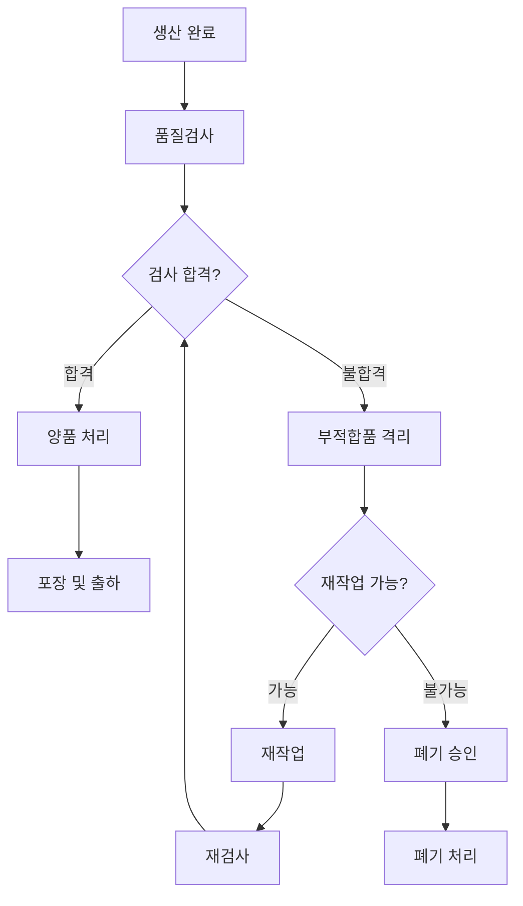

# Chapter 5. 품질관리

---

# 학습목표

이번 장을 학습한 후 학생들은 다음 내용을 설명할 수 있다.

* 제조업에서 품질이 무엇인지 설명할 수 있다.
* 수입검사, 공정검사, 최종검사, 출하검사의 차이를 구분할 수 있다.
* 전수검사와 샘플링검사의 특징을 비교할 수 있다.
* 양품과 불량품의 판정 기준을 설명할 수 있다.
* 주요 불량 유형을 분류할 수 있다.
* 재작업과 폐기의 차이를 이해할 수 있다.
* 품질 비용의 종류와 품질개선의 필요성을 설명할 수 있다.
* MES에서 관리해야 하는 품질 데이터를 이해할 수 있다.

---

# 1. 품질관리란?

## 1.1 품질의 개념

품질(Quality)은 제품이나 서비스가 고객의 요구사항과 정해진 기준을 얼마나 충족하는지를 나타내는 개념이다.

품질이 좋은 제품은 단순히 고급스럽거나 비싼 제품을 의미하지 않는다.

> 품질이란 제품이 정해진 규격과 고객의 요구사항을 지속적으로 만족하는 정도이다.

예를 들어 저렴한 볼펜이라도 다음 조건을 만족하면 품질이 좋은 제품이라고 할 수 있다.

* 글씨가 정상적으로 써진다.
* 잉크가 새지 않는다.
* 쉽게 부러지지 않는다.
* 정해진 수명 동안 사용할 수 있다.
* 제품마다 성능 차이가 크지 않다.

---

## 1.2 품질의 두 가지 관점

품질은 크게 설계품질과 제조품질로 구분할 수 있다.

### 설계품질

제품을 어떤 성능과 규격으로 만들 것인지 결정한 수준이다.

예시:

```text
자동차 최고속도: 200km/h

배터리 사용시간: 10시간

센서 측정오차: ±0.5℃
```

설계품질은 고객 요구사항과 제품기획에 의해 결정된다.

---

### 제조품질

설계된 제품이 실제 생산과정에서 설계기준에 맞게 만들어졌는지를 의미한다.

예시:

```text
설계기준: 길이 100±0.5mm

실제 측정값: 100.2mm

판정: 합격
```

아무리 좋은 설계를 하더라도 생산과정에서 규격을 지키지 못하면 품질이 좋은 제품이라고 할 수 없다.

---

## 1.3 품질관리의 정의

품질관리(Quality Control)는 제품이 정해진 품질기준을 만족하도록 검사하고, 불량을 분석하며, 불량이 다시 발생하지 않도록 개선하는 활동이다.

```text
품질기준 설정

↓

검사 실시

↓

합격 또는 불합격 판정

↓

불량 원인 분석

↓

개선조치

↓

재발 방지
```

---

## 1.4 품질관리의 목적

* 고객 요구사항 충족
* 불량품 출하 방지
* 고객 불만 감소
* 재작업과 폐기 감소
* 생산원가 절감
* 제품 신뢰성 향상
* 기업 이미지 향상
* 품질문제 추적성 확보

---

# 2. 품질과 제조업의 QCD

품질관리는 제조업의 핵심 목표인 QCD와 직접 연결된다.

| 항목       | 품질관리와의 관계                |
| -------- | ------------------------ |
| Quality  | 불량을 줄이고 제품기준을 만족시킴       |
| Cost     | 재작업, 폐기, 반품 비용을 줄임       |
| Delivery | 품질문제로 인한 생산 및 출하 지연을 방지함 |

품질이 나쁘면 단순히 제품 하나가 불량이 되는 것으로 끝나지 않는다.

다음과 같은 문제가 함께 발생할 수 있다.

* 재작업 증가
* 생산시간 증가
* 자재 낭비
* 설비 추가 사용
* 납기 지연
* 고객 반품
* 기업 신뢰도 하락

---

# 3. 품질기준

## 3.1 품질기준이란?

품질기준은 제품이 합격인지 불합격인지 판단하기 위한 기준이다.

품질기준이 명확하지 않으면 작업자나 검사자마다 다른 판정을 내릴 수 있다.

---

## 3.2 품질기준의 예

| 검사대상  | 품질기준       |
| ----- | ---------- |
| 제품 길이 | 100±0.5mm  |
| 제품 무게 | 500±10g    |
| 표면 상태 | 긁힘과 균열 없음  |
| 체결 토크 | 2.0±0.2N·m |
| 전압    | 5±0.1V     |
| 온도    | 180±5℃     |
| 누설검사  | 누설 없음      |

---

## 3.3 규격 상한과 하한

제품의 측정값은 일정한 허용범위 안에 있어야 한다.

예를 들어 제품 길이 기준이 다음과 같다고 가정한다.

```text
기준값: 100mm

허용오차: ±0.5mm
```

규격 하한과 상한은 다음과 같다.

```text
규격 하한: 99.5mm

규격 상한: 100.5mm
```

판정 예시는 다음과 같다.

|     측정값 | 판정  |
| ------: | --- |
|  99.3mm | 불합격 |
|  99.8mm | 합격  |
| 100.2mm | 합격  |
| 100.7mm | 불합격 |

---

# 4. 검사 방식

검사는 검사 시점, 검사 범위, 검사 방법에 따라 여러 형태로 구분할 수 있다.

---

# 4.1 검사 시점에 따른 분류

## 수입검사

수입검사(Incoming Inspection)는 공급업체에서 입고된 원자재나 부품을 검사하는 활동이다.

```text
원자재 입고

↓

수입검사

↓

합격 → 창고 입고

불합격 → 반품 또는 격리
```

### 주요 검사대상

* 원자재
* 구매 부품
* 외주 가공품
* 포장재
* 소모품

### 주요 확인사항

* 입고수량
* 규격
* 외관
* 성분
* 치수
* 공급업체 성적서
* 원자재 LOT

---

## 공정검사

공정검사(In-Process Inspection)는 제품이 생산되는 중간 단계에서 실시하는 검사이다.

공정검사의 목적은 불량이 다음 공정으로 이동하는 것을 방지하는 것이다.

```text
가공

↓

공정검사

↓

조립

↓

공정검사

↓

최종공정
```

예시:

* 가공 후 치수검사
* 조립 후 체결상태 검사
* 용접 후 용접부 검사
* 도장 후 두께검사
* 배터리 공정 중 전압검사

---

## 최종검사

최종검사(Final Inspection)는 제품 생산이 완료된 후 완제품 상태에서 실시하는 검사이다.

주요 검사내용은 다음과 같다.

* 외관
* 치수
* 기능
* 성능
* 안전성
* 제품 수량
* 라벨 정보

---

## 출하검사

출하검사(Outgoing Inspection)는 고객에게 제품을 출하하기 직전에 실시하는 검사이다.

출하검사에서는 제품 자체뿐 아니라 다음 정보도 함께 확인한다.

* 고객 주문번호
* 제품코드
* 출하수량
* 포장상태
* 생산 LOT
* 라벨
* 배송지
* 품질성적서

---

## 검사 시점 비교

| 검사 종류 | 검사 시점    | 주요 목적           |
| ----- | -------- | --------------- |
| 수입검사  | 원자재 입고 시 | 불량자재 투입 방지      |
| 공정검사  | 생산 중     | 불량의 다음 공정 이동 방지 |
| 최종검사  | 생산 완료 후  | 완제품 품질 확인       |
| 출하검사  | 고객 출하 전  | 불량품과 오출하 방지     |

---

# 4.2 검사 수량에 따른 분류

## 전수검사

전수검사는 생산된 모든 제품을 검사하는 방식이다.

예를 들어 1,000개를 생산하면 1,000개 전체를 검사한다.

### 장점

* 모든 제품의 검사결과를 확인할 수 있다.
* 불량품 출하 가능성을 낮출 수 있다.
* 안전이 중요한 제품에 적합하다.

### 단점

* 검사시간이 오래 걸린다.
* 검사비용이 많이 발생한다.
* 검사과정에서 제품이 손상될 수 있다.
* 검사자가 피로해지면 오류가 발생할 수 있다.

### 적용 사례

* 항공기 핵심부품
* 자동차 안전부품
* 의료기기
* 고가 반도체
* 배터리 안전검사

---

## 샘플링검사

샘플링검사는 전체 제품 중 일부를 선택하여 검사하는 방식이다.

예를 들어 1,000개 중 50개를 선택하여 검사한다.

### 장점

* 검사시간이 짧다.
* 검사비용이 낮다.
* 대량생산에 적합하다.
* 파괴검사에 적용할 수 있다.

### 단점

* 검사하지 않은 제품 중 불량이 존재할 수 있다.
* 표본 선택이 잘못되면 결과가 부정확할 수 있다.
* 샘플링 기준이 필요하다.

---

## 전수검사와 샘플링검사 비교

| 항목        | 전수검사     | 샘플링검사    |
| --------- | -------- | -------- |
| 검사대상      | 전체 제품    | 일부 제품    |
| 검사시간      | 길다       | 짧다       |
| 검사비용      | 높다       | 낮다       |
| 불량 검출 가능성 | 높다       | 상대적으로 낮다 |
| 적용        | 안전, 고가제품 | 대량생산품    |

---

# 4.3 검사 방법에 따른 분류

## 외관검사

제품의 표면이나 모양을 눈 또는 카메라로 검사한다.

예시:

* 긁힘
* 찌그러짐
* 균열
* 색상 차이
* 이물질
* 인쇄 오류
* 조립 누락

---

## 치수검사

제품의 길이, 두께, 지름, 높이 등을 측정한다.

사용 장비 예시:

* 자
* 버니어캘리퍼스
* 마이크로미터
* 3차원 측정기
* 레이저 측정기

---

## 기능검사

제품이 설계된 기능대로 동작하는지 확인한다.

예시:

* 전원이 켜지는가?
* 센서가 값을 측정하는가?
* 버튼이 정상적으로 작동하는가?
* 모터가 회전하는가?
* 통신이 정상적으로 이루어지는가?

---

## 성능검사

제품의 성능이 정해진 기준을 만족하는지 검사한다.

예시:

* 모터 회전속도
* 배터리 사용시간
* 센서 정밀도
* 서버 응답속도
* 제품 출력

---

## 파괴검사

검사 과정에서 제품이 손상되거나 다시 사용할 수 없게 되는 검사이다.

예시:

* 인장강도 검사
* 충격시험
* 압축시험
* 화재시험
* 수명시험

파괴검사는 모든 제품을 검사하기 어렵기 때문에 주로 샘플링검사를 사용한다.

---

## 비파괴검사

제품을 손상시키지 않고 내부나 표면의 결함을 검사하는 방식이다.

대표적인 비파괴검사는 다음과 같다.

* 초음파검사
* 방사선검사
* 자분탐상검사
* 침투탐상검사
* 와전류검사
* 비전검사

---

# 5. 양품과 불량

## 5.1 양품이란?

양품(Good Product)은 정해진 품질기준과 고객 요구사항을 만족하는 제품이다.

양품은 다음 공정으로 이동하거나 고객에게 출하할 수 있다.

```text
검사결과: 기준 만족

↓

양품 판정

↓

다음 공정 또는 출하
```

---

## 5.2 불량품이란?

불량품(Defective Product)은 정해진 품질기준이나 고객 요구사항을 만족하지 못하는 제품이다.

불량품은 바로 다음 공정이나 고객에게 전달해서는 안 된다.

```text
검사결과: 기준 이탈

↓

불량 판정

↓

격리

↓

원인 분석

↓

재작업, 폐기 또는 특채
```

---

## 5.3 부적합품

품질기준을 만족하지 못한 제품이나 자재를 부적합품(Nonconforming Product)이라고 한다.

부적합품은 양품과 섞이지 않도록 별도의 장소에 보관하거나 시스템에서 사용을 제한해야 한다.

이를 부적합품 격리라고 한다.

---

## 5.4 양품률

양품률은 생산된 제품 중 양품의 비율을 의미한다.

```text
양품률 = 양품수량 ÷ 생산수량 × 100
```

예시:

```text
생산수량: 1,000개
양품수량: 970개

양품률 = 970 ÷ 1,000 × 100
        = 97%
```

---

## 5.5 불량률

불량률은 생산된 제품 중 불량품의 비율을 의미한다.

```text
불량률 = 불량수량 ÷ 생산수량 × 100
```

예시:

```text
생산수량: 1,000개
불량수량: 30개

불량률 = 30 ÷ 1,000 × 100
        = 3%
```

---

## 5.6 수율

수율(Yield)은 투입한 수량 중 정상적으로 생산된 양품의 비율이다.

```text
수율 = 양품수량 ÷ 투입수량 × 100
```

예시:

```text
투입수량: 1,100개
양품수량: 1,000개

수율 = 1,000 ÷ 1,100 × 100
     ≒ 90.91%
```

---

## 5.7 양품수량과 불량수량의 관계

일반적으로 다음 관계가 성립한다.

```text
생산수량 = 양품수량 + 불량수량
```

예시:

```text
생산수량: 500개
양품수량: 480개
불량수량: 20개
```

---

# 6. 불량 유형

## 6.1 불량 유형 관리의 필요성

불량수량만 기록해서는 불량을 개선하기 어렵다.

어떤 종류의 불량이 발생했는지 구분해야 반복되는 문제를 찾을 수 있다.

예를 들어 다음과 같이 관리할 수 있다.

```text
총 불량수량: 50개

조립불량: 20개
외관불량: 15개
치수불량: 10개
기능불량: 5개
```

---

## 6.2 외관불량

제품의 겉모습이 기준을 만족하지 못하는 경우이다.

예시:

* 긁힘
* 찌그러짐
* 균열
* 변색
* 오염
* 도장불량
* 인쇄불량
* 이물질

---

## 6.3 치수불량

제품의 길이, 두께, 높이, 지름 등이 규격범위를 벗어난 경우이다.

예시:

```text
기준: 100±0.5mm

측정값: 100.8mm

판정: 치수불량
```

---

## 6.4 조립불량

부품이 정상적으로 조립되지 않은 경우이다.

예시:

* 부품 누락
* 부품 반대 조립
* 나사 미체결
* 체결 토크 부족
* 부품 위치 오류
* 커넥터 미삽입

---

## 6.5 기능불량

제품의 기능이 정상적으로 동작하지 않는 경우이다.

예시:

* 전원 불량
* 센서 미동작
* 통신 불량
* 버튼 미동작
* 모터 회전 불량
* 프로그램 오류

---

## 6.6 성능불량

제품은 동작하지만 정해진 성능기준을 만족하지 못하는 경우이다.

예시:

* 속도 부족
* 출력 부족
* 정밀도 부족
* 배터리 사용시간 부족
* 소음 기준 초과

---

## 6.7 자재불량

원자재나 구매부품의 문제로 발생하는 불량이다.

예시:

* 자재 규격 오류
* 부품 손상
* 원재료 성분 이상
* 공급업체 가공불량
* 원자재 오염

---

## 6.8 공정조건 불량

생산조건이 기준값을 벗어나 발생하는 불량이다.

예시:

* 온도 이상
* 압력 이상
* 속도 이상
* 전류 이상
* 체결 토크 이상
* 가열시간 부족
* 냉각시간 부족

---

## 6.9 불량코드 관리

MES에서는 불량 유형을 코드화하여 관리하는 것이 일반적이다.

| 불량코드    | 불량명  | 분류   |
| ------- | ---- | ---- |
| DEF-001 | 긁힘   | 외관불량 |
| DEF-002 | 치수초과 | 치수불량 |
| DEF-003 | 나사누락 | 조립불량 |
| DEF-004 | 전원불량 | 기능불량 |
| DEF-005 | 출력부족 | 성능불량 |

불량코드를 사용하면 공정별, 설비별, 제품별 불량을 분석하기 쉽다.

---

# 7. 불량 원인

불량 유형과 불량 원인은 구분해야 한다.

예를 들어 제품에 긁힘이 발생한 것은 불량 유형이고, 작업대에 금속 이물질이 있었던 것은 불량 원인이다.

```text
불량 유형: 긁힘

불량 원인: 작업대 이물질
```

---

## 7.1 불량 원인의 주요 분류

불량 원인은 일반적으로 4M 또는 5M1E 관점에서 분석한다.

| 구분          | 의미  | 예시               |
| ----------- | --- | ---------------- |
| Man         | 작업자 | 작업실수, 숙련도 부족     |
| Machine     | 설비  | 설비고장, 센서오류       |
| Material    | 자재  | 원자재 불량, 규격 오류    |
| Method      | 방법  | 작업표준 오류, 작업순서 누락 |
| Measurement | 측정  | 측정장비 오류, 측정방법 오류 |
| Environment | 환경  | 온도, 습도, 먼지, 진동   |

---

## 7.2 작업자 원인

* 작업표준 미준수
* 작업자 숙련도 부족
* 부품 조립 누락
* 잘못된 설비 설정
* 검사 누락

---

## 7.3 설비 원인

* 설비 마모
* 센서 오작동
* 금형 손상
* 설비 설정값 오류
* 예방보전 미실시

---

## 7.4 자재 원인

* 자재 규격 불일치
* 공급업체 품질 문제
* 자재 보관불량
* 유효기간 경과
* 자재 LOT 이상

---

## 7.5 작업방법 원인

* 작업순서 오류
* 작업표준 부재
* 공정조건 설정 오류
* 잘못된 검사기준
* 작업방법 변경 미반영

---

# 8. 재작업

## 8.1 재작업이란?

재작업(Rework)은 불량 또는 부적합 제품을 다시 가공하거나 조립하여 품질기준을 만족하도록 만드는 작업이다.

```text
불량 판정

↓

재작업 가능 여부 확인

↓

재작업

↓

재검사

↓

합격 → 양품 처리

불합격 → 폐기 또는 추가조치
```

---

## 8.2 재작업의 예

* 나사를 다시 체결함
* 부품을 교체함
* 제품을 다시 도장함
* 용접부위를 다시 용접함
* 프로그램을 다시 설치함
* 치수를 다시 가공함
* 라벨을 다시 부착함

---

## 8.3 재작업 시 필요한 데이터

| 데이터      | 설명        |
| -------- | --------- |
| 재작업번호    | 재작업 식별번호  |
| 제품코드     | 재작업 대상 제품 |
| 생산 LOT   | 대상 생산 LOT |
| 불량코드     | 발생한 불량 유형 |
| 불량원인     | 불량 발생 원인  |
| 재작업내용    | 수행할 작업    |
| 재작업자     | 담당 작업자    |
| 재작업설비    | 사용 설비     |
| 재작업 시작시간 | 작업 시작 시각  |
| 재작업 종료시간 | 작업 종료 시각  |
| 재검사결과    | 합격 또는 불합격 |

---

## 8.4 재작업의 문제점

재작업을 하면 불량품을 양품으로 만들 수 있지만 추가 비용이 발생한다.

* 추가 인건비
* 추가 설비사용
* 추가 검사비용
* 생산시간 증가
* 납기 지연
* 제품 신뢰성 저하 가능성
* 재작업 이력관리 필요

따라서 재작업이 가능하더라도 불량 발생 자체를 줄이는 것이 더 중요하다.

---

## 8.5 재작업률

```text
재작업률 = 재작업수량 ÷ 생산수량 × 100
```

예시:

```text
생산수량: 1,000개
재작업수량: 40개

재작업률 = 40 ÷ 1,000 × 100
          = 4%
```

---

# 9. 폐기

## 9.1 폐기란?

폐기(Scrap)는 불량품을 재작업하거나 수리할 수 없거나, 재작업 비용이 지나치게 높아 더 이상 사용할 수 없도록 처리하는 것이다.

```text
불량 판정

↓

재작업 가능 여부 검토

↓

재작업 불가능

↓

폐기 승인

↓

폐기 처리
```

---

## 9.2 폐기 대상의 예

* 심하게 파손된 제품
* 규격을 크게 벗어난 제품
* 오염된 식품
* 유효기간이 지난 자재
* 안전기준을 만족하지 못한 제품
* 복구가 불가능한 전자부품
* 고객 요구사항을 만족할 수 없는 제품

---

## 9.3 폐기 시 필요한 데이터

| 데이터    | 설명           |
| ------ | ------------ |
| 폐기번호   | 폐기 식별번호      |
| 제품코드   | 폐기 제품        |
| 생산 LOT | 대상 생산 LOT    |
| 폐기수량   | 폐기 제품 수량     |
| 폐기원인   | 폐기 사유        |
| 불량코드   | 불량 유형        |
| 폐기일자   | 폐기 처리일       |
| 승인자    | 폐기 승인 담당자    |
| 폐기방법   | 파쇄, 소각, 반출 등 |
| 폐기비용   | 폐기에 발생한 비용   |

---

## 9.4 폐기의 영향

폐기는 다음과 같은 손실을 발생시킨다.

* 원자재 손실
* 인건비 손실
* 설비사용시간 손실
* 에너지비용 손실
* 폐기물 처리비용
* 환경 부담
* 생산량 부족
* 납기 지연

---

## 9.5 폐기율

```text
폐기율 = 폐기수량 ÷ 생산수량 × 100
```

예시:

```text
생산수량: 2,000개
폐기수량: 20개

폐기율 = 20 ÷ 2,000 × 100
        = 1%
```

---

# 10. 재작업과 폐기의 비교

| 항목        | 재작업             | 폐기           |
| --------- | --------------- | ------------ |
| 의미        | 다시 작업하여 양품으로 만듦 | 더 이상 사용하지 않음 |
| 제품 사용 가능성 | 재검사 합격 후 사용 가능  | 사용 불가능       |
| 추가비용      | 인건비, 설비비, 검사비   | 자재손실, 처리비용   |
| 결과        | 양품 또는 재불량       | 최종 손실        |
| MES 관리    | 재작업 이력과 재검사     | 폐기수량과 폐기원인   |

---

# 11. 특채

특채(Concession)는 품질기준을 완전히 만족하지 못하지만 제품의 기능과 안전에 문제가 없다고 판단하여 승인 후 제한적으로 사용하는 방식이다.

예를 들어 제품 표면에 작은 흠집이 있지만 기능에는 문제가 없고 고객이 사용을 승인한 경우 특채 처리할 수 있다.

특채는 담당자가 임의로 결정해서는 안 된다.

다음 정보가 필요하다.

* 부적합 내용
* 제품 영향 분석
* 고객 승인
* 품질책임자 승인
* 사용 범위
* 대상 LOT
* 특채 수량

---

# 12. 품질 비용

## 12.1 품질 비용이란?

품질 비용(Cost of Quality)은 품질을 확보하기 위해 사용하는 비용과 품질문제로 인해 발생하는 손실비용을 의미한다.

품질 비용은 크게 다음 네 가지로 구분한다.

```text
품질 비용

├─ 예방비용
├─ 평가비용
├─ 내부 실패비용
└─ 외부 실패비용
```

---

# 12.2 예방비용

예방비용(Prevention Cost)은 불량이 발생하지 않도록 사전에 투입하는 비용이다.

예시:

* 작업자 교육
* 작업표준 작성
* 설비 예방보전
* 품질계획 수립
* 공정개선
* 공급업체 품질관리
* 측정장비 관리
* 품질시스템 구축

예방비용은 단기적으로 비용처럼 보이지만 장기적으로 불량과 고객 클레임을 줄인다.

---

# 12.3 평가비용

평가비용(Appraisal Cost)은 제품이 품질기준을 만족하는지 검사하고 평가하는 데 발생하는 비용이다.

예시:

* 수입검사 비용
* 공정검사 비용
* 최종검사 비용
* 출하검사 비용
* 검사장비 비용
* 시험실 운영비
* 품질 감사비용
* 측정장비 교정비용

---

# 12.4 내부 실패비용

내부 실패비용(Internal Failure Cost)은 제품이 고객에게 출하되기 전에 공장 내부에서 발견된 불량으로 인해 발생하는 비용이다.

예시:

* 재작업 비용
* 폐기 비용
* 재검사 비용
* 생산 중단
* 자재 손실
* 설비 추가 사용
* 생산계획 변경
* 불량 분석 비용

---

# 12.5 외부 실패비용

외부 실패비용(External Failure Cost)은 불량품이 고객에게 전달된 이후 발생하는 비용이다.

예시:

* 고객 반품
* 제품 교환
* 무상수리
* 리콜
* 출장수리
* 손해배상
* 고객 클레임 처리
* 기업 이미지 손상
* 고객 이탈

외부 실패비용은 내부 실패비용보다 훨씬 큰 손실을 발생시킬 수 있다.

---

# 12.6 품질 비용 비교

| 품질 비용   | 발생 시점   | 예시         |
| ------- | ------- | ---------- |
| 예방비용    | 불량 발생 전 | 교육, 예방보전   |
| 평가비용    | 검사 시    | 수입검사, 최종검사 |
| 내부 실패비용 | 출하 전    | 재작업, 폐기    |
| 외부 실패비용 | 출하 후    | 반품, 리콜     |

---

# 12.7 품질 비용의 관계

예방비용과 평가비용을 적절히 투자하면 내부 실패비용과 외부 실패비용을 줄일 수 있다.

```text
예방활동 강화

↓

불량 발생 감소

↓

재작업 및 폐기 감소

↓

고객 불만 감소

↓

전체 품질 비용 절감
```

중요한 점은 검사만 많이 한다고 품질이 좋아지는 것은 아니라는 것이다.

> 좋은 품질관리는 불량을 검사로 찾아내는 것이 아니라 불량이 발생하지 않도록 공정을 관리하는 것이다.

---

# 13. 품질 데이터

MES 또는 QMS에서는 품질검사 결과를 체계적으로 저장해야 한다.

| 데이터    | 설명             | 예시               |
| ------ | -------------- | ---------------- |
| 검사번호   | 검사 식별번호        | INS-2026-001     |
| 검사유형   | 수입, 공정, 최종, 출하 | 공정검사             |
| 제품코드   | 검사 제품          | PROD-A001        |
| 생산 LOT | 검사 대상 LOT      | LOT-20260720-001 |
| 공정코드   | 검사 공정          | PROC-030         |
| 검사수량   | 검사한 수량         | 100개             |
| 합격수량   | 합격 수량          | 97개              |
| 불량수량   | 불량 수량          | 3개               |
| 검사항목   | 측정 대상          | 길이               |
| 기준값    | 목표값            | 100mm            |
| 규격하한   | 최소 허용값         | 99.5mm           |
| 규격상한   | 최대 허용값         | 100.5mm          |
| 측정값    | 실제 측정값         | 100.2mm          |
| 판정결과   | 합격 또는 불합격      | 합격               |
| 불량코드   | 불량 유형          | DEF-002          |
| 검사자    | 검사 담당자         | 김품질              |
| 검사일시   | 검사 수행시간        | 2026-07-20 14:30 |

---

# 14. MES에서의 품질관리

MES는 생산실적과 품질검사 데이터를 연결하여 관리한다.

```text
작업지시

↓

생산실적

↓

생산 LOT

↓

품질검사

↓

합격 또는 불합격

↓

재작업, 폐기, 특채

↓

출하 가능 여부 결정
```

---

## 14.1 MES 품질관리 기능

* 검사대상 자동 생성
* 검사기준 제공
* 측정값 입력
* 자동 합격 및 불합격 판정
* 불량코드 등록
* 재작업지시 생성
* 폐기수량 관리
* 부적합품 격리
* 생산 LOT 추적
* 공정별 불량률 분석
* 설비별 불량 분석
* 작업자별 불량 분석
* 품질이상 알림

---

## 14.2 자동 판정 예시

품질기준이 다음과 같다고 가정한다.

```text
규격하한: 99.5mm

규격상한: 100.5mm
```

자동 판정 조건은 다음과 같다.

```text
99.5 ≤ 측정값 ≤ 100.5

→ 합격
```

그 외에는 불합격이다.

```text
측정값 < 99.5 또는 측정값 > 100.5

→ 불합격
```

---

# 15. 품질 추적성

제품에 문제가 발생하면 생산과 검사 이력을 추적해야 한다.

```text
고객 불량 접수

↓

제품 일련번호 확인

↓

출하번호 확인

↓

생산 LOT 확인

↓

검사결과 확인

↓

작업지시 확인

↓

설비 및 작업자 확인

↓

원자재 LOT 확인
```

이를 통해 다음 내용을 확인할 수 있다.

* 어떤 원자재가 사용되었는가?
* 어느 공정과 설비에서 생산되었는가?
* 누가 작업했는가?
* 검사결과는 무엇이었는가?
* 동일 LOT 제품은 어디에 출하되었는가?
* 동일한 문제가 반복되고 있는가?

---

# 16. 품질관리 사례

스마트센서 1,000개를 생산한 사례를 살펴보자.

## 생산 결과

```text
생산수량: 1,000개
양품수량: 950개
불량수량: 50개
```

---

## 불량 유형

| 불량 유형 | 불량수량 |
| ----- | ---: |
| 외관불량  |  15개 |
| 조립불량  |  20개 |
| 기능불량  |  10개 |
| 치수불량  |   5개 |
| 합계    |  50개 |

---

## 불량품 처리

```text
재작업 가능: 35개
폐기: 15개
```

재작업 결과는 다음과 같다.

```text
재작업수량: 35개
재검사 합격: 30개
재검사 불합격: 5개
```

최종 양품수량은 다음과 같다.

```text
최종 양품수량 = 최초 양품수량 + 재작업 합격수량

최종 양품수량 = 950 + 30
               = 980개
```

최종 폐기수량은 다음과 같다.

```text
최초 폐기수량: 15개
재작업 후 불합격: 5개

최종 폐기수량 = 20개
```

---

## 최종 수율

```text
최종 수율 = 최종 양품수량 ÷ 생산수량 × 100
```

```text
최종 수율 = 980 ÷ 1,000 × 100
           = 98%
```

---

# 17. 품질 개선 활동

품질관리는 불량을 기록하는 것으로 끝나지 않는다.

반복되는 불량의 원인을 분석하고 개선해야 한다.

```text
불량 발생

↓

불량 유형 분류

↓

원인 분석

↓

개선대책 수립

↓

개선 실행

↓

효과 확인

↓

표준화
```

---

## 17.1 대표적인 품질 개선 방법

* 작업표준 개선
* 작업자 교육
* 설비 예방보전
* 자재 공급업체 개선
* 공정조건 자동수집
* 검사 자동화
* 비전검사 도입
* 불량방지장치 적용
* 측정장비 교정
* 공정별 불량 데이터 분석

---

# 18. 실습 1: 품질지표 계산

다음 생산데이터를 이용하여 양품률과 불량률을 계산하시오.

```text
생산수량: 2,000개
양품수량: 1,920개
불량수량: 80개
```

### 계산식

```text
양품률 = 양품수량 ÷ 생산수량 × 100

불량률 = 불량수량 ÷ 생산수량 × 100
```

---

# 19. 실습 2: 검사 판정

다음 품질기준을 이용하여 측정값을 판정하시오.

```text
기준값: 50mm
허용오차: ±0.3mm
```

규격범위는 다음과 같다.

```text
49.7mm 이상 50.3mm 이하
```

| 측정번호 |    측정값 | 판정 |
| ---: | -----: | -- |
|    1 | 49.6mm |    |
|    2 | 49.8mm |    |
|    3 | 50.0mm |    |
|    4 | 50.3mm |    |
|    5 | 50.5mm |    |

---

# 20. 실습 3: 불량 유형 분류

다음 불량 사례를 적절한 불량 유형으로 분류하시오.

| 불량 사례            | 불량 유형 |
| ---------------- | ----- |
| 제품 표면에 긁힘이 있음    |       |
| 제품 길이가 규격보다 김    |       |
| 나사 하나가 누락됨       |       |
| 전원이 켜지지 않음       |       |
| 모터 회전속도가 기준보다 느림 |       |
| 원자재에 이물질이 포함됨    |       |

---

# 21. 실습 4: 불량품 처리

다음 불량품에 대해 재작업 또는 폐기 중 적절한 처리방법을 선택하고 이유를 작성하시오.

| 불량 내용           | 처리방법 | 이유 |
| --------------- | ---- | -- |
| 라벨이 잘못 부착됨      |      |    |
| 제품이 심하게 파손됨     |      |    |
| 나사가 느슨하게 체결됨    |      |    |
| 식품이 오염됨         |      |    |
| 프로그램 버전이 잘못 설치됨 |      |    |
| 제품 치수가 크게 부족함   |      |    |

---

# 22. 실습 5: 품질 비용 분류

다음 비용을 예방비용, 평가비용, 내부 실패비용, 외부 실패비용으로 분류하시오.

| 비용 항목       | 품질 비용 분류 |
| ----------- | -------- |
| 작업자 품질교육    |          |
| 최종검사 비용     |          |
| 불량제품 재작업 비용 |          |
| 고객 반품 처리비용  |          |
| 설비 예방보전 비용  |          |
| 제품 폐기비용     |          |
| 측정장비 교정비용   |          |
| 제품 리콜비용     |          |

---

# 23. 실습 6: 품질관리 흐름도 작성



---

# 24. 조별 토의

1. 검사 수량을 늘리면 품질이 무조건 좋아지는가?
2. 전수검사가 필요한 제품에는 어떤 것이 있는가?
3. 샘플링검사의 가장 큰 위험은 무엇인가?
4. 불량수량만 기록하고 불량 유형을 기록하지 않으면 어떤 문제가 발생하는가?
5. 재작업이 많다는 것은 어떤 의미인가?
6. 폐기율을 낮추기 위해 어떤 데이터를 분석해야 하는가?
7. 외부 실패비용이 내부 실패비용보다 위험한 이유는 무엇인가?
8. 품질검사 자동화는 모든 공정에 적합한가?

---

# 25. 연습문제

## 문제 1

품질의 의미를 고객 요구사항과 제품 규격의 관점에서 설명하시오.

---

## 문제 2

수입검사와 공정검사의 차이를 설명하시오.

---

## 문제 3

전수검사와 샘플링검사의 장단점을 각각 설명하시오.

---

## 문제 4

다음 중 외관불량이 아닌 것은 무엇인가?

1. 긁힘
2. 변색
3. 나사 누락
4. 표면 오염

---

## 문제 5

다음 조건에서 불량률을 계산하시오.

```text
생산수량: 800개
불량수량: 24개
```

---

## 문제 6

재작업과 폐기의 차이를 설명하시오.

---

## 문제 7

품질 비용의 네 가지 종류를 작성하시오.

---

## 문제 8

다음 중 내부 실패비용에 해당하는 것은 무엇인가?

1. 작업자 교육비
2. 최종검사비
3. 재작업비
4. 고객 반품비

---

## 문제 9

불량 유형과 불량 원인의 차이를 예를 들어 설명하시오.

---

## 문제 10

MES에서 품질검사 데이터와 생산 LOT를 연결해야 하는 이유를 설명하시오.

---

# 26. 핵심 내용 정리

* 품질은 제품이 고객 요구사항과 정해진 기준을 만족하는 정도이다.
* 품질관리는 검사, 판정, 원인 분석, 개선, 재발 방지를 포함한다.
* 검사는 시점에 따라 수입검사, 공정검사, 최종검사, 출하검사로 구분된다.
* 검사 수량에 따라 전수검사와 샘플링검사로 구분할 수 있다.
* 양품은 품질기준을 만족하는 제품이고 불량품은 기준을 만족하지 못하는 제품이다.
* 불량 유형에는 외관불량, 치수불량, 조립불량, 기능불량, 성능불량 등이 있다.
* 불량 원인은 작업자, 설비, 자재, 작업방법, 측정, 환경 관점에서 분석할 수 있다.
* 재작업은 불량품을 다시 작업하여 양품으로 만드는 활동이다.
* 폐기는 재작업이 불가능하거나 경제성이 없는 제품을 사용하지 않도록 처리하는 활동이다.
* 품질 비용은 예방비용, 평가비용, 내부 실패비용, 외부 실패비용으로 구분된다.
* 품질관리는 불량을 검사로 찾아내는 활동보다 불량이 발생하지 않도록 예방하는 활동이 중요하다.
* MES는 검사결과, 불량코드, 재작업, 폐기, 생산 LOT를 연결하여 품질 추적성을 제공한다.

---

# 다음 시간 예고

## Chapter 6. 설비관리

* 설비의 개념
* 설비 상태
* 가동과 비가동
* 설비고장
* 예방보전
* 사후보전
* 설비점검
* 설비이력
* 가동률
* MTBF와 MTTR
* MES에서의 설비관리
