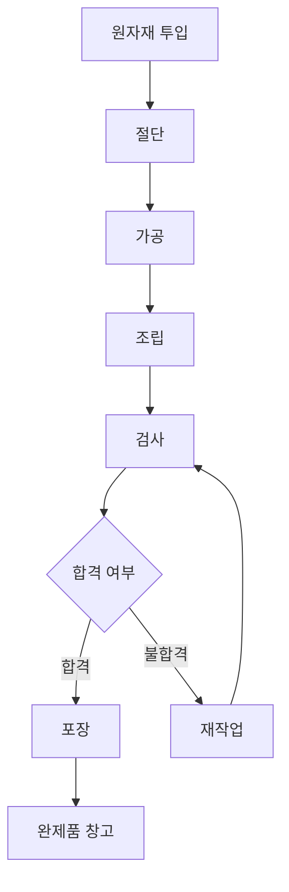

# Chapter 6. 공정(Process) 이해

---

# 학습목표

이번 장을 학습한 후 학생들은 다음 내용을 설명할 수 있다.

* 제조업에서 공정(Process)의 의미를 설명할 수 있다.
* 공정과 작업(Operation)의 관계를 이해할 수 있다.
* Routing의 개념과 필요성을 설명할 수 있다.
* 제품이 생산되는 공정순서를 작성할 수 있다.
* Cycle Time과 Lead Time의 차이를 구분할 수 있다.
* 공정별 생산능력을 계산할 수 있다.
* Bottleneck 공정을 찾고 개선 방향을 제시할 수 있다.
* MES에서 공정 진행정보를 어떻게 관리하는지 설명할 수 있다.

---

# 1. 공정(Process)이란?

## 1.1 공정의 정의

공정(Process)은 원자재, 부품 또는 반제품이 완제품으로 변화하는 과정에서 수행되는 개별 생산 단계를 의미한다.

제품은 일반적으로 하나의 작업만으로 완성되지 않는다.

여러 개의 공정을 정해진 순서대로 거치면서 완제품이 된다.

```text
원자재

↓

절단

↓

가공

↓

조립

↓

검사

↓

포장

↓

완제품
```

예를 들어 금속 부품을 생산한다면 다음과 같은 공정이 필요할 수 있다.

```text
원자재 입고

↓

절단

↓

선반가공

↓

밀링가공

↓

열처리

↓

표면처리

↓

검사

↓

포장
```

각 단계가 하나의 공정이 될 수 있다.

> 공정은 제품의 상태나 특성을 변화시키는 생산활동의 단위이다.

---

## 1.2 공정의 역할

공정은 다음과 같은 변화를 발생시킨다.

* 원자재의 크기나 모양을 변경한다.
* 여러 부품을 하나의 제품으로 조립한다.
* 제품의 물리적 또는 화학적 성질을 변경한다.
* 제품이 품질기준을 만족하는지 확인한다.
* 제품을 보관하거나 운송할 수 있도록 포장한다.

---

## 1.3 공정의 예

| 산업   | 대표 공정               |
| ---- | ------------------- |
| 자동차  | 프레스, 용접, 도장, 조립, 검사 |
| 철강   | 제선, 제강, 연주, 압연, 검사  |
| 반도체  | 증착, 노광, 식각, 세정, 검사  |
| 배터리  | 혼합, 코팅, 압연, 조립, 활성화 |
| 식품   | 혼합, 가열, 냉각, 충전, 포장  |
| 전자제품 | 부품삽입, 납땜, 조립, 기능검사  |
| 기계가공 | 절단, 선반, 밀링, 연마, 검사  |

---

# 2. 공정과 작업의 차이

공정(Process)과 작업(Operation)은 비슷하게 사용되지만 구분할 필요가 있다.

## 2.1 공정

공정은 제품이 거쳐야 하는 생산 단계이다.

예시:

```text
공정명: 케이스 조립
```

## 2.2 작업

작업은 해당 공정 안에서 작업자가 실제로 수행하는 구체적인 행동이다.

예시:

```text
1. 하부 케이스를 작업대에 놓는다.
2. PCB를 케이스에 삽입한다.
3. 상부 케이스를 결합한다.
4. 나사 4개를 체결한다.
5. 외관을 확인한다.
```

---

## 2.3 공정과 작업 비교

| 구분     | 공정             | 작업                |
| ------ | -------------- | ----------------- |
| 의미     | 제품이 거치는 생산 단계  | 공정 안에서 수행하는 세부 행동 |
| 예시     | 조립공정           | 나사 체결             |
| 관리 단위  | 공정코드           | 작업순서              |
| 주요 데이터 | 설비, 표준시간, 공정순서 | 작업방법, 작업조건        |
| MES 활용 | 공정진행 및 실적관리    | 작업표준 제공           |

---

# 3. 공정의 구성요소

하나의 공정을 정의하려면 다음과 같은 정보가 필요하다.

| 항목    | 설명          | 예시           |
| ----- | ----------- | ------------ |
| 공정코드  | 공정을 식별하는 코드 | PROC-010     |
| 공정명   | 공정의 이름      | 절단공정         |
| 작업장   | 공정이 수행되는 장소 | 가공 작업장       |
| 생산라인  | 공정이 속한 라인   | 가공 1라인       |
| 설비코드  | 사용하는 설비     | CUT-001      |
| 표준시간  | 기준 작업시간     | 30초          |
| 작업표준  | 작업방법과 순서    | 절단 작업표준서     |
| 검사기준  | 공정검사 기준     | 길이 100±0.5mm |
| 투입단위  | 공정에 투입되는 단위 | EA           |
| 산출단위  | 공정 완료 후 단위  | EA           |
| 이전 공정 | 앞에서 수행할 공정  | 원자재 준비       |
| 다음 공정 | 이후 수행할 공정   | 가공공정         |

---

# 4. 공정의 종류

공정은 수행하는 역할에 따라 여러 종류로 분류할 수 있다.

## 4.1 가공공정

원자재의 크기, 모양 또는 성질을 변화시키는 공정이다.

예시:

* 절단
* 선반가공
* 밀링가공
* 프레스
* 연삭
* 열처리
* 용접
* 도장

---

## 4.2 조립공정

여러 부품을 결합하여 제품 또는 반제품을 만드는 공정이다.

예시:

* 부품 삽입
* 나사 체결
* 용접 조립
* 접착
* 케이블 연결
* 모듈 조립

---

## 4.3 검사공정

제품이 정해진 품질기준을 만족하는지 확인하는 공정이다.

예시:

* 외관검사
* 치수검사
* 기능검사
* 성능검사
* 누설검사
* 비전검사

---

## 4.4 포장공정

검사에 합격한 제품을 보호하고 출하할 수 있도록 포장하는 공정이다.

예시:

* 개별 포장
* 박스 포장
* 라벨 부착
* 팔레트 적재
* 출하 단위 구성

---

## 4.5 이동 및 대기

이동과 대기는 제품의 가치를 직접 높이지는 않지만 실제 생산현장에서 발생한다.

예시:

* 다음 공정으로 제품 운반
* 검사 대기
* 설비 작업 대기
* 자재 투입 대기
* 포장 대기

이동시간과 대기시간이 길어지면 전체 Lead Time이 증가한다.

---

# 5. Routing

## 5.1 Routing이란?

Routing은 하나의 제품을 생산하기 위해 거쳐야 하는 공정의 순서와 생산방법을 정의한 정보이다.

한국어로는 다음과 같이 표현할 수 있다.

* 공정경로
* 공정순서
* 생산경로
* 공정 Routing

예를 들어 제품 A를 생산하기 위한 Routing은 다음과 같다.

```text
제품 A Routing

공정 10: 절단

↓

공정 20: 가공

↓

공정 30: 조립

↓

공정 40: 검사

↓

공정 50: 포장
```

> Routing은 제품이 어떤 공정을 어떤 순서로 거쳐야 하는지를 정의한 생산 경로이다.

---

## 5.2 Routing이 필요한 이유

Routing을 정의하면 다음 내용을 명확하게 관리할 수 있다.

* 제품이 거쳐야 할 공정
* 공정 수행 순서
* 공정별 설비
* 공정별 작업장
* 공정별 표준시간
* 공정별 작업방법
* 공정별 검사기준
* 공정 간 이동관계

Routing이 없으면 작업자마다 서로 다른 순서로 작업하거나 필수 공정이 누락될 수 있다.

---

## 5.3 Routing 데이터

| 데이터           | 설명               | 예시         |
| ------------- | ---------------- | ---------- |
| Routing 코드    | Routing 식별번호     | ROUTE-A001 |
| 제품코드          | 대상 제품            | PROD-A001  |
| 공정순서          | 공정 진행 순서         | 10         |
| 공정코드          | 수행할 공정           | PROC-010   |
| 공정명           | 공정 이름            | 절단         |
| 작업장           | 공정 수행 장소         | 가공 작업장     |
| 설비코드          | 기본 사용 설비         | CUT-001    |
| 표준 Cycle Time | 제품 1개 기준시간       | 30초        |
| 준비시간          | 작업 전 준비시간        | 20분        |
| 이동시간          | 다음 공정 이동시간       | 5분         |
| 검사여부          | 공정검사 수행 여부       | Y          |
| 사용여부          | 현재 Routing 적용 여부 | Y          |

---

# 6. Routing 예제

스마트센서 A형의 Routing을 작성하면 다음과 같다.

| 공정순서 | 공정코드     | 공정명    | 주요 작업       | 표준시간 |
| ---: | -------- | ------ | ----------- | ---: |
|   10 | PROC-010 | PCB 조립 | 부품 삽입 및 납땜  |  40초 |
|   20 | PROC-020 | 센서 조립  | 센서모듈 장착     |  30초 |
|   30 | PROC-030 | 케이스 조립 | 케이스 및 나사 체결 |  25초 |
|   40 | PROC-040 | 기능검사   | 전원 및 통신 검사  |  20초 |
|   50 | PROC-050 | 포장     | 라벨 및 박스 포장  |  15초 |

흐름으로 표현하면 다음과 같다.

```text
PCB 조립

↓

센서 조립

↓

케이스 조립

↓

기능검사

↓

포장
```

---

# 7. BOM과 Routing의 차이

BOM과 Routing은 제품생산에 필요한 핵심 기준정보이다.

그러나 두 정보의 역할은 서로 다르다.

## 7.1 BOM

BOM은 제품을 만들기 위해 무엇이 필요한지를 정의한다.

```text
스마트센서 1개

├─ PCB 1개
├─ 센서모듈 1개
├─ 케이스 1개
└─ 나사 4개
```

## 7.2 Routing

Routing은 제품을 어떤 순서로 생산할지를 정의한다.

```text
PCB 조립

↓

센서 조립

↓

케이스 조립

↓

검사
```

---

## 7.3 BOM과 Routing 비교

| 구분    | BOM       | Routing      |
| ----- | --------- | ------------ |
| 핵심 질문 | 무엇이 필요한가? | 어떻게 생산하는가?   |
| 관리대상  | 원자재와 부품   | 공정과 작업순서     |
| 주요 정보 | 자재코드, 소요량 | 공정코드, 순서, 시간 |
| 활용    | 자재 소요량 계산 | 생산 실행과 일정 계산 |
| 시스템   | ERP, MES  | ERP, MES     |

---

# 8. 공정순서

## 8.1 공정순서란?

공정순서는 제품이 생산되는 과정에서 각 공정을 수행하는 순서를 의미한다.

공정순서는 일반적으로 숫자로 관리한다.

```text
10: 절단

20: 가공

30: 조립

40: 검사

50: 포장
```

---

## 8.2 공정순서를 10단위로 관리하는 이유

공정순서를 다음과 같이 1, 2, 3으로 작성할 수도 있다.

```text
1: 절단
2: 가공
3: 조립
```

그러나 실제 현장에서는 중간공정이 추가될 수 있다.

예를 들어 절단과 가공 사이에 세척공정을 추가해야 할 수 있다.

기존 순서가 10단위이면 다음과 같이 추가할 수 있다.

```text
10: 절단

15: 세척

20: 가공

30: 조립
```

따라서 공정순서를 10, 20, 30처럼 일정한 간격으로 관리하면 변경이 편리하다.

---

## 8.3 공정순서 준수

제품은 원칙적으로 정의된 공정순서에 따라 생산되어야 한다.

```text
공정 10 완료

↓

공정 20 시작 가능

↓

공정 20 완료

↓

공정 30 시작 가능
```

MES에서는 이전 공정이 완료되지 않으면 다음 공정을 시작하지 못하도록 제어할 수 있다.

---

## 8.4 공정 건너뛰기

정해진 공정을 수행하지 않고 다음 공정으로 이동하는 것을 공정 건너뛰기 또는 공정 누락이라고 할 수 있다.

예시:

```text
정상 흐름

조립 → 검사 → 포장
```

```text
비정상 흐름

조립 → 포장
```

검사공정이 누락되면 불량품이 고객에게 출하될 수 있다.

---

## 8.5 재작업 공정

불량이 발생하면 정상 Routing과 다른 재작업 공정을 거칠 수 있다.

```text
조립

↓

검사

↓

불합격

↓

재작업

↓

재검사

↓

합격

↓

포장
```

MES에서는 정상 Routing과 재작업 Routing을 구분하여 관리할 수 있다.

---

# 9. 공정의 선후관계

공정은 앞뒤 관계에 따라 연결된다.

## 9.1 선행공정

현재 공정을 수행하기 전에 완료되어야 하는 공정이다.

예시:

```text
현재 공정: 조립

선행공정: 가공
```

---

## 9.2 후속공정

현재 공정이 완료된 이후 수행되는 공정이다.

예시:

```text
현재 공정: 조립

후속공정: 검사
```

---

## 9.3 직렬공정

직렬공정은 모든 공정이 하나의 순서로 연결된 구조이다.

```text
공정 A

↓

공정 B

↓

공정 C

↓

공정 D
```

---

## 9.4 병렬공정

병렬공정은 여러 공정이 동시에 수행된 후 하나의 공정에서 합쳐지는 구조이다.

```text
        ┌→ 부품 A 조립 ─┐
원자재 ─┤               ├→ 최종 조립
        └→ 부품 B 조립 ─┘
```

병렬공정은 전체 Lead Time을 줄이는 데 유리할 수 있다.

---

## 9.5 선택공정

제품의 옵션이나 품질결과에 따라 서로 다른 공정으로 진행하는 구조이다.

```text
제품 조립

↓

옵션 확인

├─ 일반형 → 기본검사
│
└─ 고급형 → 추가검사
```

---

# 10. Cycle Time

## 10.1 Cycle Time의 정의

Cycle Time은 제품 한 개 또는 일정 단위의 제품을 생산하는 데 걸리는 반복 작업시간이다.

일반적으로 하나의 공정에서 제품 한 개를 처리하는 데 필요한 시간으로 이해할 수 있다.

```text
Cycle Time = 제품 한 개를 생산하는 데 필요한 시간
```

예시:

```text
제품 1개 조립시간: 30초

Cycle Time = 30초/개
```

---

## 10.2 Cycle Time 계산

일정 시간 동안 생산한 수량을 이용하여 실제 Cycle Time을 계산할 수 있다.

```text
Cycle Time = 실제 가동시간 ÷ 생산수량
```

예시:

```text
실제 가동시간: 3,600초

생산수량: 100개
```

```text
Cycle Time = 3,600 ÷ 100
           = 36초/개
```

---

## 10.3 시간당 생산량 계산

Cycle Time을 알면 시간당 생산 가능한 수량을 계산할 수 있다.

```text
시간당 생산량 = 3,600초 ÷ Cycle Time
```

예시:

```text
Cycle Time: 30초/개
```

```text
시간당 생산량 = 3,600 ÷ 30
               = 120개/시간
```

---

## 10.4 Cycle Time 예제

| 공정 | Cycle Time | 시간당 생산능력 |
| -- | ---------: | -------: |
| 절단 |        15초 |     240개 |
| 가공 |        30초 |     120개 |
| 조립 |        45초 |      80개 |
| 검사 |        20초 |     180개 |
| 포장 |        25초 |     144개 |

시간당 생산능력은 다음 공식으로 계산한다.

```text
시간당 생산능력 = 3,600초 ÷ Cycle Time
```

---

# 11. 표준 Cycle Time과 실제 Cycle Time

## 11.1 표준 Cycle Time

표준 Cycle Time은 정해진 작업방법과 정상적인 조건에서 제품 한 개를 생산하는 데 필요한 기준시간이다.

```text
표준 Cycle Time: 30초
```

---

## 11.2 실제 Cycle Time

실제 Cycle Time은 현장에서 실제 생산에 걸린 시간이다.

```text
실제 Cycle Time: 36초
```

---

## 11.3 비교

| 구분    | 표준 Cycle Time | 실제 Cycle Time |
| ----- | ------------: | ------------: |
| 의미    |       기준 작업시간 |       실제 소요시간 |
| 사용 목적 |    생산계획, 표준설정 |          실적분석 |
| 예시    |           30초 |           36초 |

실제 Cycle Time이 표준보다 길다면 원인을 분석해야 한다.

```text
표준 Cycle Time: 30초

실제 Cycle Time: 36초

차이: 6초 증가
```

가능한 원인은 다음과 같다.

* 작업자 숙련도 부족
* 설비속도 저하
* 자재 공급 지연
* 작업방법 미준수
* 잦은 설비 정지
* 품질 확인시간 증가

---

# 12. Cycle Time과 Takt Time

Cycle Time과 함께 자주 사용되는 개념이 Takt Time이다.

## 12.1 Takt Time의 정의

Takt Time은 고객의 요구수량을 만족하기 위해 제품 하나를 몇 초마다 생산해야 하는지를 나타내는 목표시간이다.

```text
Takt Time = 실제 생산 가능시간 ÷ 고객 요구수량
```

---

## 12.2 Takt Time 계산 예시

```text
하루 생산 가능시간: 8시간

휴식시간: 1시간

실제 생산 가능시간: 7시간

고객 요구수량: 700개
```

초 단위로 변환하면 다음과 같다.

```text
7시간 = 7 × 60 × 60
       = 25,200초
```

```text
Takt Time = 25,200초 ÷ 700개
          = 36초/개
```

즉 고객 요구를 맞추려면 최소 36초마다 제품 한 개를 생산해야 한다.

---

## 12.3 Cycle Time과 Takt Time 비교

| 구분 | Cycle Time      | Takt Time       |
| -- | --------------- | --------------- |
| 의미 | 실제 또는 표준 생산시간   | 고객 요구에 따른 목표시간  |
| 기준 | 공정의 생산속도        | 고객 수요           |
| 질문 | 실제 몇 초마다 생산하는가? | 몇 초마다 생산해야 하는가? |

다음과 같이 해석할 수 있다.

```text
Cycle Time ≤ Takt Time

→ 고객 요구수량 충족 가능
```

```text
Cycle Time > Takt Time

→ 생산속도 부족
```

---

# 13. Lead Time

## 13.1 Lead Time의 정의

Lead Time은 생산 요청 또는 주문이 발생한 시점부터 제품이 완성될 때까지 걸리는 전체 시간이다.

생산 Lead Time에는 실제 가공시간뿐 아니라 대기, 이동, 검사, 보관시간도 포함될 수 있다.

```text
Lead Time

= 가공시간
+ 대기시간
+ 이동시간
+ 검사시간
+ 준비시간
```

---

## 13.2 Lead Time 예시

제품 하나가 다음 공정을 거친다고 가정한다.

| 구분    |  시간 |
| ----- | --: |
| 작업 준비 | 20분 |
| 절단    | 10분 |
| 공정 대기 | 60분 |
| 가공    | 20분 |
| 이동    | 10분 |
| 검사 대기 | 30분 |
| 검사    | 10분 |

전체 Lead Time은 다음과 같다.

```text
Lead Time

= 20 + 10 + 60 + 20 + 10 + 30 + 10

= 160분
```

실제 가공과 검사에 사용된 시간은 40분이지만 전체 Lead Time은 160분이다.

---

## 13.3 Lead Time의 구성

```text
Lead Time

├─ 준비시간
├─ 가공시간
├─ 대기시간
├─ 이동시간
├─ 검사시간
└─ 보관시간
```

---

## 13.4 Lead Time이 길어지는 원인

* 공정 사이의 대기시간 증가
* 자재 공급 지연
* 설비고장
* 검사 대기
* 재작업 발생
* 과도한 재공품
* 작업지시 우선순위 변경
* 긴 이동거리
* 생산일정 오류
* 병목공정 발생

---

# 14. Cycle Time과 Lead Time의 차이

Cycle Time과 Lead Time은 모두 시간을 의미하지만 범위가 다르다.

| 구분    | Cycle Time        | Lead Time      |
| ----- | ----------------- | -------------- |
| 의미    | 제품 한 개를 처리하는 작업시간 | 요청부터 완료까지 전체시간 |
| 범위    | 개별 공정 중심          | 전체 생산흐름 중심     |
| 포함 내용 | 실제 작업시간           | 작업, 대기, 이동, 검사 |
| 활용    | 공정 생산능력 계산        | 납기와 생산기간 계산    |

---

## 14.1 간단한 비교 예제

제품 가공시간이 10분이지만 설비 앞에서 2시간 대기했다고 가정한다.

```text
Cycle Time: 10분

대기시간: 120분

Lead Time: 130분
```

이 사례에서는 실제 작업시간보다 대기시간이 훨씬 길다.

따라서 Lead Time을 줄이기 위해서는 가공속도만 높일 것이 아니라 대기시간도 개선해야 한다.

---

# 15. 재공품과 Lead Time

재공품(WIP, Work In Process)은 공정 사이에 대기 중인 반제품을 의미한다.

재공품이 많아지면 일반적으로 Lead Time도 증가한다.

```text
재공품 증가

↓

공정 대기 증가

↓

생산 흐름 지연

↓

Lead Time 증가
```

예시:

```text
조립공정 앞 재공품: 1,000개

조립공정 시간당 생산량: 100개
```

모든 재공품을 처리하려면 최소 10시간이 필요하다.

```text
필요시간 = 1,000개 ÷ 100개/시간
         = 10시간
```

---

# 16. Bottleneck

## 16.1 Bottleneck의 정의

Bottleneck은 전체 생산공정의 생산속도와 생산량을 제한하는 가장 느린 공정이다.

한국어로는 병목공정이라고 한다.

병의 목 부분이 좁아 액체가 천천히 나오는 모습에서 나온 표현이다.

```text
넓은 병

↓

좁은 병목

↓

액체 배출속도 제한
```

생산라인에서도 가장 느린 공정이 전체 생산량을 제한한다.

---

## 16.2 Bottleneck 예제

다음과 같은 생산라인이 있다고 가정한다.

| 공정 | 시간당 생산능력 |
| -- | -------: |
| 절단 |     200개 |
| 가공 |     150개 |
| 조립 |     100개 |
| 검사 |     180개 |
| 포장 |     160개 |

가장 생산능력이 낮은 공정은 조립공정이다.

```text
조립공정 생산능력: 100개/시간
```

따라서 조립공정이 Bottleneck이다.

전체 생산라인의 최대 생산량도 약 100개/시간으로 제한된다.

---

## 16.3 Cycle Time으로 Bottleneck 찾기

Cycle Time이 가장 긴 공정이 일반적으로 Bottleneck 후보가 된다.

| 공정 | Cycle Time |
| -- | ---------: |
| 절단 |        18초 |
| 가공 |        24초 |
| 조립 |        40초 |
| 검사 |        20초 |
| 포장 |        25초 |

Cycle Time이 가장 긴 조립공정이 가장 느린 공정이다.

```text
조립공정 Cycle Time: 40초
```

시간당 생산능력은 다음과 같다.

```text
3,600초 ÷ 40초 = 90개/시간
```

---

# 17. Bottleneck에서 발생하는 현상

병목공정 앞에는 재공품이 쌓이고, 병목공정 뒤의 공정은 작업할 제품이 없어 대기할 수 있다.

```text
절단

↓

가공

↓

재공품 적체

↓

조립 ← Bottleneck

↓

검사 대기

↓

포장 대기
```

대표적인 현상은 다음과 같다.

* 병목공정 앞 재공품 증가
* 생산 Lead Time 증가
* 앞 공정의 과잉생산
* 뒤 공정의 작업대기
* 납기 지연
* 작업장 공간 부족
* 제품 추적 어려움
* 전체 생산량 제한

---

# 18. Bottleneck과 비Bottleneck 공정

## 18.1 Bottleneck 공정

* 전체 생산량을 제한한다.
* 멈추면 전체 생산라인에 큰 영향을 준다.
* 가동시간을 최대한 확보해야 한다.
* 불량과 재작업을 최소화해야 한다.
* 작업 우선순위를 정확히 관리해야 한다.

## 18.2 비Bottleneck 공정

* 병목공정보다 생산능력이 높다.
* 무조건 최대속도로 생산하면 재공품이 증가할 수 있다.
* 병목공정의 처리속도에 맞추어 운영해야 한다.

---

# 19. Bottleneck 개선방법

## 19.1 작업방법 개선

불필요한 작업을 제거하고 작업순서를 단순화한다.

```text
기존 Cycle Time: 40초

개선 Cycle Time: 32초
```

---

## 19.2 설비 추가

동일한 작업을 수행하는 설비를 추가하여 병렬로 생산한다.

```text
기존: 설비 1대 × 100개/시간

개선: 설비 2대 × 100개/시간

총 생산능력: 200개/시간
```

---

## 19.3 작업자 추가

사람이 수행하는 공정이라면 작업자를 추가하거나 작업을 분담할 수 있다.

---

## 19.4 자동화 도입

반복적이고 시간이 많이 걸리는 작업을 자동화한다.

예시:

* 자동 나사 체결기
* 자동 검사기
* 로봇 조립
* 비전검사
* 자동 라벨 부착기

---

## 19.5 준비시간 단축

품목 변경과 설비 준비에 걸리는 시간을 줄인다.

이를 Setup Time 또는 Changeover Time 개선이라고 한다.

---

## 19.6 예방보전

병목설비가 고장 나면 전체 생산라인이 정지할 수 있다.

따라서 병목설비는 예방점검과 부품관리를 우선적으로 수행해야 한다.

---

## 19.7 불량 감소

병목공정에서 불량이 발생하면 부족한 생산능력을 재작업에 다시 사용해야 한다.

따라서 병목공정의 품질관리가 특히 중요하다.

---

# 20. Bottleneck 개선 시 주의점

하나의 병목공정을 개선하면 다른 공정이 새로운 병목공정이 될 수 있다.

개선 전:

| 공정 |    생산능력 |
| -- | ------: |
| 절단 | 200개/시간 |
| 가공 | 150개/시간 |
| 조립 | 100개/시간 |
| 검사 | 180개/시간 |

조립공정을 개선하여 170개/시간으로 높였다고 가정한다.

개선 후:

| 공정 |    생산능력 |
| -- | ------: |
| 절단 | 200개/시간 |
| 가공 | 150개/시간 |
| 조립 | 170개/시간 |
| 검사 | 180개/시간 |

이제 가공공정의 생산능력 150개/시간이 가장 낮다.

따라서 새로운 Bottleneck은 가공공정이 된다.

> 병목은 완전히 사라지는 것이 아니라 개선에 따라 다른 공정으로 이동할 수 있다.

---

# 21. 공정능력과 생산량 계산

다음 공정 정보를 이용하여 생산능력을 계산해보자.

| 공정 | Cycle Time |
| -- | ---------: |
| 절단 |        20초 |
| 가공 |        30초 |
| 조립 |        45초 |
| 검사 |        25초 |

---

## 21.1 공정별 시간당 생산능력

### 절단공정

```text
3,600 ÷ 20 = 180개/시간
```

### 가공공정

```text
3,600 ÷ 30 = 120개/시간
```

### 조립공정

```text
3,600 ÷ 45 = 80개/시간
```

### 검사공정

```text
3,600 ÷ 25 = 144개/시간
```

---

## 21.2 Bottleneck 확인

가장 생산능력이 낮은 공정은 조립공정이다.

```text
조립공정 생산능력: 80개/시간
```

따라서 전체 라인의 최대 생산능력은 약 80개/시간이다.

---

## 21.3 8시간 생산량

생산 중단과 불량이 없다고 가정하면 다음과 같다.

```text
8시간 생산량 = 80개/시간 × 8시간
              = 640개
```

---

# 22. Setup Time

## 22.1 Setup Time의 정의

Setup Time은 제품 생산을 시작하기 전에 설비와 작업환경을 준비하는 데 걸리는 시간이다.

예시:

* 금형 교체
* 설비 조건 설정
* 자재 교체
* 공구 교체
* 시험생산
* 설비 청소
* 프로그램 변경

---

## 22.2 Setup Time과 Cycle Time

Cycle Time은 제품을 반복 생산하는 시간이지만 Setup Time은 생산 시작 전에 한 번 발생하는 준비시간이다.

예시:

```text
Setup Time: 30분

Cycle Time: 20초/개

생산수량: 100개
```

제품 100개 생산에 필요한 총시간은 다음과 같다.

```text
총 생산시간

= Setup Time + Cycle Time × 생산수량
```

```text
= 30분 + 20초 × 100개
= 30분 + 2,000초
= 30분 + 33분 20초
= 63분 20초
```

---

# 23. 공정 데이터와 MES

MES에서는 제품이 각 공정을 통과하는 정보를 수집하고 관리한다.

```text
작업지시

↓

공정 10 시작

↓

공정 10 완료

↓

공정 20 시작

↓

공정 20 완료

↓

공정 30 시작

↓

제품 생산 완료
```

---

## 23.1 MES에서 관리하는 공정 데이터

| 데이터        | 설명            |
| ---------- | ------------- |
| 작업지시번호     | 어떤 작업지시에 속하는가 |
| 제품코드       | 어떤 제품인가       |
| 생산 LOT     | 어떤 생산 묶음인가    |
| 공정코드       | 어느 공정인가       |
| 공정순서       | 몇 번째 공정인가     |
| 투입수량       | 공정에 투입된 수량    |
| 완료수량       | 공정을 완료한 수량    |
| 양품수량       | 정상 처리된 수량     |
| 불량수량       | 불량 발생 수량      |
| 작업시작시간     | 실제 공정 시작시간    |
| 작업종료시간     | 실제 공정 종료시간    |
| Cycle Time | 실제 제품 처리시간    |
| 설비코드       | 사용한 설비        |
| 작업자        | 작업 담당자        |
| 대기시간       | 공정 시작 전 대기시간  |
| 비가동시간      | 공정 중 정지시간     |

---

## 23.2 공정 상태

MES에서는 공정의 진행상태를 다음과 같이 관리할 수 있다.

```text
대기

↓

투입

↓

작업 중

↓

일시중지

↓

완료

↓

다음 공정 이동
```

대표적인 공정 상태는 다음과 같다.

| 상태  | 의미            |
| --- | ------------- |
| 대기  | 공정 시작 전       |
| 투입  | 공정에 제품이 투입됨   |
| 진행  | 현재 작업 중       |
| 중지  | 일시적으로 작업이 중단됨 |
| 완료  | 공정작업 완료       |
| 불량  | 품질문제 발생       |
| 재작업 | 다시 작업 중       |
| 이동  | 다음 공정으로 이동 중  |

---

# 24. 공정 추적

공정 추적은 제품이 현재 어느 공정에 있으며, 이전에 어떤 공정을 거쳤는지 확인하는 것이다.

예시:

```text
제품 LOT: LOT-20260720-001

공정 10 절단: 완료

공정 20 가공: 완료

공정 30 조립: 진행 중

공정 40 검사: 대기

공정 50 포장: 대기
```

이를 통해 생산관리자는 다음 정보를 확인할 수 있다.

* 제품이 현재 어느 공정에 있는가?
* 어느 공정에서 지연되고 있는가?
* 이전 공정은 언제 완료되었는가?
* 공정별 생산수량은 얼마인가?
* 공정별 불량은 얼마나 발생했는가?
* 어느 공정에 재공품이 쌓여 있는가?

---

# 25. 공정별 실적 비교

다음과 같은 생산실적이 있다고 가정한다.

| 공정 |  투입수량 | 완료수량 | 불량수량 | 실제 Cycle Time |
| -- | ----: | ---: | ---: | ------------: |
| 절단 | 1,000 |  990 |   10 |           18초 |
| 가공 |   990 |  970 |   20 |           28초 |
| 조립 |   970 |  930 |   40 |           42초 |
| 검사 |   930 |  920 |   10 |           22초 |

이 데이터를 통해 다음 내용을 분석할 수 있다.

* 조립공정의 불량수량이 가장 많다.
* 조립공정의 Cycle Time이 가장 길다.
* 조립공정이 Bottleneck일 가능성이 높다.
* 전체 최종 양품수량은 920개이다.
* 공정이 진행될수록 수량이 감소하고 있다.

---

# 26. 공정개선 관점

공정개선은 단순히 설비속도를 높이는 활동이 아니다.

다음 요소를 함께 분석해야 한다.

* Cycle Time
* 대기시간
* 이동시간
* Setup Time
* 설비 비가동시간
* 불량률
* 재작업시간
* 재공품
* 작업자 동선
* 자재 공급방식

---

## 26.1 가치작업과 비가치작업

### 가치작업

고객이 원하는 제품의 형태나 기능을 실제로 변화시키는 작업이다.

예시:

* 절단
* 가공
* 조립
* 용접
* 도장

### 비가치작업

제품의 가치를 직접 높이지 않는 활동이다.

예시:

* 대기
* 불필요한 이동
* 재작업
* 반복검사
* 과도한 보관
* 불필요한 운반

Lead Time을 줄이기 위해서는 비가치작업을 줄이는 것이 중요하다.

---

# 27. 사례 분석

스마트센서 A형 생산라인의 공정정보가 다음과 같다고 가정한다.

| 공정     | 표준 Cycle Time | 실제 Cycle Time | 시간당 생산능력 |
| ------ | ------------: | ------------: | -------: |
| PCB 조립 |           30초 |           35초 |   약 103개 |
| 센서 조립  |           25초 |           28초 |   약 129개 |
| 케이스 조립 |           40초 |           45초 |      80개 |
| 기능검사   |           20초 |           22초 |   약 164개 |
| 포장     |           15초 |           18초 |     200개 |

---

## 27.1 Bottleneck 분석

실제 Cycle Time이 가장 긴 공정은 케이스 조립이다.

```text
케이스 조립 Cycle Time: 45초
```

시간당 생산능력은 다음과 같다.

```text
3,600 ÷ 45 = 80개/시간
```

따라서 케이스 조립공정이 Bottleneck이다.

---

## 27.2 개선방안

* 자동 나사 체결기 도입
* 나사 체결 작업을 두 명이 분담
* 부품 공급위치 개선
* 작업표준 재설계
* 체결검사를 자동화
* 부품 사전배치

---

## 27.3 개선 결과

Cycle Time을 45초에서 30초로 줄였다고 가정한다.

```text
개선 전 생산능력

3,600 ÷ 45 = 80개/시간
```

```text
개선 후 생산능력

3,600 ÷ 30 = 120개/시간
```

시간당 생산능력이 80개에서 120개로 증가한다.

---

# 28. 실습 1: Routing 작성

스마트폰 조립공정을 참고하여 Routing을 작성하시오.

| 공정순서 | 공정코드 | 공정명 | 사용설비 | 표준 Cycle Time |
| ---: | ---- | --- | ---- | ------------: |
|   10 |      |     |      |               |
|   20 |      |     |      |               |
|   30 |      |     |      |               |
|   40 |      |     |      |               |
|   50 |      |     |      |               |

---

# 29. 실습 2: 공정순서 작성

다음 작업을 올바른 생산순서로 배치하시오.

```text
포장
원자재 절단
최종검사
부품 조립
표면가공
```

작성 예시:

```text
공정 10:

공정 20:

공정 30:

공정 40:

공정 50:
```

---

# 30. 실습 3: Cycle Time 계산

다음 생산실적에서 실제 Cycle Time을 계산하시오.

```text
실제 가동시간: 7,200초

생산수량: 240개
```

계산식:

```text
Cycle Time = 실제 가동시간 ÷ 생산수량
```

---

# 31. 실습 4: 시간당 생산능력 계산

다음 공정별 시간당 생산능력을 계산하시오.

| 공정 | Cycle Time | 시간당 생산능력 |
| -- | ---------: | -------: |
| 절단 |        20초 |          |
| 가공 |        30초 |          |
| 조립 |        45초 |          |
| 검사 |        25초 |          |
| 포장 |        15초 |          |

계산식:

```text
시간당 생산능력 = 3,600초 ÷ Cycle Time
```

---

# 32. 실습 5: Bottleneck 찾기

다음 생산라인의 Bottleneck을 찾으시오.

| 공정 | 시간당 생산능력 |
| -- | -------: |
| 절단 |     180개 |
| 가공 |     120개 |
| 조립 |      80개 |
| 검사 |     144개 |
| 포장 |     200개 |

### 질문

1. Bottleneck 공정은 어디인가?
2. 전체 생산라인의 최대 시간당 생산량은 얼마인가?
3. 8시간 동안 최대 몇 개를 생산할 수 있는가?
4. Bottleneck 앞에는 어떤 현상이 발생할 수 있는가?
5. Bottleneck을 개선할 수 있는 방법을 두 가지 작성하시오.

---

# 33. 실습 6: Lead Time 계산

다음 데이터를 이용하여 전체 Lead Time을 계산하시오.

| 구분    |  시간 |
| ----- | --: |
| 작업 준비 | 20분 |
| 가공    | 30분 |
| 공정 대기 | 90분 |
| 이동    | 10분 |
| 검사 대기 | 40분 |
| 검사    | 10분 |
| 포장    | 20분 |

### 질문

1. 전체 Lead Time은 몇 분인가?
2. 실제 작업시간은 몇 분인가?
3. 대기시간은 몇 분인가?
4. Lead Time을 줄이려면 어떤 시간을 우선 개선해야 하는가?

---

# 34. 실습 7: 공정 흐름도 작성

다음 예제를 참고하여 선택한 제품의 공정 흐름도를 작성하시오.



---

# 35. 조별 토의

1. 제품별로 Routing이 달라지는 이유는 무엇인가?
2. 공정순서를 관리하지 않으면 어떤 문제가 발생할 수 있는가?
3. Cycle Time이 짧으면 항상 생산성이 높다고 할 수 있는가?
4. Cycle Time과 Lead Time의 가장 큰 차이는 무엇인가?
5. 생산현장에서 실제 작업시간보다 대기시간이 길어지는 이유는 무엇인가?
6. Bottleneck이 아닌 공정을 최대속도로 생산하면 어떤 문제가 발생하는가?
7. Bottleneck 설비의 고장이 다른 설비의 고장보다 더 중요한 이유는 무엇인가?
8. 공정 자동화를 결정할 때 Cycle Time 이외에 어떤 요소를 고려해야 하는가?

---

# 36. 연습문제

## 문제 1

공정(Process)의 의미를 설명하시오.

---

## 문제 2

Routing이 필요한 이유를 세 가지 작성하시오.

---

## 문제 3

BOM과 Routing의 차이를 설명하시오.

---

## 문제 4

공정순서를 10, 20, 30처럼 일정한 간격으로 관리하는 이유를 설명하시오.

---

## 문제 5

Cycle Time의 의미와 계산식을 작성하시오.

---

## 문제 6

다음 조건에서 시간당 생산량을 계산하시오.

```text
Cycle Time: 40초
```

---

## 문제 7

Cycle Time과 Lead Time의 차이를 설명하시오.

---

## 문제 8

다음 중 Lead Time에 포함되지 않는 것은 무엇인가?

1. 가공시간
2. 대기시간
3. 이동시간
4. 제품 판매가격

---

## 문제 9

Bottleneck의 의미를 설명하시오.

---

## 문제 10

다음 공정 중 Bottleneck을 찾으시오.

| 공정 | Cycle Time |
| -- | ---------: |
| 절단 |        20초 |
| 가공 |        35초 |
| 조립 |        50초 |
| 검사 |        25초 |

---

## 문제 11

Bottleneck 공정 앞에 재공품이 증가하는 이유를 설명하시오.

---

## 문제 12

공정개선을 통해 Lead Time을 줄일 수 있는 방법을 세 가지 작성하시오.

---

# 37. 핵심 내용 정리

* 공정은 원자재나 반제품이 완제품으로 변화하는 개별 생산 단계이다.
* 작업은 하나의 공정 안에서 작업자가 수행하는 구체적인 행동이다.
* Routing은 제품이 거쳐야 하는 공정과 공정순서를 정의한 생산경로이다.
* BOM은 제품생산에 필요한 자재를 정의하고 Routing은 제품을 생산하는 방법과 순서를 정의한다.
* 공정순서는 제품이 생산되는 작업의 선후관계를 나타낸다.
* Cycle Time은 하나의 제품을 처리하는 데 걸리는 반복 작업시간이다.
* 시간당 생산능력은 `3,600초 ÷ Cycle Time`으로 계산할 수 있다.
* Takt Time은 고객 요구수량을 충족하기 위해 제품을 생산해야 하는 목표속도이다.
* Lead Time은 생산 요청부터 제품 완료까지 걸리는 전체시간이다.
* Lead Time에는 가공시간뿐 아니라 준비, 대기, 이동, 검사시간이 포함된다.
* Bottleneck은 전체 생산량을 제한하는 가장 느린 공정이다.
* Bottleneck 앞에는 재공품이 쌓이고 뒤 공정은 작업대기가 발생할 수 있다.
* 병목공정을 개선하면 다른 공정이 새로운 병목공정이 될 수 있다.
* MES는 제품별 Routing, 공정순서, 공정상태, 작업시간, 생산수량을 관리한다.

---
* MES와 ERP의 BOM 활용
